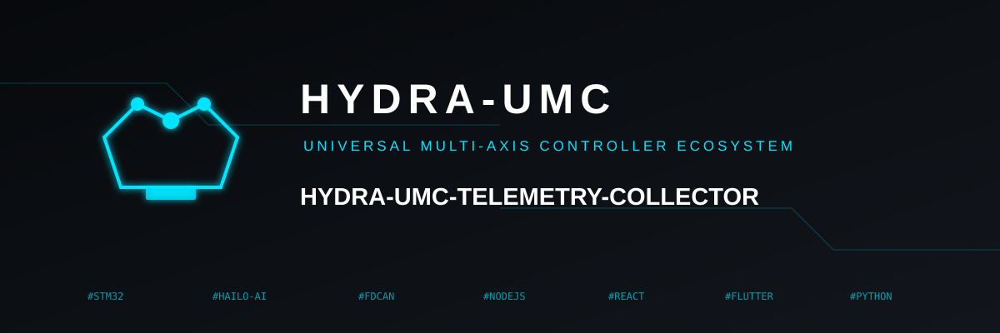
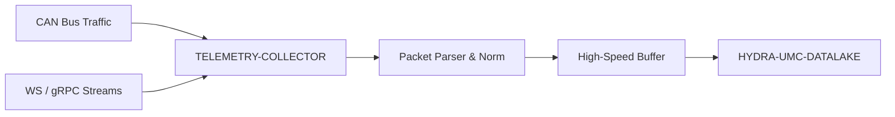

<p align="center">
  
</p>

# 📡 HYDRA-UMC-TELEMETRY-COLLECTOR

<p align="center">🇺🇸 <b>English</b> | <a href="README_spa.md">🇪🇸 Español</a> | <a href="README_fra.md">🇫🇷 Français</a> | <a href="README_ita.md">🇮🇹 Italiano</a> | <a href="README_deu.md">🇩🇪 Deutsch</a> | <a href="README_zho.md">🇨🇳 简体中文</a> | <a href="README_jpn.md">🇯🇵 日本語</a></p>

### 🚀 High-Throughput Ingestion Node for CAN and WebSocket Logs

<p align="left">
  
  
  
</p>

---

## 1. 🛠️ TECHNICAL OVERVIEW

**HYDRA-UMC-TELEMETRY-COLLECTOR** is the high-speed gateway that captures all raw communication within the ecosystem. It listens to the FDCAN buses, WebSocket streams, and gRPC updates, funneling the data into the Datalake.

It performs real-time parsing and normalization of heterogeneous data sources, ensuring that a motor current spike on a CAN bus is correctly correlated with an AI inference result from a Vision Node.

### Key Features:
* 🚀 **Multi-Protocol Ingestion:** Handles CAN, WebSocket, gRPC, and HTTP telemetry.
* ⚡ **High Throughput:** Optimized for thousands of messages per millisecond with minimal CPU overhead.
* 🧬 **Data Normalization:** Translates raw binary packets into standardized JSON/Protobuf formats.
* 🛡️ **Buffered Delivery:** Ensures zero data loss during temporary database outages or network spikes.

---

## 2. 🔄 INGESTION WORKFLOW



---

## 3. 🧱 ARCHITECTURE & DESIGN DECISIONS

* **Why `src/` is the Go module root, not the repo root.** Keeps the installable module's own files (`main.go`, `version.go`, `go.mod`) separate from repo-root tooling (`bump_version.py`, `docker-compose.yml`) - `go build ./...` runs from inside `src/`, not the repo root.
* **Why collection is separate from HYDRA-UMC-DATALAKE itself.** Collection (polling HYDRA-UMC-SERVER, buffering, batching writes) is an I/O-bound concern distinct from storage/query - keeping it a separate process means a collector restart or backpressure spike doesn't touch the datalake's own query path.
* **Why a failed sink write requeues the batch instead of dropping it.** `src/collector` is what actually earns the "Buffered Delivery: zero data loss" claim: `FlushOnce` only removes a drained batch from the buffer once `Sink.Write` confirms it, and puts it straight back at the front on failure - a real outage retries the same samples, it doesn't lose them. The buffer (`src/buffer`) is still bounded, though - an outage that outlasts its capacity does drop the oldest excess, a real, honest limit rather than a promise of infinite memory.
* **Why CAN and WebSocket both parse into the same `Sample` shape.** `src/telemetry` normalizes both heterogeneous sources into one struct before anything touches the buffer or the sink - the actual mechanism behind "a motor current spike on CAN correctly correlated with a Vision Node result": neither downstream stage needs to know which protocol a sample arrived over.
* **Why the CAN wire format is this project's own v0 convention, not the ecosystem's real CAN IDs yet.** The real CAN ID tables live in HYDRA-UMC's and URTC's own firmware docs - integrating against them for real is future work (see `mejoras_futuras.txt`), not something to guess at without that reference open.
* **Why `DatalakeSink` writes one sample per HTTP request, and why a partial batch failure can duplicate rows on retry.** HYDRA-UMC-DATALAKE's own `POST /ingest` (see that project's `src/hydra_umc_datalake/api.py`) is single-sample, not batch - a "batch write" here really is N real requests. If one fails partway through a batch, `Write` returns an error and `collector.go`'s own retry logic requeues the WHOLE batch, so already-written samples get re-sent and land as duplicate rows in DATALAKE on the next successful flush. At-least-once with occasional duplicates on a real outage - not silently dropping data (at-most-once) - is this v0's honest trade-off; real exactly-once delivery (idempotency keys, upserts) is future work, see `mejoras_futuras.txt`. `ConsoleSink` (print to stdout) is still the default when `-datalake-url` isn't given, for running this collector standalone.
* **How this fits the rest of the ecosystem.** A sibling service under HYDRA-UMC-DATALAKE - the one component that actually reaches out to HYDRA-UMC-SERVER for per-robot telemetry and writes it into the shared time-series store.

---

## 📂 DIRECTORY STRUCTURE

Pure-software service (ingestion node) - no hardware, firmware or OS of its own; those folders are omitted by repository structure policy.

```text
HYDRA-UMC-TELEMETRY-COLLECTOR/
├── src/                  # Go module
│   ├── go.mod          # Module definition
│   ├── version.go      # const Version = "X.Y.Z"
│   ├── main.go         # Entry point: wires everything, starts the HTTP API
│   ├── telemetry/      # Sample type + CAN/WebSocket parsers (normalization)
│   ├── buffer/         # Bounded, backpressure-reporting FIFO (Ring)
│   ├── collector/      # Orchestrates ingest+flush, retries on sink failure
│   ├── sink/           # Where flushed batches go (ConsoleSink today)
│   └── api/             # Plain JSON/HTTP handlers wrapping the collector
├── build/               # Compiled binaries (gitignored)
├── bump_version.py      # Odometer-style version bump (run by build)
├── build.sh / build.bat # Real build: bump + go build
├── run.sh / run.bat     # Real run: executes the compiled binary
└── README.md
```

Pruned from the original template: `hardware/`, `firmware/`, `os/`, `docs/`,
`images/` and `scripts/` — this is a pure software service (Go binary) with
no dedicated hardware or firmware of its own, no operating system image to
maintain, and no documentation/media/utility-script content substantial
enough yet to warrant their own folders.

---

## 4. ⚙️ BUILD & RUN

Requires Go >= 1.21. A real ingestion pipeline with an HTTP API, not just a
skeleton that compiles.

```bash
# Linux/macOS
./build.sh
./run.sh -addr :8092 -datalake-url http://localhost:8095

# Windows
build.bat
run.bat -addr :8092 -datalake-url http://localhost:8095
```

`build` bumps the version (`src/version.go`) and compiles the Go module in
`src/` into `build/telemetry-collector(.exe)`. `run` executes the compiled
binary, forwarding any flags, and starts listening for real traffic.
`-datalake-url` points flushed batches at a real, running
HYDRA-UMC-DATALAKE instance's `POST /ingest` (`sink.DatalakeSink`) -
omit it to print flushed samples to stdout instead
(`sink.ConsoleSink`), useful for running this collector standalone.

```bash
# Ingest a WebSocket-style telemetry sample
curl -X POST localhost:8092/ingest/ws \
  -d '{"sourceId":"robot-1","kind":"motor_temp","timestamp":1700000000000,"fields":{"value":42.5}}'

# Ingest a CAN frame (8 bytes, base64 - see src/telemetry/can.go for the wire format)
curl -X POST localhost:8092/ingest/can \
  -d '{"arbitrationId":7,"data":"AQAAUEEAAAA="}'

# Check what the collector has ingested/flushed/dropped
curl localhost:8092/stats
```

```bash
cd src && go test ./...   # telemetry (CAN round-trip, WS validation),
                           # buffer (bounded FIFO, backpressure, requeue),
                           # collector (the actual "don't lose data on a
                           # sink outage" behavior), and api (real HTTP
                           # round-trips via httptest)
```

---

## 🚀 ROADMAP
* **Phase 1:** Datalake high-throughput ingestion and indexing for historical analysis.
* **Phase 2:** Telemetry collector edge-compression and secure transmission protocols.
* **Phase 3:** Anomaly detection using unsupervised learning and motor vibration analysis.
* **Phase 4:** Compression-on-the-fly for massive log ingestion and multi-protocol optimization.

---

## 🔗 Related Projects

This project is part of a larger robotics ecosystem by the same author (JuanenRac / Electro Hobby 3D), spanning firmware, control software, AI nodes, and fleet tooling. Worth knowing about, since a request might actually be about one of these rather than this repository.

### Family

**Parent:** **[HYDRA-UMC-DATALAKE](https://github.com/JuanenRac/HYDRA-UMC-DATALAKE)** — the integration parent this collector feeds.

**Siblings:**
- **[HYDRA-UMC-ANOMALY-DETECTOR](https://github.com/JuanenRac/HYDRA-UMC-ANOMALY-DETECTOR)** — sibling analytics service, same parent.
- **[HYDRA-UMC-PRODUCTION-REPORTS](https://github.com/JuanenRac/HYDRA-UMC-PRODUCTION-REPORTS)** — sibling analytics service, same parent.

### Directly Related (outside the family)

- **[HYDRA-UMC-SERVER](https://github.com/JuanenRac/HYDRA-UMC-SERVER)** — the source of the logs this project ingests.

### Rest of the Ecosystem

**HYDRA-UMC platform** — the multi-robot micro-factory cell
- **[HYDRA-UMC](https://github.com/JuanenRac/HYDRA-UMC)** — the CM5 + STM32H745 motherboard orchestrating up to 8 robot arms.
- **[HYDRA-UMC-SERVER](https://github.com/JuanenRac/HYDRA-UMC-SERVER)** — the Express/WebSocket backend every control client talks to.
- **[HYDRA-UMC-STUDIO](https://github.com/JuanenRac/HYDRA-UMC-STUDIO)** — web-based control dashboard, multi-robot 3D visualization.
- **[HYDRA-UMC-ANDROID-CONTROL](https://github.com/JuanenRac/HYDRA-UMC-ANDROID-CONTROL)** — Android control app over Wi-Fi/Bluetooth.
- **[HYDRA-UMC-IOS-CONTROL](https://github.com/JuanenRac/HYDRA-UMC-IOS-CONTROL)** — iOS/iPadOS control app built in Flutter.
- **[HYDRA-UMC-SUITE](https://github.com/JuanenRac/HYDRA-UMC-SUITE)** — desktop swarm command center (Python/PySide6).
- **[HYDRA-UMC-EDITOR-URDF](https://github.com/JuanenRac/HYDRA-UMC-EDITOR-URDF)** — desktop URDF model editor for the robot catalog.
- **[HYDRA-UMC-DSI](https://github.com/JuanenRac/HYDRA-UMC-DSI)** — native touch UI for the onboard DSI touchscreen.

**URTC platform** — the tool head controller every HYDRA-UMC robot arm carries
- **[URTC](https://github.com/JuanenRac/URTC)** — CAN bus tool head controller, 25 tool profiles.
- **[URTC-FLASHER](https://github.com/JuanenRac/URTC-FLASHER)** — desktop CAN-OTA + SWD/JTAG flashing tool.
- **[URTC-TESTER](https://github.com/JuanenRac/URTC-TESTER)** — desktop live CAN-bus diagnostic tool.
- **[URTC-WEB-STUDIO](https://github.com/JuanenRac/URTC-WEB-STUDIO)** — browser-based alternative via Web Serial API.

**🎥 Vision AI Node (Hailo-8)**
- [HYDRA-UMC-VISION-NODE](https://github.com/JuanenRac/HYDRA-UMC-VISION-NODE)
- [HYDRA-UMC-VISION-STREAMER](https://github.com/JuanenRac/HYDRA-UMC-VISION-STREAMER)
- [HYDRA-UMC-DETECTION-HEF](https://github.com/JuanenRac/HYDRA-UMC-DETECTION-HEF)
- [HYDRA-UMC-SAFETY-ZONES](https://github.com/JuanenRac/HYDRA-UMC-SAFETY-ZONES)
- [HYDRA-UMC-VISUAL-SERVOING-API](https://github.com/JuanenRac/HYDRA-UMC-VISUAL-SERVOING-API)

**🧠 Cognitive AI Node (Hailo-10)**
- [HYDRA-UMC-COGNITIVE-NODE](https://github.com/JuanenRac/HYDRA-UMC-COGNITIVE-NODE)
- [HYDRA-UMC-VLA-ENGINE](https://github.com/JuanenRac/HYDRA-UMC-VLA-ENGINE)
- [HYDRA-UMC-VOICE-UI](https://github.com/JuanenRac/HYDRA-UMC-VOICE-UI)
- [HYDRA-UMC-SEMANTIC-PLANNER](https://github.com/JuanenRac/HYDRA-UMC-SEMANTIC-PLANNER)
- [HYDRA-UMC-DOCS-QA](https://github.com/JuanenRac/HYDRA-UMC-DOCS-QA)

**🐝 Orchestration & Swarm**
- [HYDRA-UMC-ORCHESTRATOR](https://github.com/JuanenRac/HYDRA-UMC-ORCHESTRATOR)
- [HYDRA-UMC-SWARM-SYNC](https://github.com/JuanenRac/HYDRA-UMC-SWARM-SYNC)
- [HYDRA-UMC-PATH-PLANNER-3D](https://github.com/JuanenRac/HYDRA-UMC-PATH-PLANNER-3D)
- [HYDRA-UMC-JOB-DISPATCHER](https://github.com/JuanenRac/HYDRA-UMC-JOB-DISPATCHER)
- [HYDRA-UMC-NODE-HEALING](https://github.com/JuanenRac/HYDRA-UMC-NODE-HEALING)

**🎮 Digital Twin & Simulation**
- [HYDRA-UMC-TWIN](https://github.com/JuanenRac/HYDRA-UMC-TWIN)
- [HYDRA-UMC-PHYSICS-REPLICA](https://github.com/JuanenRac/HYDRA-UMC-PHYSICS-REPLICA)
- [HYDRA-UMC-HIL-BRIDGE](https://github.com/JuanenRac/HYDRA-UMC-HIL-BRIDGE)
- [HYDRA-UMC-SYNTHETIC-DATA-GEN](https://github.com/JuanenRac/HYDRA-UMC-SYNTHETIC-DATA-GEN)

**🏭 Industrial Gateway**
- [HYDRA-UMC-GATEWAY-INDUSTRIAL](https://github.com/JuanenRac/HYDRA-UMC-GATEWAY-INDUSTRIAL)
- [HYDRA-UMC-OPCUA-SERVER](https://github.com/JuanenRac/HYDRA-UMC-OPCUA-SERVER)
- [HYDRA-UMC-MQTT-BROKER](https://github.com/JuanenRac/HYDRA-UMC-MQTT-BROKER)
- [HYDRA-UMC-MTCONNECT-ADAPTER](https://github.com/JuanenRac/HYDRA-UMC-MTCONNECT-ADAPTER)

**🛠️ Complementary Tools**
- [URTC-SMART-RACK](https://github.com/JuanenRac/URTC-SMART-RACK)
- [URTC-VISION-TOOL](https://github.com/JuanenRac/URTC-VISION-TOOL)
- [HYDRA-UMC-WATCH](https://github.com/JuanenRac/HYDRA-UMC-WATCH)
- [HYDRA-UMC-TOOL-CLI](https://github.com/JuanenRac/HYDRA-UMC-TOOL-CLI)
- [HYDRA-UMC-DASHBOARD-AI](https://github.com/JuanenRac/HYDRA-UMC-DASHBOARD-AI)


## 👤 AUTHOR
**JuanenRac** (Electro Hobby 3D)
📧 electrohobby3d@gmail.com

## 📜 LICENSE
GPL-3.0 - See LICENSE for details.

## 🛠️ BUILD & RUN

Use the non-versioning build check before a release build:

| Action | Windows | Linux / macOS |
|---|---|---|
| Build check (no version or CHANGELOG change) | `build-test.bat` | `./build-test.sh` |
| Run / development (when provided) | `run*.bat` or `dev*.bat` | `./run*.sh` or `./dev*.sh` |

`build-test.bat` and `build-test.sh` compile or validate the project stack without incrementing `hydra-umc.project.json` or modifying `CHANGELOG.md`. They may create normal compiler output only. Existing `build*.bat`, `build*.sh`, `run*` and `dev*` scripts retain their project-specific, versioned or runtime behavior; use them when that behavior is required.