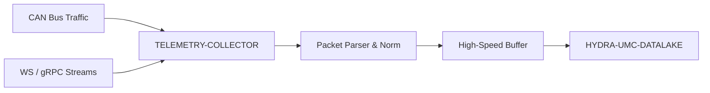

<p align="center">
  
</p>

# 📡 HYDRA-UMC-TELEMETRY-COLLECTOR

<p align="center">🇺🇸 <b>English</b> | <a href="README_spa.md">🇪🇸 Español</a> | <a href="README_fra.md">🇫🇷 Français</a> | <a href="README_ita.md">🇮🇹 Italiano</a> | <a href="README_deu.md">🇩🇪 Deutsch</a> | <a href="README_zho.md">🇨🇳 简体中文</a> | <a href="README_jpn.md">🇯🇵 日本語</a></p>

### 🚀 High-Throughput Ingestion Node for CAN and WebSocket Logs

<p align="left">
  
  
  
</p>

---

## 1. 🛠️ TECHNICAL OVERVIEW

**HYDRA-UMC-TELEMETRY-COLLECTOR** is the high-speed gateway that captures all raw communication within the ecosystem. It listens to the FDCAN buses, WebSocket streams, and gRPC updates, funneling the data into the Datalake.

It performs real-time parsing and normalization of heterogeneous data sources, ensuring that a motor current spike on a CAN bus is correctly correlated with an AI inference result from a Vision Node.

### Key Features:
* 🚀 **Multi-Protocol Ingestion:** Handles CAN, WebSocket, gRPC, and HTTP telemetry.
* ⚡ **High Throughput:** Optimized for thousands of messages per millisecond with minimal CPU overhead.
* 🧬 **Data Normalization:** Translates raw binary packets into standardized JSON/Protobuf formats.
* 🛡️ **Buffered Delivery:** Ensures zero data loss during temporary database outages or network spikes.
* 🔁 **Reconnect-Safe Deduplication:** An optional per-producer sequence number, tracked in a bounded reorder window, so a device that reconnects and resends its last few unacked messages never inflates ingest counts. *(implemented)*
* 🩺 **Real Failure Diagnosis:** Every flush failure is classified as the sink genuinely rejecting the data vs. a transport problem - exposed in `GET /stats` for real operational visibility. *(implemented)*

---

## 2. 🔄 INGESTION WORKFLOW



---

## 3. 🧱 ARCHITECTURE & DESIGN DECISIONS

* **Why `src/` is the Go module root, not the repo root.** Keeps the installable module's own files (`main.go`, `version.go`, `go.mod`) separate from repo-root tooling (`bump_version.py`, `docker-compose.yml`) - `go build ./...` runs from inside `src/`, not the repo root.
* **Why collection is separate from HYDRA-UMC-DATALAKE itself.** Collection (polling HYDRA-UMC-SERVER, buffering, batching writes) is an I/O-bound concern distinct from storage/query - keeping it a separate process means a collector restart or backpressure spike doesn't touch the datalake's own query path.
* **Why a failed sink write requeues the batch instead of dropping it.** `src/collector` is what actually earns the "Buffered Delivery: zero data loss" claim: `FlushOnce` only removes a drained batch from the buffer once `Sink.Write` confirms it, and puts it straight back at the front on failure - a real outage retries the same samples, it doesn't lose them. The buffer (`src/buffer`) is still bounded, though - an outage that outlasts its capacity does drop the oldest excess, a real, honest limit rather than a promise of infinite memory.
* **Why CAN and WebSocket both parse into the same `Sample` shape.** `src/telemetry` normalizes both heterogeneous sources into one struct before anything touches the buffer or the sink - the actual mechanism behind "a motor current spike on CAN correctly correlated with a Vision Node result": neither downstream stage needs to know which protocol a sample arrived over.
* **Why the CAN wire format is this project's own v0 convention, not the ecosystem's real CAN IDs yet.** The real CAN ID tables live in HYDRA-UMC's and URTC's own firmware docs - integrating against them for real is future work (see `mejoras_futuras.txt`), not something to guess at without that reference open.
* **Why `DatalakeSink` writes one sample per HTTP request, and why a partial batch failure can duplicate rows on retry.** HYDRA-UMC-DATALAKE's own `POST /ingest` (see that project's `src/hydra_umc_datalake/api.py`) is single-sample, not batch - a "batch write" here really is N real requests. If one fails partway through a batch, `Write` returns an error and `collector.go`'s own retry logic requeues the WHOLE batch, so already-written samples get re-sent and land as duplicate rows in DATALAKE on the next successful flush. At-least-once with occasional duplicates on a real outage - not silently dropping data (at-most-once) - is this v0's honest trade-off; real exactly-once delivery (idempotency keys, upserts) is future work, see `mejoras_futuras.txt`. `ConsoleSink` (print to stdout) is still the default when `-datalake-url` isn't given, for running this collector standalone.
* **How this fits the rest of the ecosystem.** A sibling service under HYDRA-UMC-DATALAKE - the one component that actually reaches out to HYDRA-UMC-SERVER for per-robot telemetry and writes it into the shared time-series store.
* **Why deduplication is a separate `dedup` package, keyed on an optional `Sequence`, not a hash of the sample's own content.** A real reconnect resends the identical bytes, so content-hashing would work for that case - but it would also silently swallow two genuinely different samples that happen to share every field (e.g. two `0.0` readings a second apart). A per-producer sequence number is what a real device already has to track its own unacked messages, so reusing it is the honest, real signal - not a guess derived from data that doesn't actually promise uniqueness. `Sequence == 0`/omitted opts a producer out entirely, so nothing about pre-existing behavior changed for a device that doesn't send one.
* **Why `sink.InvalidDataError` doesn't change the retry policy, only makes it diagnosable.** `collector.go`'s all-or-nothing requeue-and-retry (see above) stays exactly as it was - a permanently-invalid sample still gets retried like anything else, which is itself a known, documented limitation (see `mejoras_futuras.txt`). What's new is real visibility: `GET /stats`'s `invalidDataErrors` vs. `transportErrors` lets an operator tell "DATALAKE is rejecting our data" apart from "the network to DATALAKE is down" without guessing from logs.

---

## 📂 DIRECTORY STRUCTURE

Pure-software service (ingestion node) - no hardware, firmware or OS of its own; those folders are omitted by repository structure policy.

```text
HYDRA-UMC-TELEMETRY-COLLECTOR/
├── src/                  # Go module
│   ├── go.mod          # Module definition
│   ├── version.go      # const Version = "X.Y.Z"
│   ├── main.go         # Entry point: wires everything, starts the HTTP API
│   ├── telemetry/      # Sample type + CAN/WebSocket parsers (normalization)
│   ├── buffer/         # Bounded, backpressure-reporting FIFO (Ring)
│   ├── dedup/           # Real per-producer sequence deduplication (reorder window)
│   ├── collector/      # Orchestrates ingest+flush, retries on sink failure, dedup
│   ├── sink/           # Where flushed batches go (ConsoleSink today), transport/invalid-data classification
│   └── api/             # Plain JSON/HTTP handlers wrapping the collector
├── docs/
│   └── API.md           # Real HTTP endpoint reference (requests, responses, status codes)
├── images/              # Media and diagrams
├── systemd/
│   └── hydra-umc-telemetry-collector.service # Local CM5 telemetry-ingestion API systemd unit
├── tools/
│   ├── build_test.py    # Non-versioning build/compile check
│   └── ci_validate.py   # Manifest/CHANGELOG/docs validation used by CI
├── build/               # Compiled binaries (gitignored)
├── bump_version.py      # Odometer-style native version bump (run by build)
├── bump_manifest_version.py # Syncs hydra-umc.project.json's version to the native one (--sync)
├── build.sh / build.bat # Real build: bump + go build
├── run.sh / run.bat     # Real run: executes the compiled binary
└── README.md
```

Pruned from the original template: `hardware/`, `firmware/` and `os/` —
this is a pure software service (Go binary) with no dedicated hardware or
firmware of its own and no operating system image to maintain. See
[`docs/API.md`](docs/API.md) for the full
HTTP endpoint reference.

---

## 4. ⚙️ BUILD & RUN GUIDE

Requires Go >= 1.21. A real ingestion pipeline with an HTTP API, not just a
skeleton that compiles.

```bash
# Linux/macOS
./build.sh
./run.sh -addr :8092 -datalake-url http://localhost:8095

# Windows
build.bat
run.bat -addr :8092 -datalake-url http://localhost:8095
```

`build` bumps the version (`src/version.go`) and compiles the Go module in
`src/` into `build/telemetry-collector(.exe)`. `run` executes the compiled
binary, forwarding any flags, and starts listening for real traffic.
`-datalake-url` points flushed batches at a real, running
HYDRA-UMC-DATALAKE instance's `POST /ingest` (`sink.DatalakeSink`) -
omit it to print flushed samples to stdout instead
(`sink.ConsoleSink`), useful for running this collector standalone.

```bash
# Ingest a WebSocket-style telemetry sample
curl -X POST localhost:8092/ingest/ws \
  -d '{"sourceId":"robot-1","kind":"motor_temp","timestamp":1700000000000,"fields":{"value":42.5}}'

# Ingest a CAN frame (8 bytes, base64 - see src/telemetry/can.go for the wire format)
curl -X POST localhost:8092/ingest/can \
  -d '{"arbitrationId":7,"data":"AQAAUEEAAAA="}'

# Check what the collector has ingested/flushed/dropped
curl localhost:8092/stats
```

```bash
cd src && go test ./...   # telemetry (CAN round-trip, WS validation),
                           # buffer (bounded FIFO, backpressure, requeue),
                           # collector (the actual "don't lose data on a
                           # sink outage" behavior), and api (real HTTP
                           # round-trips via httptest)
```

---

## 🚀 ROADMAP
* **Phase 1:** Datalake high-throughput ingestion and indexing for historical analysis.
* **Phase 2:** Telemetry collector edge-compression and secure transmission protocols.
* **Phase 3:** Anomaly detection using unsupervised learning and motor vibration analysis.
* **Phase 4:** Compression-on-the-fly for massive log ingestion and multi-protocol optimization.

---

## 🔗 Related Projects

This project is part of the HYDRA-UMC robotics ecosystem by the same author (JuanenRac / Electro Hobby 3D). Worth knowing about, since a request might actually be about one of these rather than this repository.

**Parent Project**
- **[HYDRA-UMC-DATALAKE](https://github.com/JuanenRac/HYDRA-UMC-DATALAKE)** — real sqlite3-backed time-series store with a real ingest/query HTTP API; the parent this repo is one specific analytics service of, within its own data-and-analytics layer.

**Sibling Projects** — the other analytics services of HYDRA-UMC-DATALAKE's own data-and-analytics layer
- **[HYDRA-UMC-ANOMALY-DETECTOR](https://github.com/JuanenRac/HYDRA-UMC-ANOMALY-DETECTOR)** — real FFT + statistical baseline anomaly detector with drift monitoring.
- **[HYDRA-UMC-PRODUCTION-REPORTS](https://github.com/JuanenRac/HYDRA-UMC-PRODUCTION-REPORTS)** — real OEE/availability calculation over DATALAKE history, with reproducible CSV export.

**Directly Related**
- **[HYDRA-UMC-SERVER](https://github.com/JuanenRac/HYDRA-UMC-SERVER)** — the real headless backend (REST/WebSocket) every control client actually talks to — the source of the logs this project ingests.
- **[HYDRA-UMC](https://github.com/JuanenRac/HYDRA-UMC)** — the physical robot-arm motherboard: CM5 host + dual-core STM32H745, orchestrating up to 8 tool arms over CAN-OTA/SPI-OTA — the real CAN ID table this project's own CAN wire format is meant to eventually integrate against; today it uses its own v0 convention, honestly tracked as future work rather than claimed as done.
- **[URTC](https://github.com/JuanenRac/URTC)** — firmware for the physical Universal Robot Tool Controller PCB, 25+ tool profiles over CAN bus — the real CAN ID table this project's own CAN wire format is meant to eventually integrate against; today it uses its own v0 convention, honestly tracked as future work rather than claimed as done.

**Also Part of the Ecosystem**

*Core Hardware & Platform*
- **[HYDRA-UMC-OS](https://github.com/JuanenRac/HYDRA-UMC-OS)** — reproducible Raspberry Pi OS product layer for the CM5: read-only agent, validated config/profiles, WiFi first-contact provisioning.
- **[HYDRA-UMC-SDK](https://github.com/JuanenRac/HYDRA-UMC-SDK)** — the shared JSON-Schema contract and safety-gate boundary every bridge validates its commands against.

*Core Backend & Clients*
- **[HYDRA-UMC-STUDIO](https://github.com/JuanenRac/HYDRA-UMC-STUDIO)** — web control dashboard with real-time multi-robot 3D visualization.
- **[HYDRA-UMC-SUITE](https://github.com/JuanenRac/HYDRA-UMC-SUITE)** — desktop (PySide6) swarm command center for multiple servers at once, packaged as a standalone executable.
- **[HYDRA-UMC-ANDROID-CONTROL](https://github.com/JuanenRac/HYDRA-UMC-ANDROID-CONTROL)** — native Android control app with biometric login and a paired Wear OS companion.
- **[HYDRA-UMC-IOS-CONTROL](https://github.com/JuanenRac/HYDRA-UMC-IOS-CONTROL)** — iOS/iPadOS control app (Flutter) with real-time WebSocket sync.
- **[HYDRA-UMC-DSI](https://github.com/JuanenRac/HYDRA-UMC-DSI)** — native touch UI for the onboard 7" DSI touchscreen, embedded on the CM5 itself.
- **[HYDRA-UMC-EDITOR-URDF](https://github.com/JuanenRac/HYDRA-UMC-EDITOR-URDF)** — desktop graphical URDF creator/editor that pushes finished models into STUDIO's own catalog.
- **[HYDRA-UMC-BRIDGE-AMR](https://github.com/JuanenRac/HYDRA-UMC-BRIDGE-AMR)** — coordination boundary for AGV/AMR fleets via a real VDA 5050 MQTT publisher.
- **[HYDRA-UMC-BRIDGE-CNC](https://github.com/JuanenRac/HYDRA-UMC-BRIDGE-CNC)** — high-level CNC-cell coordinator with real GRBL status/control-byte access.
- **[HYDRA-UMC-BRIDGE-DROIDS](https://github.com/JuanenRac/HYDRA-UMC-BRIDGE-DROIDS)** — coordination boundary for legged/humanoid droids, with a real Boston Dynamics Spot command sender.
- **[HYDRA-UMC-BRIDGE-LASER](https://github.com/JuanenRac/HYDRA-UMC-BRIDGE-LASER)** — laser-cell safety coordinator reading 3 real key/enclosure/interlock GPIO safeguards.
- **[HYDRA-UMC-BRIDGE-OPENPNP](https://github.com/JuanenRac/HYDRA-UMC-BRIDGE-OPENPNP)** — safe high-level board-flow coordinator for OpenPnP pick-and-place.
- **[HYDRA-UMC-BRIDGE-PRINTER3D](https://github.com/JuanenRac/HYDRA-UMC-BRIDGE-PRINTER3D)** — safe coordination boundary for Moonraker/Klipper 3D printers, with real gated job commands.
- **[HYDRA-UMC-BRIDGE-ROS2](https://github.com/JuanenRac/HYDRA-UMC-BRIDGE-ROS2)** — safety coordinator with a real, lazily-imported rclpy ROS 2 transport.
- **[HYDRA-UMC-BRIDGE-UAV](https://github.com/JuanenRac/HYDRA-UMC-BRIDGE-UAV)** — coordination boundary for camera-equipped UAVs, with a real MAVLink command sender.

*URTC Tool Platform*
- **[URTC-FLASHER](https://github.com/JuanenRac/URTC-FLASHER)** — desktop GUI flashing tool for URTC boards, CAN-OTA plus full-chip SWD/JTAG.
- **[URTC-TESTER](https://github.com/JuanenRac/URTC-TESTER)** — desktop live CAN-bus diagnostic tool for URTC boards, one panel per tool profile.
- **[URTC-WEB-STUDIO](https://github.com/JuanenRac/URTC-WEB-STUDIO)** — browser-based alternative to URTC-TESTER via the Web Serial API, no local install needed.

*Vision AI Node (Hailo-8)*
- **[HYDRA-UMC-VISION-NODE](https://github.com/JuanenRac/HYDRA-UMC-VISION-NODE)** — integration hub for the Hailo-8 vision pipeline, with a real per-stage hardware-readiness check.
- **[HYDRA-UMC-DETECTION-HEF](https://github.com/JuanenRac/HYDRA-UMC-DETECTION-HEF)** — real compiled-model registry with Hailo-architecture/checksum safe-load verification.
- **[HYDRA-UMC-VISION-STREAMER](https://github.com/JuanenRac/HYDRA-UMC-VISION-STREAMER)** — real GStreamer pipeline + MediaMTX config generator with a real HailoRT integration boundary.
- **[HYDRA-UMC-VISUAL-SERVOING-API](https://github.com/JuanenRac/HYDRA-UMC-VISUAL-SERVOING-API)** — real Position-Based Visual Servoing correction law, safety-gated on upstream zone state.
- **[HYDRA-UMC-SAFETY-ZONES](https://github.com/JuanenRac/HYDRA-UMC-SAFETY-ZONES)** — real zone-breach checking and E-STOP requesting, with calibration-freshness enforcement.

*Cognitive AI Node (Hailo-10)*
- **[HYDRA-UMC-COGNITIVE-NODE](https://github.com/JuanenRac/HYDRA-UMC-COGNITIVE-NODE)** — integration hub for the Hailo-10 cognitive pipeline (LLM/VLA/voice orchestration).
- **[HYDRA-UMC-VLA-ENGINE](https://github.com/JuanenRac/HYDRA-UMC-VLA-ENGINE)** — real action-token encoding/decoding and trajectory generation for a Vision-Language-Action model.
- **[HYDRA-UMC-VOICE-UI](https://github.com/JuanenRac/HYDRA-UMC-VOICE-UI)** — real voice front-end (VAD + intent parser) with a bounded, confirmation-gated Watch relay.
- **[HYDRA-UMC-SEMANTIC-PLANNER](https://github.com/JuanenRac/HYDRA-UMC-SEMANTIC-PLANNER)** — real rule-based task decomposition and semantic error recovery over MCU error codes.
- **[HYDRA-UMC-DOCS-QA](https://github.com/JuanenRac/HYDRA-UMC-DOCS-QA)** — real stdlib-only TF-IDF document search over this ecosystem's own Markdown docs.

*Orchestration & Swarm*
- **[HYDRA-UMC-ORCHESTRATOR](https://github.com/JuanenRac/HYDRA-UMC-ORCHESTRATOR)** — integration hub with a real gRPC/Protobuf health-report contract and mission state machine.
- **[HYDRA-UMC-JOB-DISPATCHER](https://github.com/JuanenRac/HYDRA-UMC-JOB-DISPATCHER)** — real priority-based job queue with deduplication, over a real HTTP API.
- **[HYDRA-UMC-NODE-HEALING](https://github.com/JuanenRac/HYDRA-UMC-NODE-HEALING)** — real gRPC-based fleet health watchdog with retry/backoff and identity-mismatch detection.
- **[HYDRA-UMC-PATH-PLANNER-3D](https://github.com/JuanenRac/HYDRA-UMC-PATH-PLANNER-3D)** — real RRT-based 3D path planner with real obstacle/workspace collision validation.
- **[HYDRA-UMC-SWARM-SYNC](https://github.com/JuanenRac/HYDRA-UMC-SWARM-SYNC)** — real CRDT LWW-Element-Map state sync, property-tested for multi-cell convergence.

*Digital Twin & Simulation*
- **[HYDRA-UMC-TWIN](https://github.com/JuanenRac/HYDRA-UMC-TWIN)** — integration hub for the digital-twin engine, with a real version-compatibility sync contract.
- **[HYDRA-UMC-HIL-BRIDGE](https://github.com/JuanenRac/HYDRA-UMC-HIL-BRIDGE)** — real hardware-in-the-loop safety interlock routing commands between simulation and real hardware.
- **[HYDRA-UMC-PHYSICS-REPLICA](https://github.com/JuanenRac/HYDRA-UMC-PHYSICS-REPLICA)** — real forward kinematics and joint-limit validation over a real URDF subset.
- **[HYDRA-UMC-SYNTHETIC-DATA-GEN](https://github.com/JuanenRac/HYDRA-UMC-SYNTHETIC-DATA-GEN)** — real procedural 2D scene generator with YOLO/COCO annotation export.

*Industrial Gateway*
- **[HYDRA-UMC-GATEWAY-INDUSTRIAL](https://github.com/JuanenRac/HYDRA-UMC-GATEWAY-INDUSTRIAL)** — integration hub relaying to industrial protocols, with a real command allowlist/backpressure layer.
- **[HYDRA-UMC-OPCUA-SERVER](https://github.com/JuanenRac/HYDRA-UMC-OPCUA-SERVER)** — real OPC-UA address space, verified with a real binary-protocol client session.
- **[HYDRA-UMC-MQTT-BROKER](https://github.com/JuanenRac/HYDRA-UMC-MQTT-BROKER)** — real MQTT broker with optional per-client authentication and topic ACLs.
- **[HYDRA-UMC-MTCONNECT-ADAPTER](https://github.com/JuanenRac/HYDRA-UMC-MTCONNECT-ADAPTER)** — real MTConnect `/probe` and `/current` XML endpoints with degraded-mode output.

*Complementary Tools & Ecosystem Operations*
- **[HYDRA-UMC-DASHBOARD-AI](https://github.com/JuanenRac/HYDRA-UMC-DASHBOARD-AI)** — Smart Summaries and Anomaly Highlighting panels over DATALAKE/ANOMALY-DETECTOR, with an honest statistical fallback.
- **[HYDRA-UMC-TOOL-CLI](https://github.com/JuanenRac/HYDRA-UMC-TOOL-CLI)** — fleet CLI with a real, stable exit-code contract, a genuine live client of HYDRA-UMC-SERVER's own API.
- **[HYDRA-UMC-WATCH](https://github.com/JuanenRac/HYDRA-UMC-WATCH)** — WearOS companion app with real haptic alerts and a paired-phone voice relay.
- **[URTC-SMART-RACK](https://github.com/JuanenRac/URTC-SMART-RACK)** — firmware for a board-mounting rack with real tool-ID decoding and Smart Idle pre-heating logic.
- **[URTC-VISION-TOOL](https://github.com/JuanenRac/URTC-VISION-TOOL)** — firmware plus a real Python vision companion for a thermal/RGB inspection tool head.
- **[HYDRA-UMC-UPDATER](https://github.com/JuanenRac/HYDRA-UMC-UPDATER)** — administrative desktop tool that discovers, clones and updates every repo in this ecosystem.


---

## 📚 Documentation & Community

- **[CONTRIBUTING.md](CONTRIBUTING.md)** — tech stack and coding guidelines for a pull request.
- **[CODE_OF_CONDUCT.md](CODE_OF_CONDUCT.md)** — the standards of behavior expected in this community.
- **[SECURITY.md](SECURITY.md)** — how to report a vulnerability, and this project's own real security focus areas.
- **[SUPPORT.md](SUPPORT.md)** — where to ask questions and report bugs.
- **[LICENSE.md](LICENSE.md)** — this project's own license.

## 👤 AUTHOR
**JuanenRac** (Electro Hobby 3D)
📧 electrohobby3d@gmail.com
📺 [youtube.com/@electrohobby3d](https://youtube.com/@electrohobby3d)

## 📜 LICENSE
GPL-3.0 - See LICENSE for details.
