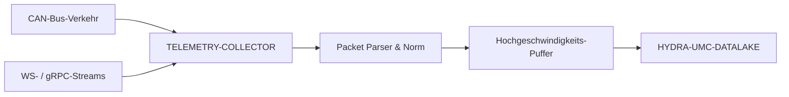

<p align="center">
  
</p>

# 📡 HYDRA-UMC-TELEMETRY-COLLECTOR

<p align="center"><a href="README.md">🇺🇸 English</a> | <a href="README_spa.md">🇪🇸 Español</a> | <a href="README_fra.md">🇫🇷 Français</a> | <a href="README_ita.md">🇮🇹 Italiano</a> | 🇩🇪 <b>Deutsch</b> | <a href="README_zho.md">🇨🇳 简体中文</a> | <a href="README_jpn.md">🇯🇵 日本語</a></p>

### 🚀 High-Throughput-Ingestion-Knoten für CAN- und WebSocket-Logs

<p align="left">
  
  
  
</p>

---

## 1. 🛠️ TECHNISCHER ÜBERBLICK

**HYDRA-UMC-TELEMETRY-COLLECTOR** ist das Hochgeschwindigkeits-Gateway, das die gesamte Rohkommunikation innerhalb del Ökosystems erfasst. Es lauscht auf den FDCAN-Bussen, WebSocket-Streams und gRPC-Updates und leitet die Daten in den Datalake weiter.

Es führt Echtzeit-Parsing und Normalisierung heterogener Datenquellen durch und stellt sicher, dass eine Motorstromspitze auf einem CAN-Bus korrekt mit einem KI-Inferenzergebnis von einem Vision Node korreliert wird.

### Hauptmerkmale:
* 🚀 **Multi-Protokoll-Ingestion:** Verarbeitet CAN-, WebSocket-, gRPC- und HTTP-Telemetrie.
* ⚡ **Hoher Durchsatz:** Optimiert für Tausende von Nachrichten pro Millisekunde mit minimalem CPU-Overhead.
* 🧬 **Daten-Normalisierung:** Übersetzt rohe Binärpakete in standardisierte JSON/Protobuf-Formate.
* 🛡️ **Gepufferte Zustellung:** Gewährleistet null Datenverlust bei vorübergehenden Datenbankausfällen oder Netzwerkspitzen.
* 🔁 **Reconnect-sichere Deduplizierung:** Eine optionale Sequenznummer pro Produzent, verfolgt in einem begrenzten Reorder-Fenster, sodass ein Gerät, das sich neu verbindet und seine letzten unbestätigten Nachrichten erneut sendet, die Ingest-Zählungen niemals aufbläht. *(implementiert)*
* 🩺 **Echte Fehlerdiagnose:** Jeder Flush-Fehler wird klassifiziert als echte Ablehnung der Daten durch den Sink gegenüber einem Transportproblem - offengelegt in `GET /stats` für echte operative Sichtbarkeit. *(implementiert)*

---

## 2. 🔄 INGESTION-WORKFLOW



---

## 3. 🧱 ARCHITEKTUR & DESIGNENTSCHEIDUNGEN

* **Warum `src/` die Go-Modulwurzel ist, nicht das Repo-Root.** Hält die eigenen Dateien des installierbaren Moduls (`main.go`, `version.go`, `go.mod`) getrennt von den Repo-Root-Tools (`bump_version.py`, `docker-compose.yml`) - `go build ./...` läuft von innerhalb `src/`, nicht vom Repo-Root.
* **Warum die Sammlung von HYDRA-UMC-DATALAKE selbst getrennt ist.** Sammlung (HYDRA-UMC-SERVER abfragen, puffern, Schreibvorgänge bündeln) ist ein E/A-gebundenes Anliegen, das sich von Speicherung/Abfrage unterscheidet - es als separaten Prozess zu halten bedeutet, dass ein Neustart des Collectors oder ein Gegendruck-Spitzenwert nicht den eigenen Abfragepfad des Data Lake berührt.
* **Warum ein fehlgeschlagenes Sink-Schreiben den Batch erneut einreiht, statt ihn zu verwerfen.** `src/collector` ist das, was das Versprechen "Gepufferte Zustellung: kein Datenverlust" tatsächlich einlöst: `FlushOnce` entfernt einen abgezapften Batch erst dann aus dem Puffer, wenn `Sink.Write` ihn bestätigt, und legt ihn bei einem Fehler direkt wieder vorne ein - ein echter Ausfall wiederholt dieselben Samples, statt sie zu verlieren. Der Puffer (`src/buffer`) bleibt trotzdem begrenzt - ein Ausfall, der seine Kapazität übersteigt, verwirft tatsächlich die ältesten überzähligen Einträge, eine echte, ehrliche Grenze statt eines Versprechens von unendlichem Speicher.
* **Warum CAN und WebSocket beide in dieselbe `Sample`-Form geparst werden.** `src/telemetry` normalisiert beide heterogenen Quellen zu einer einzigen Struktur, bevor irgendetwas den Puffer oder den Sink berührt - der eigentliche Mechanismus hinter "ein Motorstromspitzenwert auf CAN korrekt korreliert mit einem Ergebnis eines Vision Node": keine nachgelagerte Stufe muss wissen, über welches Protokoll ein Sample eintraf.
* **Warum das CAN-Drahtformat die eigene v0-Konvention dieses Projekts ist, noch nicht die echten CAN-IDs des Ökosystems.** Die echten CAN-ID-Tabellen leben in der eigenen Firmware-Dokumentation von HYDRA-UMC und URTC - die echte Integration dagegen ist künftige Arbeit (siehe `mejoras_futuras.txt`), nichts, das man ohne diese Referenz vor sich erraten sollte.
* **Warum `DatalakeSink` ein Sample pro HTTP-Anfrage schreibt und warum ein teilweiser Batch-Fehler bei einem erneuten Versuch Zeilen duplizieren kann.** HYDRA-UMC-DATALAKEs eigenes `POST /ingest` (siehe `src/hydra_umc_datalake/api.py` dieses Projekts) ist Single-Sample, kein Batch - ein "Batch-Write" hier bedeutet in Wirklichkeit N echte Anfragen. Schlägt eine mitten in einem Batch fehl, gibt `Write` einen Fehler zurück, und die eigene Retry-Logik von `collector.go` reiht den GESAMTEN Batch wieder vorne ein - bereits geschriebene Samples werden erneut gesendet und landen beim nächsten erfolgreichen Flush als doppelte Zeilen in DATALAKE. Mindestens-einmal mit gelegentlichen Duplikaten bei einem echten Ausfall - statt Daten still zu verlieren (höchstens-einmal) - ist der ehrliche Kompromiss dieser v0; eine echte Genau-einmal-Zustellung (Idempotenzschlüssel, Upserts) ist künftige Arbeit, siehe `mejoras_futuras.txt`. `ConsoleSink` (Ausgabe auf stdout) bleibt der Standard, wenn `-datalake-url` nicht angegeben wird, um diesen Collector eigenständig auszuführen.
* **Wie sich das ins restliche Ökosystem einfügt.** Ein Geschwisterdienst unter HYDRA-UMC-DATALAKE - die Komponente, die tatsächlich HYDRA-UMC-SERVER für Telemetrie pro Roboter kontaktiert und sie in den gemeinsamen Zeitreihenspeicher schreibt.
* **Warum Deduplizierung ein separates `dedup`-Paket ist, das auf einer optionalen `Sequence` basiert, nicht auf einem Hash des Sample-Inhalts selbst.** Eine echte Reconnect sendet exakt dieselben Bytes erneut, daher würde Content-Hashing für diesen Fall funktionieren - aber es würde auch still zwei echt unterschiedliche Samples verschlucken, die zufällig alle Felder teilen (z. B. zwei `0.0`-Messwerte im Abstand einer Sekunde). Eine Sequenznummer pro Produzent ist das, was ein echtes Gerät ohnehin schon verfolgen muss, um seine eigenen unbestätigten Nachrichten im Blick zu behalten - sie wiederzuverwenden ist also das ehrliche, echte Signal, keine Vermutung, die aus Daten abgeleitet wird, die tatsächlich keine Eindeutigkeit versprechen. `Sequence == 0`/weggelassen nimmt einen Produzenten vollständig aus, sodass sich am bestehenden Verhalten für ein Gerät, das keine sendet, nichts ändert.
* **Warum `sink.InvalidDataError` die Retry-Policy nicht ändert, sondern sie nur diagnostizierbar macht.** Das Alles-oder-nichts-Requeue-und-Retry von `collector.go` (siehe oben) bleibt exakt so, wie es war - ein dauerhaft ungültiges Sample wird weiterhin wie jedes andere erneut versucht, was selbst eine bekannte, dokumentierte Einschränkung ist (siehe `mejoras_futuras.txt`). Neu ist echte Sichtbarkeit: `invalidDataErrors` gegenüber `transportErrors` in `GET /stats` lässt einen Operator "DATALAKE lehnt unsere Daten ab" von "das Netzwerk zu DATALAKE ist ausgefallen" unterscheiden, ohne aus Logs raten zu müssen.

---

## 📂 VERZEICHNISSTRUKTUR

Reiner Software-Dienst (Ingestion-Knoten) - ohne eigene Hardware, Firmware oder Betriebssystem; diese Ordner werden gemäß der Repository-Strukturpolitik ausgelassen.

```text
HYDRA-UMC-TELEMETRY-COLLECTOR/
├── src/                  # Go-Modul
│   ├── go.mod            # Modul-Definition
│   ├── version.go        # const Version = "X.Y.Z"
│   ├── main.go           # Einstiegspunkt: verbindet alles, startet die HTTP-API
│   ├── telemetry/        # Sample-Typ + CAN/WebSocket-Parser (Normalisierung)
│   ├── buffer/           # Begrenzte FIFO mit Gegendruck-Meldung (Ring)
│   ├── dedup/            # Echte Deduplizierung per Sequenz pro Produzent (Reorder-Fenster)
│   ├── collector/        # Orchestriert Ingest+Flush, wiederholt bei Sink-Fehler, Dedup
│   ├── sink/              # Wohin geflushte Batches gehen (heute ConsoleSink), Transport-/Invalid-Data-Klassifizierung
│   └── api/                # Einfache JSON/HTTP-Handler, die den Collector umschließen
├── docs/
│   └── API.md              # Echte HTTP-Endpunktreferenz (Requests, Responses, Statuscodes)
├── build/                # Kompilierte Binärdateien (von git ignoriert)
├── bump_version.py        # Versionserhöhung im "Kilometerzähler"-Stil (vom Build ausgeführt)
├── build.sh / build.bat   # Echter Build: Bump + go build
├── run.sh / run.bat       # Echte Ausführung: startet die kompilierte Binärdatei
└── README.md
```

Aus der ursprünglichen Vorlage entfernt: `hardware/`, `firmware/`, `os/`,
`images/` und `scripts/` — dies ist ein reiner Softwaredienst
(Go-Binärdatei) ohne eigene Hardware oder Firmware, ohne zu pflegendes
Betriebssystem-Image, und ohne Medien-/Utility-Skript-Inhalt, der eigene
Ordner bislang rechtfertigen würde. Siehe [`docs/API.md`](docs/API.md)
für die vollständige HTTP-Endpunktreferenz.

---

## 4. ⚙️ BUILD & AUSFÜHRUNG

Erfordert Go >= 1.21. Eine echte Ingestion-Pipeline mit HTTP-API, nicht nur
ein kompilierbares Skelett.

```bash
# Linux/macOS
./build.sh
./run.sh -addr :8092 -datalake-url http://localhost:8095

# Windows
build.bat
run.bat -addr :8092 -datalake-url http://localhost:8095
```

`build` erhöht die Version (`src/version.go`) und kompiliert das Go-Modul
in `src/` zu `build/telemetry-collector(.exe)`. `run` führt die
kompilierte Binärdatei aus, reicht dabei jedes Flag weiter, und beginnt,
echten Verkehr entgegenzunehmen. `-datalake-url` lenkt geleerte Batches
an eine echte, laufende HYDRA-UMC-DATALAKE-Instanz (`POST /ingest`,
`sink.DatalakeSink`) - wird es weggelassen, werden geleerte Samples
stattdessen auf stdout ausgegeben (`sink.ConsoleSink`), nützlich um
diesen Collector eigenständig auszuführen:

```bash
# Ein WebSocket-artiges Telemetrie-Sample einspeisen
curl -X POST localhost:8092/ingest/ws \
  -d '{"sourceId":"robot-1","kind":"motor_temp","timestamp":1700000000000,"fields":{"value":42.5}}'

# Einen CAN-Frame einspeisen (8 Bytes, base64 - siehe src/telemetry/can.go für das Format)
curl -X POST localhost:8092/ingest/can \
  -d '{"arbitrationId":7,"data":"AQAAUEEAAAA="}'

# Nachsehen, was der Collector eingelesen/geflusht/verworfen hat
curl localhost:8092/stats
```

```bash
cd src && go test ./...   # telemetry (CAN-Roundtrip, WS-Validierung),
                           # buffer (begrenzte FIFO, Gegendruck, Requeue),
                           # collector (das tatsächliche "kein Datenverlust
                           # bei einem Sink-Ausfall"-Verhalten), und api
                           # (echte HTTP-Roundtrips via httptest)
```

---

## 🚀 FAHRPLAN
* **Phase 1:** Hochdurchsatz-Ingestion und Indexierung des Datalakes für historische Analysen.
* **Phase 2:** Edge-Kompression des Telemetrie-Collectors und sichere Übertragungsprotokolle.
* **Phase 3:** Anomalieerkennung mittels unüberwachtem Lernen und Motorvibrationsanalyse.
* **Phase 4:** Compression-on-the-fly für massive Log-Aufnahme und Multi-Protokoll-Optimierung.

---

## 🔗 Verwandte Projekte

Dieses Projekt ist Teil eines größeren Robotik-Ökosystems desselben Autors (JuanenRac / Electro Hobby 3D), das Firmware, Steuerungssoftware, KI-Knoten und Flotten-Tools umfasst. Gut zu wissen, denn eine Anfrage könnte tatsächlich eines dieser Projekte betreffen statt dieses Repository.

### Familie

**Elternteil:** **[HYDRA-UMC-DATALAKE](https://github.com/JuanenRac/HYDRA-UMC-DATALAKE)** — der Integrations-Elternteil, den dieser Collector speist.

**Geschwister:**
- **[HYDRA-UMC-ANOMALY-DETECTOR](https://github.com/JuanenRac/HYDRA-UMC-ANOMALY-DETECTOR)** — Geschwister-Analysedienst, gleicher Elternteil.
- **[HYDRA-UMC-PRODUCTION-REPORTS](https://github.com/JuanenRac/HYDRA-UMC-PRODUCTION-REPORTS)** — Geschwister-Analysedienst, gleicher Elternteil.

### Direkte Beziehung (außerhalb der Familie)

- **[HYDRA-UMC-SERVER](https://github.com/JuanenRac/HYDRA-UMC-SERVER)** — die Quelle der von diesem Projekt aufgenommenen Logs.
- **[HYDRA-UMC](https://github.com/JuanenRac/HYDRA-UMC)** / **[URTC](https://github.com/JuanenRac/URTC)** — die echten CAN-ID-Tabellen, gegen die das eigene CAN-Drahtformat v0 dieses Projekts eines Tages integriert werden soll; heute verwendet es seine eigene v0-Konvention, ehrlich als zukünftige Arbeit in `mejoras_futuras.txt` nachverfolgt statt als erledigt behauptet.

### Restliches Ökosystem

**HYDRA-UMC-Plattform** — die Multi-Roboter-Mikrofabrikzelle
- **[HYDRA-UMC](https://github.com/JuanenRac/HYDRA-UMC)** — das CM5 + STM32H745-Motherboard, das bis zu 8 Roboterarme orchestriert.
- **[HYDRA-UMC-SERVER](https://github.com/JuanenRac/HYDRA-UMC-SERVER)** — das Express/WebSocket-Backend, mit dem jeder Steuerungsclient spricht.
- **[HYDRA-UMC-STUDIO](https://github.com/JuanenRac/HYDRA-UMC-STUDIO)** — webbasiertes Steuerungs-Dashboard, Multi-Roboter-3D-Visualisierung.
- **[HYDRA-UMC-ANDROID-CONTROL](https://github.com/JuanenRac/HYDRA-UMC-ANDROID-CONTROL)** — Android-Steuerungs-App über Wi-Fi/Bluetooth.
- **[HYDRA-UMC-IOS-CONTROL](https://github.com/JuanenRac/HYDRA-UMC-IOS-CONTROL)** — iOS/iPadOS-Steuerungs-App, gebaut in Flutter.
- **[HYDRA-UMC-SUITE](https://github.com/JuanenRac/HYDRA-UMC-SUITE)** — Desktop-Schwarm-Kommandozentrale (Python/PySide6).
- **[HYDRA-UMC-EDITOR-URDF](https://github.com/JuanenRac/HYDRA-UMC-EDITOR-URDF)** — Desktop-URDF-Modelleditor für den Roboterkatalog.
- **[HYDRA-UMC-DSI](https://github.com/JuanenRac/HYDRA-UMC-DSI)** — native Touch-UI für den eingebauten DSI-Touchscreen.

**URTC-Plattform** — der Werkzeugkopf-Controller, den jeder HYDRA-UMC-Roboterarm trägt
- **[URTC](https://github.com/JuanenRac/URTC)** — CAN-Bus-Werkzeugkopf-Controller, 25 Werkzeugprofile.
- **[URTC-FLASHER](https://github.com/JuanenRac/URTC-FLASHER)** — Desktop-Tool für CAN-OTA + SWD/JTAG-Flashing.
- **[URTC-TESTER](https://github.com/JuanenRac/URTC-TESTER)** — Desktop-Tool für Live-CAN-Bus-Diagnose.
- **[URTC-WEB-STUDIO](https://github.com/JuanenRac/URTC-WEB-STUDIO)** — browserbasierte Alternative über die Web-Serial-API.

**🎥 Vision-KI-Knoten (Hailo-8)**
- [HYDRA-UMC-VISION-NODE](https://github.com/JuanenRac/HYDRA-UMC-VISION-NODE)
- [HYDRA-UMC-VISION-STREAMER](https://github.com/JuanenRac/HYDRA-UMC-VISION-STREAMER)
- [HYDRA-UMC-DETECTION-HEF](https://github.com/JuanenRac/HYDRA-UMC-DETECTION-HEF)
- [HYDRA-UMC-SAFETY-ZONES](https://github.com/JuanenRac/HYDRA-UMC-SAFETY-ZONES)
- [HYDRA-UMC-VISUAL-SERVOING-API](https://github.com/JuanenRac/HYDRA-UMC-VISUAL-SERVOING-API)

**🧠 Kognitiver KI-Knoten (Hailo-10)**
- [HYDRA-UMC-COGNITIVE-NODE](https://github.com/JuanenRac/HYDRA-UMC-COGNITIVE-NODE)
- [HYDRA-UMC-VLA-ENGINE](https://github.com/JuanenRac/HYDRA-UMC-VLA-ENGINE)
- [HYDRA-UMC-VOICE-UI](https://github.com/JuanenRac/HYDRA-UMC-VOICE-UI)
- [HYDRA-UMC-SEMANTIC-PLANNER](https://github.com/JuanenRac/HYDRA-UMC-SEMANTIC-PLANNER)
- [HYDRA-UMC-DOCS-QA](https://github.com/JuanenRac/HYDRA-UMC-DOCS-QA)

**🐝 Orchestrierung & Schwarm**
- [HYDRA-UMC-ORCHESTRATOR](https://github.com/JuanenRac/HYDRA-UMC-ORCHESTRATOR)
- [HYDRA-UMC-SWARM-SYNC](https://github.com/JuanenRac/HYDRA-UMC-SWARM-SYNC)
- [HYDRA-UMC-PATH-PLANNER-3D](https://github.com/JuanenRac/HYDRA-UMC-PATH-PLANNER-3D)
- [HYDRA-UMC-JOB-DISPATCHER](https://github.com/JuanenRac/HYDRA-UMC-JOB-DISPATCHER)
- [HYDRA-UMC-NODE-HEALING](https://github.com/JuanenRac/HYDRA-UMC-NODE-HEALING)

**🎮 Digitaler Zwilling & Simulation**
- [HYDRA-UMC-TWIN](https://github.com/JuanenRac/HYDRA-UMC-TWIN)
- [HYDRA-UMC-PHYSICS-REPLICA](https://github.com/JuanenRac/HYDRA-UMC-PHYSICS-REPLICA)
- [HYDRA-UMC-HIL-BRIDGE](https://github.com/JuanenRac/HYDRA-UMC-HIL-BRIDGE)
- [HYDRA-UMC-SYNTHETIC-DATA-GEN](https://github.com/JuanenRac/HYDRA-UMC-SYNTHETIC-DATA-GEN)

**🏭 Industrielles Gateway**
- [HYDRA-UMC-GATEWAY-INDUSTRIAL](https://github.com/JuanenRac/HYDRA-UMC-GATEWAY-INDUSTRIAL)
- [HYDRA-UMC-OPCUA-SERVER](https://github.com/JuanenRac/HYDRA-UMC-OPCUA-SERVER)
- [HYDRA-UMC-MQTT-BROKER](https://github.com/JuanenRac/HYDRA-UMC-MQTT-BROKER)
- [HYDRA-UMC-MTCONNECT-ADAPTER](https://github.com/JuanenRac/HYDRA-UMC-MTCONNECT-ADAPTER)

**🛠️ Ergänzende Werkzeuge**
- [URTC-SMART-RACK](https://github.com/JuanenRac/URTC-SMART-RACK)
- [URTC-VISION-TOOL](https://github.com/JuanenRac/URTC-VISION-TOOL)
- [HYDRA-UMC-WATCH](https://github.com/JuanenRac/HYDRA-UMC-WATCH)
- [HYDRA-UMC-TOOL-CLI](https://github.com/JuanenRac/HYDRA-UMC-TOOL-CLI)
- [HYDRA-UMC-DASHBOARD-AI](https://github.com/JuanenRac/HYDRA-UMC-DASHBOARD-AI)


## 👤 AUTOR
**JuanenRac** (Electro Hobby 3D)
📧 electrohobby3d@gmail.com
📺 [youtube.com/@electrohobby3d](https://youtube.com/@electrohobby3d)

## 📜 LIZENZ
GPL-3.0 - Siehe LICENSE für Details.
