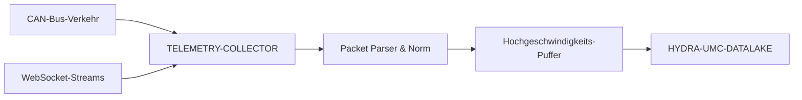

<p align="center">
  
</p>

# 📡 HYDRA-UMC-TELEMETRY-COLLECTOR

<p align="center"><a href="README.md">🇺🇸 English</a> | <a href="README_spa.md">🇪🇸 Español</a> | <a href="README_fra.md">🇫🇷 Français</a> | <a href="README_ita.md">🇮🇹 Italiano</a> | 🇩🇪 <b>Deutsch</b> | <a href="README_zho.md">🇨🇳 简体中文</a> | <a href="README_jpn.md">🇯🇵 日本語</a></p>

### 🚀 High-Throughput-Ingestion-Knoten für CAN- und WebSocket-Logs

<p align="center">
  
  
  
</p>

**Ehrlichkeitscheck - was heute wirklich läuft:** die echte Ingestion-Pipeline - `telemetry`, das CAN-Frames und WebSocket-JSON in ein normalisiertes `Sample` parst, der begrenzte Ring mit Rückstau-Meldung von `buffer`, die Ingest+Flush-Orchestrierung von `collector` (ein fehlgeschlagener Sink-Schreibvorgang reiht den gesamten Batch erneut ein, statt ihn zu verlieren), die wiederverbindungssichere Sequenznachverfolgung pro Produzent von `dedup`, und der echte `DatalakeSink` von `sink` (getestet gegen einen echten `net/http/httptest.Server`, der DATALAKEs eigenen `POST /ingest` implementiert) oder dessen `ConsoleSink`-Fallback - sind alle real und getestet (48 Tests, `go test ./...`). Zwei echte Lücken, die man vor der Integration kennen sollte: dieser Collector öffnet selbst keine echte Verbindung zu einem physischen FDCAN-Bus und akzeptiert keine echten WebSocket-Live-Verbindungen von einem Roboter - die Ingestion erfolgt über seine eigene einfache HTTP-API (`POST /ingest/can`, `POST /ingest/ws`), etwas anderes muss den echten Bus/Socket also noch lesen und Frames hierher weiterleiten. Und das eigene CAN-Frame-Format von `telemetry/can.go` (Signal-Code-Byte + float32-Wert) ist eine eigene, selbst erklärte v0-Konvention dieses Projekts, noch nicht die tatsächlichen, vom Ökosystem dokumentierten CAN-ID-Tabellen aus der eigenen Firmware von HYDRA-UMC/URTC - bewusst nicht geraten. Die Ausgabe ist nur echtes JSON; das eigene "JSON/Protobuf" des READMEs und die gRPC-Ingestion sind weiterhin geplant, nirgendwo in diesem Code implementiert. Siehe `CHANGELOG.md` für das, was bisher genau ausgeliefert wurde.

---

## 1. 🛠️ TECHNISCHER ÜBERBLICK

**HYDRA-UMC-TELEMETRY-COLLECTOR** ist das Hochgeschwindigkeits-Gateway, das die gesamte Rohkommunikation innerhalb del Ökosystems erfasst. Es lauscht auf den FDCAN-Bussen und WebSocket-Streams und leitet die Daten in den Datalake weiter.

Es führt Echtzeit-Parsing und Normalisierung heterogener Datenquellen durch und stellt sicher, dass eine Motorstromspitze auf einem CAN-Bus korrekt mit einem KI-Inferenzergebnis von einem Vision Node korreliert wird.

### Hauptmerkmale:
* 🚀 **Multi-Protokoll-Ingestion:** Verarbeitet heute CAN- und WebSocket-Telemetrie über eine einfache HTTP-Ingest-API. *(gRPC-Ingestion ist geplant)*
* ⚡ **Hoher Durchsatz:** Optimiert für Tausende von Nachrichten pro Millisekunde mit minimalem CPU-Overhead.
* 🧬 **Daten-Normalisierung:** Übersetzt rohe Binärpakete in ein standardisiertes JSON-Format. *(Protobuf-Ausgabe ist geplant, nicht implementiert)*
* 🛡️ **Gepufferte Zustellung:** Gewährleistet null Datenverlust bei vorübergehenden Datenbankausfällen oder Netzwerkspitzen.
* 🔁 **Reconnect-sichere Deduplizierung:** Eine optionale Sequenznummer pro Produzent, verfolgt in einem begrenzten Reorder-Fenster, sodass ein Gerät, das sich neu verbindet und seine letzten unbestätigten Nachrichten erneut sendet, die Ingest-Zählungen niemals aufbläht. *(implementiert)*
* 🩺 **Echte Fehlerdiagnose:** Jeder Flush-Fehler wird klassifiziert als echte Ablehnung der Daten durch den Sink gegenüber einem Transportproblem - offengelegt in `GET /stats` für echte operative Sichtbarkeit. *(implementiert)*
* 🧮 **Validierung endlicher Felder:** Ein leerer Feldname oder ein `NaN`/`Infinity`/`-Infinity`-Zahlenwert wird abgelehnt (`400`), bevor er den Puffer oder einen Sink erreicht - die CAN-Dekodierung durchläuft dieselbe `Sample.Validate()`-Prüfung wie die JSON-Aufnahme. *(implementiert)*

---

## 2. 🔄 INGESTION-WORKFLOW



---

## 3. 🧱 ARCHITEKTUR & DESIGNENTSCHEIDUNGEN

* **Warum `src/` die Go-Modulwurzel ist, nicht das Repo-Root.** Hält die eigenen Dateien des installierbaren Moduls (`main.go`, `version.go`, `go.mod`) getrennt von den Repo-Root-Tools (`bump_version.py`, `docker-compose.yml`) - `go build ./...` läuft von innerhalb `src/`, nicht vom Repo-Root.
* **Warum die Sammlung von HYDRA-UMC-DATALAKE selbst getrennt ist.** Sammlung (HYDRA-UMC-SERVER abfragen, puffern, Schreibvorgänge bündeln) ist ein E/A-gebundenes Anliegen, das sich von Speicherung/Abfrage unterscheidet - es als separaten Prozess zu halten bedeutet, dass ein Neustart des Collectors oder ein Gegendruck-Spitzenwert nicht den eigenen Abfragepfad des Data Lake berührt.
* **Warum ein fehlgeschlagenes Sink-Schreiben den Batch erneut einreiht, statt ihn zu verwerfen - außer dem einen Sample, das niemals erfolgreich sein wird.** `src/collector` ist das, was das Versprechen "Gepufferte Zustellung: kein Datenverlust" tatsächlich einlöst: `FlushOnce` entfernt einen abgezapften Batch erst dann aus dem Puffer, wenn `Sink.Write` ihn bestätigt, und legt ihn bei einem Transportfehler direkt wieder vorne ein - ein echter Ausfall wiederholt dieselben Samples, statt sie zu verlieren. Die einzige Ausnahme ist ein Sample, das der Sink selbst DAUERHAFT als ungültig abgelehnt hat (siehe `sink.InvalidDataError` unten) - es bedingungslos erneut einzureihen, stellte es früher für immer wieder ganz nach vorne und blockierte jedes gültige Sample dahinter; jetzt wird es stattdessen unter Quarantäne gestellt (verworfen, gezählt in `GET /stats`s `quarantined`), während der Rest des Batches wie gewohnt erneut eingereiht wird. Der Puffer (`src/buffer`) bleibt trotzdem begrenzt - ein Ausfall, der seine Kapazität übersteigt, verwirft tatsächlich die ältesten überzähligen Einträge, eine echte, ehrliche Grenze statt eines Versprechens von unendlichem Speicher.
* **Warum CAN und WebSocket beide in dieselbe `Sample`-Form geparst werden.** `src/telemetry` normalisiert beide heterogenen Quellen zu einer einzigen Struktur, bevor irgendetwas den Puffer oder den Sink berührt - der eigentliche Mechanismus hinter "ein Motorstromspitzenwert auf CAN korrekt korreliert mit einem Ergebnis eines Vision Node": keine nachgelagerte Stufe muss wissen, über welches Protokoll ein Sample eintraf.
* **Warum das CAN-Drahtformat die eigene v0-Konvention dieses Projekts ist, noch nicht die echten CAN-IDs des Ökosystems.** Die echten CAN-ID-Tabellen leben in der eigenen Firmware-Dokumentation von HYDRA-UMC und URTC - die echte Integration dagegen ist künftige Arbeit, nichts, das man ohne diese Referenz vor sich erraten sollte.
* **Warum `DatalakeSink` ein Sample pro HTTP-Anfrage schreibt und warum ein teilweiser Batch-Fehler bei einem erneuten Versuch Zeilen duplizieren kann.** HYDRA-UMC-DATALAKEs eigenes `POST /ingest` (siehe `src/hydra_umc_datalake/api.py` dieses Projekts) ist Single-Sample, kein Batch - ein "Batch-Write" hier bedeutet in Wirklichkeit N echte Anfragen. Schlägt eine mitten in einem Batch fehl, gibt `Write` einen Fehler zurück, und die eigene Retry-Logik von `collector.go` reiht den GESAMTEN Batch wieder vorne ein - bereits geschriebene Samples werden erneut gesendet und landen beim nächsten erfolgreichen Flush als doppelte Zeilen in DATALAKE. Mindestens-einmal mit gelegentlichen Duplikaten bei einem echten Ausfall - statt Daten still zu verlieren (höchstens-einmal) - ist der ehrliche Kompromiss dieser v0; eine echte Genau-einmal-Zustellung (Idempotenzschlüssel, Upserts) ist künftige Arbeit, hier nicht versucht. `ConsoleSink` (Ausgabe auf stdout) bleibt der Standard, wenn `-datalake-url` nicht angegeben wird, um diesen Collector eigenständig auszuführen.
* **Wie sich das ins restliche Ökosystem einfügt.** Ein Geschwisterdienst unter HYDRA-UMC-DATALAKE - die Komponente, die tatsächlich HYDRA-UMC-SERVER für Telemetrie pro Roboter kontaktiert und sie in den gemeinsamen Zeitreihenspeicher schreibt.
* **Warum Deduplizierung ein separates `dedup`-Paket ist, das auf einer optionalen `Sequence` basiert, nicht auf einem Hash des Sample-Inhalts selbst.** Eine echte Reconnect sendet exakt dieselben Bytes erneut, daher würde Content-Hashing für diesen Fall funktionieren - aber es würde auch still zwei echt unterschiedliche Samples verschlucken, die zufällig alle Felder teilen (z. B. zwei `0.0`-Messwerte im Abstand einer Sekunde). Eine Sequenznummer pro Produzent ist das, was ein echtes Gerät ohnehin schon verfolgen muss, um seine eigenen unbestätigten Nachrichten im Blick zu behalten - sie wiederzuverwenden ist also das ehrliche, echte Signal, keine Vermutung, die aus Daten abgeleitet wird, die tatsächlich keine Eindeutigkeit versprechen. `Sequence == 0`/weggelassen nimmt einen Produzenten vollständig aus, sodass sich am bestehenden Verhalten für ein Gerät, das keine sendet, nichts ändert.
* **Warum `sink.InvalidDataError` den `Index` des abgelehnten Samples innerhalb des Batches trägt.** Beim Auditieren des Codes gefunden (P1): `DatalakeSink.Write` sendet ein Sample pro HTTP-Anfrage und stoppt beim ersten Fehler - wenn DATALAKE also einen echten HTTP 400 für ein bestimmtes Sample zurückgibt, markiert `Write` dessen Position im Batch auf dem Fehler selbst, bevor es ihn zurückgibt. `FlushOnce` nutzt das, um genau dieses eine Sample unter Quarantäne zu stellen (dauerhaft zu verwerfen, nie erneut einzureihen) - ein Wiederholen der identischen abgelehnten Bytes kann niemals erfolgreich sein - während der Rest des Batches weiterhin normal erneut eingereiht wird, statt dass der gesamte Batch für immer hinter einem vergifteten Sample erneut versucht (und erneut blockiert) wird. `quarantined` in `GET /stats` zählt jedes so verworfene Sample, getrennt von `invalidDataErrors` (Flush-Versuche, keine Samples) und von `dropped` (eine Kapazitätsgrenze des vollen Puffers, keine dauerhafte Ablehnung) - nichts davon ist also ein stilles Verwerfen, und `invalidDataErrors` gegenüber `transportErrors` lässt einen Operator weiterhin "DATALAKE lehnt unsere Daten ab" von "das Netzwerk zu DATALAKE ist ausgefallen" unterscheiden, ohne aus Logs raten zu müssen.

---

## 📂 VERZEICHNISSTRUKTUR

Reiner Software-Dienst (Ingestion-Knoten) - ohne eigene Hardware, Firmware oder Betriebssystem; diese Ordner werden gemäß der Repository-Strukturpolitik ausgelassen.

```text
HYDRA-UMC-TELEMETRY-COLLECTOR/
├── src/                  # Go-Modul
│   ├── go.mod            # Modul-Definition
│   ├── version.go        # const Version = "X.Y.Z"
│   ├── main.go           # Einstiegspunkt: verbindet alles, startet die HTTP-API
│   ├── telemetry/        # Sample-Typ + CAN/WebSocket-Parser (Normalisierung)
│   ├── buffer/           # Begrenzte FIFO mit Gegendruck-Meldung (Ring)
│   ├── dedup/            # Echte Deduplizierung per Sequenz pro Produzent (Reorder-Fenster)
│   ├── collector/        # Orchestriert Ingest+Flush, wiederholt bei Sink-Fehler, Dedup
│   ├── sink/              # Wohin geflushte Batches gehen (heute ConsoleSink), Transport-/Invalid-Data-Klassifizierung
│   └── api/                # Einfache JSON/HTTP-Handler, die den Collector umschließen
├── docs/
│   └── API.md              # Echte HTTP-Endpunktreferenz (Requests, Responses, Statuscodes)
├── images/               # Medien und Diagramme
├── systemd/
│   └── hydra-umc-telemetry-collector.service # systemd-Unit der lokalen CM5-Telemetrie-Erfassungs-API
├── tools/
│   ├── build_test.py     # Nicht-versionierender Build-Check
│   └── ci_validate.py    # Manifest/CHANGELOG/Docs-Validierung, von CI genutzt
├── build/                # Kompilierte Binärdateien (von git ignoriert)
├── bump_version.py        # Native Versionserhöhung im "Kilometerzähler"-Stil (vom Build ausgeführt)
├── bump_manifest_version.py # Synchronisiert die Version von hydra-umc.project.json mit der nativen (--sync)
├── build.sh / build.bat   # Echter Build: Bump + go build
├── run.sh / run.bat       # Echte Ausführung: startet die kompilierte Binärdatei
└── README.md
```

Aus der ursprünglichen Vorlage entfernt: `hardware/`, `firmware/` und
`os/` — dies ist ein reiner Softwaredienst (Go-Binärdatei) ohne eigene
Hardware oder Firmware und ohne zu pflegendes Betriebssystem-Image. Siehe [`docs/API.md`](docs/API.md)
für die vollständige HTTP-Endpunktreferenz.

---

## 4. ⚙️ BUILD & AUSFÜHRUNG

Erfordert Go >= 1.21. Eine echte Ingestion-Pipeline mit HTTP-API, nicht nur
ein kompilierbares Skelett.

```bash
# Linux/macOS
./build.sh
./run.sh -addr 127.0.0.1:8092 -datalake-url http://localhost:8095

# Windows
build.bat
run.bat -addr 127.0.0.1:8092 -datalake-url http://localhost:8095
```

`build` erhöht die Version (`src/version.go`) und kompiliert das Go-Modul
in `src/` zu `build/telemetry-collector(.exe)`. `run` führt die
kompilierte Binärdatei aus, reicht dabei jedes Flag weiter, und beginnt,
echten Verkehr entgegenzunehmen. `-datalake-url` lenkt geleerte Batches
an eine echte, laufende HYDRA-UMC-DATALAKE-Instanz (`POST /ingest`,
`sink.DatalakeSink`) - wird es weggelassen, werden geleerte Samples
stattdessen auf stdout ausgegeben (`sink.ConsoleSink`), nützlich um
diesen Collector eigenständig auszuführen:

```bash
# Ein WebSocket-artiges Telemetrie-Sample einspeisen
curl -X POST localhost:8092/ingest/ws \
  -d '{"sourceId":"robot-1","kind":"motor_temp","timestamp":1700000000000,"fields":{"value":42.5}}'

# Einen CAN-Frame einspeisen (8 Bytes, base64 - siehe src/telemetry/can.go für das Format)
curl -X POST localhost:8092/ingest/can \
  -d '{"arbitrationId":7,"data":"AQAAUEEAAAA="}'

# Nachsehen, was der Collector eingelesen/geflusht/verworfen hat
curl localhost:8092/stats
```

```bash
cd src && go test ./...   # telemetry (CAN-Roundtrip, WS-Validierung),
                           # buffer (begrenzte FIFO, Gegendruck, Requeue),
                           # collector (das tatsächliche "kein Datenverlust
                           # bei einem Sink-Ausfall"-Verhalten), und api
                           # (echte HTTP-Roundtrips via httptest)
```

---

## 🚀 FAHRPLAN
* **Phase 1:** Hochdurchsatz-Ingestion und Indexierung des Datalakes für historische Analysen.
* **Phase 2:** Edge-Kompression des Telemetrie-Collectors und sichere Übertragungsprotokolle.
* **Phase 3:** Anomalieerkennung mittels unüberwachtem Lernen und Motorvibrationsanalyse.
* **Phase 4:** Compression-on-the-fly für massive Log-Aufnahme und Multi-Protokoll-Optimierung.

---

## 🔗 Verwandte Projekte

Dieses Projekt ist Teil des HYDRA-UMC-Robotik-Ökosystems desselben Autors (JuanenRac / Electro Hobby 3D). Gut zu wissen, da eine Anfrage eigentlich eines dieser Projekte betreffen könnte statt dieses Repositorys.

**Übergeordnetes Projekt**
- **[HYDRA-UMC-DATALAKE](https://github.com/JuanenRac/HYDRA-UMC-DATALAKE)** — echter sqlite3-gestützter Zeitreihenspeicher mit einer echten Ingest-/Abfrage-HTTP-API; das übergeordnete Projekt, dessen spezifischer Analysedienst dieses Repository innerhalb seiner eigenen Daten- und Analytik-Schicht ist.

**Geschwisterprojekte** — die übrigen Analysedienste der eigenen Daten- und Analytik-Schicht von HYDRA-UMC-DATALAKE
- **[HYDRA-UMC-ANOMALY-DETECTOR](https://github.com/JuanenRac/HYDRA-UMC-ANOMALY-DETECTOR)** — echter FFT- + statistischer Basislinien-Anomaliedetektor mit Drift-Überwachung.
- **[HYDRA-UMC-PRODUCTION-REPORTS](https://github.com/JuanenRac/HYDRA-UMC-PRODUCTION-REPORTS)** — echte OEE-/Verfügbarkeitsberechnung über den DATALAKE-Verlauf, mit reproduzierbarem CSV-Export.

**Direkt verwandt**
- **[HYDRA-UMC-SERVER](https://github.com/JuanenRac/HYDRA-UMC-SERVER)** — das reale Headless-Backend (REST/WebSocket), mit dem jeder Steuerungsclient tatsächlich spricht — die Quelle der Protokolle, die dieses Projekt aufnimmt.
- **[HYDRA-UMC](https://github.com/JuanenRac/HYDRA-UMC)** — das physische Motherboard des Roboterarms: CM5-Host + Dual-Core-STM32H745, koordiniert bis zu 8 Werkzeugarme über CAN-OTA/SPI-OTA — die echte CAN-ID-Tabelle, gegen die das eigene CAN-Drahtformat dieses Projekts letztlich integriert werden soll; heute verwendet es seine eigene v0-Konvention, ehrlich als zukünftige Arbeit nachverfolgt statt als erledigt behauptet.
- **[URTC](https://github.com/JuanenRac/URTC)** — Firmware für die physische Universal-Robot-Tool-Controller-Platine, 25+ Werkzeugprofile über CAN-Bus — die echte CAN-ID-Tabelle, gegen die das eigene CAN-Drahtformat dieses Projekts letztlich integriert werden soll; heute verwendet es seine eigene v0-Konvention, ehrlich als zukünftige Arbeit nachverfolgt statt als erledigt behauptet.

**Ebenfalls Teil des Ökosystems**

*Kern-Hardware & Plattform*
- **[HYDRA-UMC-OS](https://github.com/JuanenRac/HYDRA-UMC-OS)** — reproduzierbare Raspberry-Pi-OS-Produktschicht für den CM5: schreibgeschützter Agent, validierte Konfiguration/Profile, WiFi-Ersteinrichtung.
- **[HYDRA-UMC-SDK](https://github.com/JuanenRac/HYDRA-UMC-SDK)** — der gemeinsame JSON-Schema-Vertrag und die Sicherheitsschranke, gegen die jede Bridge ihre Befehle validiert.
- **[HYDRA-UMC-CONNECTOR-HUB](https://github.com/JuanenRac/HYDRA-UMC-CONNECTOR-HUB)** — deklaratives Adapter-Manifest-Register und Validator für Konnektoren externer Maschinen; erweitert die eigene Vertragsidee des SDK auf externe Maschinen, ohne die Industrie-Gateway-Projekte zu ersetzen.

*Kern-Backend & Clients*
- **[HYDRA-UMC-STUDIO](https://github.com/JuanenRac/HYDRA-UMC-STUDIO)** — Web-Steuerungs-Dashboard mit Echtzeit-3D-Visualisierung mehrerer Roboter.
- **[HYDRA-UMC-SUITE](https://github.com/JuanenRac/HYDRA-UMC-SUITE)** — Desktop-Schwarmleitstand (PySide6) für mehrere Server gleichzeitig, verpackt als eigenständige ausführbare Datei.
- **[HYDRA-UMC-ANDROID-CONTROL](https://github.com/JuanenRac/HYDRA-UMC-ANDROID-CONTROL)** — native Android-Steuerungs-App mit biometrischem Login und einer gekoppelten Wear-OS-Begleit-App.
- **[HYDRA-UMC-IOS-CONTROL](https://github.com/JuanenRac/HYDRA-UMC-IOS-CONTROL)** — iOS/iPadOS-Steuerungs-App (Flutter) mit Echtzeit-WebSocket-Synchronisierung.
- **[HYDRA-UMC-DSI](https://github.com/JuanenRac/HYDRA-UMC-DSI)** — native Touch-UI für das eingebaute 7"-DSI-Touchscreen, direkt auf dem CM5 eingebettet.
- **[HYDRA-UMC-EDITOR-URDF](https://github.com/JuanenRac/HYDRA-UMC-EDITOR-URDF)** — grafischer Desktop-URDF-Ersteller/-Editor, der fertige Modelle in STUDIOs eigenen Katalog überträgt.
- **[HYDRA-UMC-BRIDGE-AMR](https://github.com/JuanenRac/HYDRA-UMC-BRIDGE-AMR)** — Koordinationsschranke für AGV-/AMR-Flotten über einen echten VDA-5050-MQTT-Publisher.
- **[HYDRA-UMC-BRIDGE-CNC](https://github.com/JuanenRac/HYDRA-UMC-BRIDGE-CNC)** — High-Level-Koordinator für CNC-Zellen mit echtem GRBL-Status-/Steuerbyte-Zugriff.
- **[HYDRA-UMC-BRIDGE-DROIDS](https://github.com/JuanenRac/HYDRA-UMC-BRIDGE-DROIDS)** — Koordinationsschranke für laufende/humanoide Droiden, mit einem echten Boston-Dynamics-Spot-Befehlssender.
- **[HYDRA-UMC-BRIDGE-LASER](https://github.com/JuanenRac/HYDRA-UMC-BRIDGE-LASER)** — Sicherheitskoordinator für Laserzellen, liest 3 echte Schlüssel-/Gehäuse-/Verriegelungs-GPIO-Sicherungen.
- **[HYDRA-UMC-BRIDGE-OPENPNP](https://github.com/JuanenRac/HYDRA-UMC-BRIDGE-OPENPNP)** — sicherer High-Level-Koordinator für den Leiterplattenfluss von OpenPnP Pick-and-Place.
- **[HYDRA-UMC-BRIDGE-PRINTER3D](https://github.com/JuanenRac/HYDRA-UMC-BRIDGE-PRINTER3D)** — sichere Koordinationsschranke für Moonraker/Klipper-3D-Drucker, mit echten gesicherten Job-Befehlen.
- **[HYDRA-UMC-BRIDGE-ROS2](https://github.com/JuanenRac/HYDRA-UMC-BRIDGE-ROS2)** — Sicherheitskoordinator mit einem echten, träge importierten rclpy-ROS-2-Transport.
- **[HYDRA-UMC-BRIDGE-UAV](https://github.com/JuanenRac/HYDRA-UMC-BRIDGE-UAV)** — Koordinationsschranke für kameraausgestattete UAVs, mit einem echten MAVLink-Befehlssender.

*URTC-Werkzeugplattform*
- **[URTC-FLASHER](https://github.com/JuanenRac/URTC-FLASHER)** — Desktop-GUI-Flash-Tool für URTC-Platinen, CAN-OTA plus Full-Chip-SWD/JTAG.
- **[URTC-TESTER](https://github.com/JuanenRac/URTC-TESTER)** — Desktop-Live-CAN-Bus-Diagnosetool für URTC-Platinen, ein Panel pro Werkzeugprofil.
- **[URTC-WEB-STUDIO](https://github.com/JuanenRac/URTC-WEB-STUDIO)** — browserbasierte Alternative zu URTC-TESTER über die Web-Serial-API, ohne lokale Installation.

*Vision-KI-Knoten (Hailo-8)*
- **[HYDRA-UMC-VISION-NODE](https://github.com/JuanenRac/HYDRA-UMC-VISION-NODE)** — Integrationsknoten für die Hailo-8-Vision-Pipeline, mit einer echten stufenweisen Hardware-Bereitschaftsprüfung.
- **[HYDRA-UMC-DETECTION-HEF](https://github.com/JuanenRac/HYDRA-UMC-DETECTION-HEF)** — echte Registry für kompilierte Modelle mit Hailo-Architektur-/Prüfsummen-Safe-Load-Verifizierung.
- **[HYDRA-UMC-VISION-STREAMER](https://github.com/JuanenRac/HYDRA-UMC-VISION-STREAMER)** — echter GStreamer-Pipeline- + MediaMTX-Konfigurationsgenerator mit einer echten HailoRT-Integrationsschranke.
- **[HYDRA-UMC-VISUAL-SERVOING-API](https://github.com/JuanenRac/HYDRA-UMC-VISUAL-SERVOING-API)** — echtes Position-Based-Visual-Servoing-Korrekturgesetz, sicherheitsgesteuert nach vorgelagertem Zonenstatus.
- **[HYDRA-UMC-SAFETY-ZONES](https://github.com/JuanenRac/HYDRA-UMC-SAFETY-ZONES)** — echte Zonenverletzungsprüfung und E-STOP-Anforderung, mit erzwungener Kalibrierungsaktualität.

*Kognitiver KI-Knoten (Hailo-10)*
- **[HYDRA-UMC-COGNITIVE-NODE](https://github.com/JuanenRac/HYDRA-UMC-COGNITIVE-NODE)** — Integrationsknoten für die Hailo-10-Cognitive-Pipeline (LLM-/VLA-/Sprach-Orchestrierung).
- **[HYDRA-UMC-VLA-ENGINE](https://github.com/JuanenRac/HYDRA-UMC-VLA-ENGINE)** — echte Aktions-Token-Kodierung/-Dekodierung und Trajektoriengenerierung für ein Vision-Language-Action-Modell.
- **[HYDRA-UMC-VOICE-UI](https://github.com/JuanenRac/HYDRA-UMC-VOICE-UI)** — echtes Sprach-Frontend (VAD + Intent-Parser) mit einem begrenzten, bestätigungsgesicherten Watch-Relay.
- **[HYDRA-UMC-SEMANTIC-PLANNER](https://github.com/JuanenRac/HYDRA-UMC-SEMANTIC-PLANNER)** — echte regelbasierte Aufgabenzerlegung und semantische Fehlerbehebung über MCU-Fehlercodes.
- **[HYDRA-UMC-DOCS-QA](https://github.com/JuanenRac/HYDRA-UMC-DOCS-QA)** — echte, nur auf der Standardbibliothek basierende TF-IDF-Dokumentensuche über die eigenen Markdown-Dokumente dieses Ökosystems.

*Orchestrierung & Schwarm*
- **[HYDRA-UMC-ORCHESTRATOR](https://github.com/JuanenRac/HYDRA-UMC-ORCHESTRATOR)** — Integrationsknoten mit einem echten gRPC/Protobuf-Health-Report-Vertrag und einer Missions-Zustandsmaschine.
- **[HYDRA-UMC-JOB-DISPATCHER](https://github.com/JuanenRac/HYDRA-UMC-JOB-DISPATCHER)** — echte prioritätsbasierte Job-Queue mit Deduplizierung, über eine echte HTTP-API.
- **[HYDRA-UMC-NODE-HEALING](https://github.com/JuanenRac/HYDRA-UMC-NODE-HEALING)** — echter gRPC-basierter Flotten-Health-Watchdog mit Retry/Backoff und Identitäts-Mismatch-Erkennung.
- **[HYDRA-UMC-PATH-PLANNER-3D](https://github.com/JuanenRac/HYDRA-UMC-PATH-PLANNER-3D)** — echter RRT-basierter 3D-Pfadplaner mit echter Hindernis-/Arbeitsraum-Kollisionsvalidierung.
- **[HYDRA-UMC-SWARM-SYNC](https://github.com/JuanenRac/HYDRA-UMC-SWARM-SYNC)** — echte CRDT-LWW-Element-Map-Zustandssynchronisation, eigenschaftsgetestet auf Multi-Zellen-Konvergenz.

*Digitaler Zwilling & Simulation*
- **[HYDRA-UMC-TWIN](https://github.com/JuanenRac/HYDRA-UMC-TWIN)** — Integrationsknoten für die Digital-Twin-Engine, mit einem echten Versionskompatibilitäts-Sync-Vertrag.
- **[HYDRA-UMC-HIL-BRIDGE](https://github.com/JuanenRac/HYDRA-UMC-HIL-BRIDGE)** — echte Hardware-in-the-Loop-Sicherheitsverriegelung, die Befehle zwischen Simulation und echter Hardware routet.
- **[HYDRA-UMC-PHYSICS-REPLICA](https://github.com/JuanenRac/HYDRA-UMC-PHYSICS-REPLICA)** — echte Vorwärtskinematik und Gelenkgrenzenvalidierung über eine echte URDF-Teilmenge.
- **[HYDRA-UMC-SYNTHETIC-DATA-GEN](https://github.com/JuanenRac/HYDRA-UMC-SYNTHETIC-DATA-GEN)** — echter prozeduraler 2D-Szenengenerator mit YOLO/COCO-Annotationsexport.

*Industrie-Gateway*
- **[HYDRA-UMC-GATEWAY-INDUSTRIAL](https://github.com/JuanenRac/HYDRA-UMC-GATEWAY-INDUSTRIAL)** — Integrationsknoten, der zu Industrieprotokollen weiterleitet, mit einer echten Befehls-Allowlist-/Backpressure-Schicht.
- **[HYDRA-UMC-OPCUA-SERVER](https://github.com/JuanenRac/HYDRA-UMC-OPCUA-SERVER)** — echter OPC-UA-Adressraum, verifiziert mit einer echten Binärprotokoll-Client-Session.
- **[HYDRA-UMC-MQTT-BROKER](https://github.com/JuanenRac/HYDRA-UMC-MQTT-BROKER)** — echter MQTT-Broker mit optionaler Pro-Client-Authentifizierung und Topic-ACLs.
- **[HYDRA-UMC-MTCONNECT-ADAPTER](https://github.com/JuanenRac/HYDRA-UMC-MTCONNECT-ADAPTER)** — echte MTConnect-`/probe`- und `/current`-XML-Endpunkte mit Degraded-Mode-Ausgabe.

*Ergänzende Tools & Ökosystembetrieb*
- **[HYDRA-UMC-DASHBOARD-AI](https://github.com/JuanenRac/HYDRA-UMC-DASHBOARD-AI)** — Smart-Summaries- und Anomaly-Highlighting-Panels über DATALAKE/ANOMALY-DETECTOR, mit einem ehrlichen statistischen Fallback.
- **[HYDRA-UMC-TOOL-CLI](https://github.com/JuanenRac/HYDRA-UMC-TOOL-CLI)** — Flotten-CLI mit einem echten, stabilen Exit-Code-Vertrag, ein echter Live-Client der eigenen API von HYDRA-UMC-SERVER.
- **[HYDRA-UMC-WATCH](https://github.com/JuanenRac/HYDRA-UMC-WATCH)** — WearOS-Begleit-App mit echten haptischen Alarmen und einem Sprach-Relay zum gekoppelten Telefon.
- **[URTC-SMART-RACK](https://github.com/JuanenRac/URTC-SMART-RACK)** — Firmware für ein Platinenmontagegestell mit echter Werkzeug-ID-Dekodierung und Smart-Idle-Vorheizlogik.
- **[URTC-VISION-TOOL](https://github.com/JuanenRac/URTC-VISION-TOOL)** — Firmware plus ein echter Python-Vision-Begleiter für einen Thermal-/RGB-Inspektionswerkzeugkopf.
- **[HYDRA-UMC-UPDATER](https://github.com/JuanenRac/HYDRA-UMC-UPDATER)** — administratives Desktop-Tool, das jedes Repository in diesem Ökosystem entdeckt, klont und aktualisiert.
- **[HYDRA-UMC-OS-REBUILDER](https://github.com/JuanenRac/HYDRA-UMC-OS-REBUILDER)** — Windows/Linux-Desktop-Tool, das ein flashbereites CM5-Image baut, vorgeladen mit den aktuellsten Versionen des Ökosystems, mit Ersteinrichtungs-Konfiguration für WLAN/Benutzer/SSH im Stil von Raspberry Pi Imager.
- **[HYDRA-UMC-OPS-AGENT](https://github.com/JuanenRac/HYDRA-UMC-OPS-AGENT)** — Wartungsvorfall-Koordinator: eine Edge-Rolle mit niedrigem Privileg sammelt einen bereinigten Inventar-/Gesundheits-Snapshot, eine Control-Plane-Rolle rendert ihn schreibgeschützt und bittet einen KI-Anbieter um einen Diagnosevorschlag - wendet nie einen Patch an und stellt nie etwas bereit.
- **[HYDRA-UMC-DEV-SERVER](https://github.com/JuanenRac/HYDRA-UMC-DEV-SERVER)** — reproduzierbarer Entwicklungshost (Raspberry Pi 5 / CM5), der den Quellcode des Ökosystems vorhält und begrenzte Build-/Test-Aufgaben über eine dauerhafte Warteschlange ausführt; eine dedizierte Entwicklerrolle, ausdrücklich kein operativer CM5.


---

## 📚 Dokumentation & Community

- **[CONTRIBUTING.md](CONTRIBUTING.md)** — Technologie-Stack und Coding-Richtlinien für einen Pull Request.
- **[CODE_OF_CONDUCT.md](CODE_OF_CONDUCT.md)** — die in dieser Community erwarteten Verhaltensstandards.
- **[SECURITY.md](SECURITY.md)** — wie man eine Schwachstelle meldet, und die echten Sicherheitsschwerpunkte dieses Projekts.
- **[SUPPORT.md](SUPPORT.md)** — wo man Fragen stellt und Fehler meldet.
- **[LICENSE.md](LICENSE.md)** — die eigene Lizenz dieses Projekts.

## 👤 AUTOR
**JuanenRac** (Electro Hobby 3D)
📧 electrohobby3d@gmail.com
📺 [youtube.com/@electrohobby3d](https://youtube.com/@electrohobby3d)

## 📜 LIZENZ
GPL-3.0 - Siehe LICENSE für Details.
