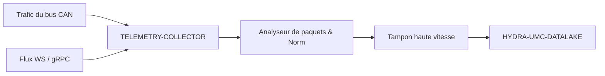

<p align="center">
  
</p>

# 📡 HYDRA-UMC-TELEMETRY-COLLECTOR

<p align="center"><a href="README.md">🇺🇸 English</a> | <a href="README_spa.md">🇪🇸 Español</a> | 🇫🇷 <b>Français</b> | <a href="README_ita.md">🇮🇹 Italiano</a> | <a href="README_deu.md">🇩🇪 Deutsch</a> | <a href="README_zho.md">🇨🇳 简体中文</a> | <a href="README_jpn.md">🇯🇵 日本語</a></p>

### 🚀 Nœud d'ingestion à haut débit pour les journaux CAN et WebSocket

<p align="left">
  
  
  
</p>

---

## 1. 🛠️ APERÇU TECHNIQUE

**HYDRA-UMC-TELEMETRY-COLLECTOR** est la passerelle haute vitesse qui capture toutes les communications brutes au sein de l'écosystème. Il écoute les bus FDCAN, les flux WebSocket et les mises à jour gRPC, canalisant les données vers le Datalake.

Il effectue l'analyse et la normalisation en temps réel de sources de données hétérogènes, garantissant qu'un pic de courant moteur sur un bus CAN est correctement corrélé avec un résultat d'inférence d'IA provenant d'un nœud de vision.

### Caractéristiques principales :
* 🚀 **Ingestion multiprotocole :** Gère la télémétrie CAN, WebSocket, gRPC et HTTP.
* ⚡ **Haut débit :** Optimisé pour des milliers de messages par milliseconde avec un surdébit CPU minimal.
* 🧬 **Normalisation des données :** Traduit les paquets binaires bruts en formats JSON/Protobuf standardisés.
* 🛡️ **Livraison mise en mémoire tampon :** Garantit zéro perte de données pendant les pannes temporaires de base de données ou les pics de réseau.

---

## 2. 🔄 FLUX DE TRAVAIL D'INGESTION



---

## 3. 🧱 ARCHITECTURE & DÉCISIONS DE CONCEPTION

* **Pourquoi `src/` est la racine du module Go, pas la racine du dépôt.** Garde les propres fichiers du module installable (`main.go`, `version.go`, `go.mod`) séparés de l'outillage à la racine du dépôt (`bump_version.py`, `docker-compose.yml`) - `go build ./...` s'exécute depuis l'intérieur de `src/`, pas depuis la racine du dépôt.
* **Pourquoi la collecte est séparée de HYDRA-UMC-DATALAKE lui-même.** La collecte (interroger HYDRA-UMC-SERVER, mettre en tampon, grouper les écritures) est une préoccupation liée aux E/S distincte du stockage/de la requête - la garder comme processus séparé signifie qu'un redémarrage du collecteur ou un pic de contre-pression ne touche pas le propre chemin de requête du lac de données.
* **Pourquoi un échec d'écriture du sink remet le lot en file plutôt que de l'abandonner.** `src/collector` est ce qui justifie réellement la promesse « Livraison bufferisée : zéro perte de données » : `FlushOnce` ne retire un lot du tampon qu'une fois que `Sink.Write` le confirme, et le remet directement en tête en cas d'échec - une vraie panne fait réessayer les mêmes échantillons, elle ne les perd pas. Le tampon (`src/buffer`) reste borné cependant - une panne qui dépasse sa capacité fait bien perdre les plus anciens en excès, une vraie limite honnête plutôt qu'une promesse de mémoire infinie.
* **Pourquoi CAN et WebSocket se parsent tous deux vers la même forme `Sample`.** `src/telemetry` normalise les deux sources hétérogènes en une seule structure avant que quoi que ce soit ne touche le tampon ou le sink - le vrai mécanisme derrière « un pic de courant moteur sur CAN correctement corrélé à un résultat d'un Vision Node » : aucune étape en aval n'a besoin de savoir via quel protocole un échantillon est arrivé.
* **Pourquoi le format de trame CAN est une convention propre v0 de ce projet, pas encore les vrais ID CAN de l'écosystème.** Les vraies tables d'ID CAN vivent dans la propre documentation firmware de HYDRA-UMC et d'URTC - s'y intégrer réellement est un travail futur (voir `mejoras_futuras.txt`), pas quelque chose à deviner sans cette référence sous les yeux.
* **Pourquoi `DatalakeSink` écrit un échantillon par requête HTTP, et pourquoi un échec partiel de lot peut dupliquer des lignes lors d'une nouvelle tentative.** Le propre `POST /ingest` de HYDRA-UMC-DATALAKE (voir `src/hydra_umc_datalake/api.py` de ce projet) est mono-échantillon, pas par lot - une « écriture par lot » ici correspond en réalité à N vraies requêtes. Si l'une échoue en cours de lot, `Write` renvoie une erreur et la propre logique de nouvelle tentative de `collector.go` remet TOUT le lot en file d'attente, donc les échantillons déjà écrits sont renvoyés et finissent en lignes dupliquées dans DATALAKE au prochain flush réussi. Au moins une fois avec des doublons occasionnels lors d'une vraie panne - plutôt que de perdre silencieusement des données (au plus une fois) - c'est le compromis honnête de cette v0 ; une vraie livraison exactement une fois (clés d'idempotence, upserts) est un travail futur, voir `mejoras_futuras.txt`. `ConsoleSink` (affichage sur stdout) reste la valeur par défaut lorsque `-datalake-url` n'est pas fourni, pour exécuter ce collecteur de manière autonome.
* **Comment cela s'intègre dans le reste de l'écosystème.** Un service frère sous HYDRA-UMC-DATALAKE - le composant qui contacte réellement HYDRA-UMC-SERVER pour la télémétrie par robot et l'écrit dans l'entrepôt de séries temporelles partagé.

---

## 📂 STRUCTURE DES RÉPERTOIRES

Service purement logiciel (nœud d'ingestion) - sans matériel, micrologiciel ou système d'exploitation propres ; ces dossiers sont omis conformément à la politique de structure du dépôt.

```text
HYDRA-UMC-TELEMETRY-COLLECTOR/
├── src/                  # Module Go
│   ├── go.mod            # Définition du module
│   ├── version.go        # const Version = "X.Y.Z"
│   ├── main.go           # Point d'entrée : relie tout, démarre l'API HTTP
│   ├── telemetry/        # Type Sample + analyseurs CAN/WebSocket (normalisation)
│   ├── buffer/           # File FIFO bornée signalant la contre-pression (Ring)
│   ├── collector/        # Orchestre ingestion+vidage, réessaie si le sink échoue
│   ├── sink/              # Où vont les lots vidés (ConsoleSink aujourd'hui)
│   └── api/                # Handlers JSON/HTTP simples encapsulant le collecteur
├── build/                # Binaires compilés (ignoré par git)
├── bump_version.py        # Incrément de version type compteur kilométrique (exécuté par le build)
├── build.sh / build.bat   # Build réel : bump + go build
├── run.sh / run.bat       # Exécution réelle : lance le binaire compilé
└── README.md
```

Élagué du modèle original : `hardware/`, `firmware/`, `os/`, `docs/`,
`images/` et `scripts/` — il s'agit d'un service purement logiciel
(binaire Go) sans matériel ni firmware propres, sans image de système
d'exploitation à maintenir, et sans contenu de documentation/médias/
scripts utilitaires encore suffisant pour justifier leurs propres
dossiers.

---

## 4. ⚙️ BUILD ET EXÉCUTION

Nécessite Go >= 1.21. Un véritable pipeline d'ingestion avec une API HTTP,
pas seulement un squelette qui compile.

```bash
# Linux/macOS
./build.sh
./run.sh -addr :8092 -datalake-url http://localhost:8095

# Windows
build.bat
run.bat -addr :8092 -datalake-url http://localhost:8095
```

`build` incrémente la version (`src/version.go`) et compile le module Go
de `src/` vers `build/telemetry-collector(.exe)`. `run` exécute le binaire
compilé, en transmettant tout indicateur, et commence à écouter du vrai
trafic. `-datalake-url` fait pointer les lots vidangés vers une instance
réelle et en cours d'exécution de HYDRA-UMC-DATALAKE (`POST /ingest`,
`sink.DatalakeSink`) - à omettre pour afficher les échantillons vidangés
sur stdout à la place (`sink.ConsoleSink`), utile pour exécuter ce
collecteur de manière autonome :

```bash
# Ingérer un échantillon de télémétrie de type WebSocket
curl -X POST localhost:8092/ingest/ws \
  -d '{"sourceId":"robot-1","kind":"motor_temp","timestamp":1700000000000,"fields":{"value":42.5}}'

# Ingérer une trame CAN (8 octets, base64 - voir src/telemetry/can.go pour le format)
curl -X POST localhost:8092/ingest/can \
  -d '{"arbitrationId":7,"data":"AQAAUEEAAAA="}'

# Voir ce que le collecteur a ingéré/vidé/abandonné
curl localhost:8092/stats
```

```bash
cd src && go test ./...   # telemetry (aller-retour CAN, validation WS),
                           # buffer (FIFO borne, contre-pression, requeue),
                           # collector (le vrai comportement "ne pas
                           # perdre de donnees lors d'une panne du sink"),
                           # et api (allers-retours HTTP reels via httptest)
```

---

## 🚀 ROADMAP
* **Phase 1 :** Ingestion à haut débit du Datalake et indexation pour l'analyse historique.
* **Phase 2 :** Compression à la périphérie du collecteur de télémétrie et protocoles de transmission sécurisés.
* **Phase 3 :** Détection d'anomalies à l'aide de l'apprentissage non supervisé et analyse des vibrations du moteur.
* **Phase 4 :** Compression à la volée pour l'ingestion massive de journaux et optimisation multi-protocole.

---

## 🔗 Projets Liés

Ce projet fait partie d'un écosystème robotique plus large du même auteur (JuanenRac / Electro Hobby 3D), couvrant firmware, logiciel de contrôle, nœuds IA et outillage de flotte. Bon à savoir, car une demande pourrait en réalité concerner l'un de ces projets plutôt que ce dépôt.

### Famille

**Parent :** **[HYDRA-UMC-DATALAKE](https://github.com/JuanenRac/HYDRA-UMC-DATALAKE)** — le parent d'intégration qu'alimente ce collecteur.

**Frères et sœurs :**
- **[HYDRA-UMC-ANOMALY-DETECTOR](https://github.com/JuanenRac/HYDRA-UMC-ANOMALY-DETECTOR)** — service d'analytique frère, même parent.
- **[HYDRA-UMC-PRODUCTION-REPORTS](https://github.com/JuanenRac/HYDRA-UMC-PRODUCTION-REPORTS)** — service d'analytique frère, même parent.

### Relation Directe (hors de la famille)

- **[HYDRA-UMC-SERVER](https://github.com/JuanenRac/HYDRA-UMC-SERVER)** — la source des logs ingérés par ce projet.

### Reste de l'Écosystème

**Plateforme HYDRA-UMC** — la cellule de micro-usine multi-robot
- **[HYDRA-UMC](https://github.com/JuanenRac/HYDRA-UMC)** — la carte mère CM5 + STM32H745 orchestrant jusqu'à 8 bras robotiques.
- **[HYDRA-UMC-SERVER](https://github.com/JuanenRac/HYDRA-UMC-SERVER)** — le backend Express/WebSocket auquel parle chaque client de contrôle.
- **[HYDRA-UMC-STUDIO](https://github.com/JuanenRac/HYDRA-UMC-STUDIO)** — tableau de bord de contrôle web, visualisation 3D multi-robot.
- **[HYDRA-UMC-ANDROID-CONTROL](https://github.com/JuanenRac/HYDRA-UMC-ANDROID-CONTROL)** — application de contrôle Android via Wi-Fi/Bluetooth.
- **[HYDRA-UMC-IOS-CONTROL](https://github.com/JuanenRac/HYDRA-UMC-IOS-CONTROL)** — application de contrôle iOS/iPadOS construite en Flutter.
- **[HYDRA-UMC-SUITE](https://github.com/JuanenRac/HYDRA-UMC-SUITE)** — centre de commande d'essaim de bureau (Python/PySide6).
- **[HYDRA-UMC-EDITOR-URDF](https://github.com/JuanenRac/HYDRA-UMC-EDITOR-URDF)** — éditeur de modèles URDF de bureau pour le catalogue de robots.
- **[HYDRA-UMC-DSI](https://github.com/JuanenRac/HYDRA-UMC-DSI)** — interface tactile native pour l'écran DSI embarqué.

**Plateforme URTC** — le contrôleur de tête d'outil que porte chaque bras HYDRA-UMC
- **[URTC](https://github.com/JuanenRac/URTC)** — contrôleur de tête d'outil sur bus CAN, 25 profils d'outil.
- **[URTC-FLASHER](https://github.com/JuanenRac/URTC-FLASHER)** — outil de bureau de flashage CAN-OTA + SWD/JTAG.
- **[URTC-TESTER](https://github.com/JuanenRac/URTC-TESTER)** — outil de bureau de diagnostic CAN en direct.
- **[URTC-WEB-STUDIO](https://github.com/JuanenRac/URTC-WEB-STUDIO)** — alternative basée navigateur via l'API Web Serial.

**🎥 Vision AI Node (Hailo-8)**
- [HYDRA-UMC-VISION-NODE](https://github.com/JuanenRac/HYDRA-UMC-VISION-NODE)
- [HYDRA-UMC-VISION-STREAMER](https://github.com/JuanenRac/HYDRA-UMC-VISION-STREAMER)
- [HYDRA-UMC-DETECTION-HEF](https://github.com/JuanenRac/HYDRA-UMC-DETECTION-HEF)
- [HYDRA-UMC-SAFETY-ZONES](https://github.com/JuanenRac/HYDRA-UMC-SAFETY-ZONES)
- [HYDRA-UMC-VISUAL-SERVOING-API](https://github.com/JuanenRac/HYDRA-UMC-VISUAL-SERVOING-API)

**🧠 Cognitive AI Node (Hailo-10)**
- [HYDRA-UMC-COGNITIVE-NODE](https://github.com/JuanenRac/HYDRA-UMC-COGNITIVE-NODE)
- [HYDRA-UMC-VLA-ENGINE](https://github.com/JuanenRac/HYDRA-UMC-VLA-ENGINE)
- [HYDRA-UMC-VOICE-UI](https://github.com/JuanenRac/HYDRA-UMC-VOICE-UI)
- [HYDRA-UMC-SEMANTIC-PLANNER](https://github.com/JuanenRac/HYDRA-UMC-SEMANTIC-PLANNER)
- [HYDRA-UMC-DOCS-QA](https://github.com/JuanenRac/HYDRA-UMC-DOCS-QA)

**🐝 Orchestration & Swarm**
- [HYDRA-UMC-ORCHESTRATOR](https://github.com/JuanenRac/HYDRA-UMC-ORCHESTRATOR)
- [HYDRA-UMC-SWARM-SYNC](https://github.com/JuanenRac/HYDRA-UMC-SWARM-SYNC)
- [HYDRA-UMC-PATH-PLANNER-3D](https://github.com/JuanenRac/HYDRA-UMC-PATH-PLANNER-3D)
- [HYDRA-UMC-JOB-DISPATCHER](https://github.com/JuanenRac/HYDRA-UMC-JOB-DISPATCHER)
- [HYDRA-UMC-NODE-HEALING](https://github.com/JuanenRac/HYDRA-UMC-NODE-HEALING)

**🎮 Digital Twin & Simulation**
- [HYDRA-UMC-TWIN](https://github.com/JuanenRac/HYDRA-UMC-TWIN)
- [HYDRA-UMC-PHYSICS-REPLICA](https://github.com/JuanenRac/HYDRA-UMC-PHYSICS-REPLICA)
- [HYDRA-UMC-HIL-BRIDGE](https://github.com/JuanenRac/HYDRA-UMC-HIL-BRIDGE)
- [HYDRA-UMC-SYNTHETIC-DATA-GEN](https://github.com/JuanenRac/HYDRA-UMC-SYNTHETIC-DATA-GEN)

**🏭 Industrial Gateway**
- [HYDRA-UMC-GATEWAY-INDUSTRIAL](https://github.com/JuanenRac/HYDRA-UMC-GATEWAY-INDUSTRIAL)
- [HYDRA-UMC-OPCUA-SERVER](https://github.com/JuanenRac/HYDRA-UMC-OPCUA-SERVER)
- [HYDRA-UMC-MQTT-BROKER](https://github.com/JuanenRac/HYDRA-UMC-MQTT-BROKER)
- [HYDRA-UMC-MTCONNECT-ADAPTER](https://github.com/JuanenRac/HYDRA-UMC-MTCONNECT-ADAPTER)

**🛠️ Complementary Tools**
- [URTC-SMART-RACK](https://github.com/JuanenRac/URTC-SMART-RACK)
- [URTC-VISION-TOOL](https://github.com/JuanenRac/URTC-VISION-TOOL)
- [HYDRA-UMC-WATCH](https://github.com/JuanenRac/HYDRA-UMC-WATCH)
- [HYDRA-UMC-TOOL-CLI](https://github.com/JuanenRac/HYDRA-UMC-TOOL-CLI)
- [HYDRA-UMC-DASHBOARD-AI](https://github.com/JuanenRac/HYDRA-UMC-DASHBOARD-AI)


## 👤 AUTEUR
**JuanenRac** (Electro Hobby 3D)
📧 electrohobby3d@gmail.com

## 📜 LICENCE
GPL-3.0 - Voir le fichier LICENSE pour plus de détails.

## 🛠️ BUILD & RUN

Utilisez la vérification de compilation sans versionnement avant une compilation de publication :

| Action | Windows | Linux / macOS |
|---|---|---|
| Vérification de compilation (sans modifier la version ni le CHANGELOG) | `build-test.bat` | `./build-test.sh` |
| Exécution / développement (si disponible) | `run*.bat` ou `dev*.bat` | `./run*.sh` ou `./dev*.sh` |

`build-test.bat` et `build-test.sh` compilent ou valident la pile du projet sans incrémenter `hydra-umc.project.json` ni modifier `CHANGELOG.md`. Ils peuvent uniquement créer les sorties normales du compilateur. Les scripts existants `build*.bat`, `build*.sh`, `run*` et `dev*` conservent leur comportement spécifique de versionnement ou d'exécution ; utilisez-les lorsque ce comportement est requis.