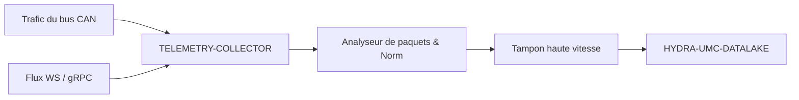

<p align="center">
  
</p>

# 📡 HYDRA-UMC-TELEMETRY-COLLECTOR

<p align="center"><a href="README.md">🇺🇸 English</a> | <a href="README_spa.md">🇪🇸 Español</a> | 🇫🇷 <b>Français</b> | <a href="README_ita.md">🇮🇹 Italiano</a> | <a href="README_deu.md">🇩🇪 Deutsch</a> | <a href="README_zho.md">🇨🇳 简体中文</a> | <a href="README_jpn.md">🇯🇵 日本語</a></p>

### 🚀 Nœud d'ingestion à haut débit pour les journaux CAN et WebSocket

<p align="left">
  
  
  
</p>

---

## 1. 🛠️ APERÇU TECHNIQUE

**HYDRA-UMC-TELEMETRY-COLLECTOR** est la passerelle haute vitesse qui capture toutes les communications brutes au sein de l'écosystème. Il écoute les bus FDCAN, les flux WebSocket et les mises à jour gRPC, canalisant les données vers le Datalake.

Il effectue l'analyse et la normalisation en temps réel de sources de données hétérogènes, garantissant qu'un pic de courant moteur sur un bus CAN est correctement corrélé avec un résultat d'inférence d'IA provenant d'un nœud de vision.

### Caractéristiques principales :
* 🚀 **Ingestion multiprotocole :** Gère la télémétrie CAN, WebSocket, gRPC et HTTP.
* ⚡ **Haut débit :** Optimisé pour des milliers de messages par milliseconde avec un surdébit CPU minimal.
* 🧬 **Normalisation des données :** Traduit les paquets binaires bruts en formats JSON/Protobuf standardisés.
* 🛡️ **Livraison mise en mémoire tampon :** Garantit zéro perte de données pendant les pannes temporaires de base de données ou les pics de réseau.
* 🔁 **Déduplication sûre en cas de reconnexion :** Un numéro de séquence optionnel par producteur, suivi dans une fenêtre de réordonnancement bornée, pour qu'un appareil qui se reconnecte et renvoie ses derniers messages non acquittés ne gonfle jamais les comptes d'ingestion. *(implémenté)*
* 🩺 **Diagnostic réel des échecs :** Chaque échec de vidage est classé comme un rejet réel des données par le sink par rapport à un problème de transport - exposé dans `GET /stats` pour une visibilité opérationnelle réelle. *(implémenté)*
* 🧮 **Validation de champs finis :** Un nom de champ vide ou une valeur numérique `NaN`/`Infinity`/`-Infinity` est rejeté (`400`) avant d'atteindre le buffer ou un sink - le décodage CAN passe par le même `Sample.Validate()` que l'ingestion JSON. *(implémenté)*

---

## 2. 🔄 FLUX DE TRAVAIL D'INGESTION



---

## 3. 🧱 ARCHITECTURE & DÉCISIONS DE CONCEPTION

* **Pourquoi `src/` est la racine du module Go, pas la racine du dépôt.** Garde les propres fichiers du module installable (`main.go`, `version.go`, `go.mod`) séparés de l'outillage à la racine du dépôt (`bump_version.py`, `docker-compose.yml`) - `go build ./...` s'exécute depuis l'intérieur de `src/`, pas depuis la racine du dépôt.
* **Pourquoi la collecte est séparée de HYDRA-UMC-DATALAKE lui-même.** La collecte (interroger HYDRA-UMC-SERVER, mettre en tampon, grouper les écritures) est une préoccupation liée aux E/S distincte du stockage/de la requête - la garder comme processus séparé signifie qu'un redémarrage du collecteur ou un pic de contre-pression ne touche pas le propre chemin de requête du lac de données.
* **Pourquoi un échec d'écriture du sink remet le lot en file plutôt que de l'abandonner.** `src/collector` est ce qui justifie réellement la promesse « Livraison bufferisée : zéro perte de données » : `FlushOnce` ne retire un lot du tampon qu'une fois que `Sink.Write` le confirme, et le remet directement en tête en cas d'échec - une vraie panne fait réessayer les mêmes échantillons, elle ne les perd pas. Le tampon (`src/buffer`) reste borné cependant - une panne qui dépasse sa capacité fait bien perdre les plus anciens en excès, une vraie limite honnête plutôt qu'une promesse de mémoire infinie.
* **Pourquoi CAN et WebSocket se parsent tous deux vers la même forme `Sample`.** `src/telemetry` normalise les deux sources hétérogènes en une seule structure avant que quoi que ce soit ne touche le tampon ou le sink - le vrai mécanisme derrière « un pic de courant moteur sur CAN correctement corrélé à un résultat d'un Vision Node » : aucune étape en aval n'a besoin de savoir via quel protocole un échantillon est arrivé.
* **Pourquoi le format de trame CAN est une convention propre v0 de ce projet, pas encore les vrais ID CAN de l'écosystème.** Les vraies tables d'ID CAN vivent dans la propre documentation firmware de HYDRA-UMC et d'URTC - s'y intégrer réellement est un travail futur, pas quelque chose à deviner sans cette référence sous les yeux.
* **Pourquoi `DatalakeSink` écrit un échantillon par requête HTTP, et pourquoi un échec partiel de lot peut dupliquer des lignes lors d'une nouvelle tentative.** Le propre `POST /ingest` de HYDRA-UMC-DATALAKE (voir `src/hydra_umc_datalake/api.py` de ce projet) est mono-échantillon, pas par lot - une « écriture par lot » ici correspond en réalité à N vraies requêtes. Si l'une échoue en cours de lot, `Write` renvoie une erreur et la propre logique de nouvelle tentative de `collector.go` remet TOUT le lot en file d'attente, donc les échantillons déjà écrits sont renvoyés et finissent en lignes dupliquées dans DATALAKE au prochain flush réussi. Au moins une fois avec des doublons occasionnels lors d'une vraie panne - plutôt que de perdre silencieusement des données (au plus une fois) - c'est le compromis honnête de cette v0 ; une vraie livraison exactement une fois (clés d'idempotence, upserts) est un travail futur, non tentée ici. `ConsoleSink` (affichage sur stdout) reste la valeur par défaut lorsque `-datalake-url` n'est pas fourni, pour exécuter ce collecteur de manière autonome.
* **Comment cela s'intègre dans le reste de l'écosystème.** Un service frère sous HYDRA-UMC-DATALAKE - le composant qui contacte réellement HYDRA-UMC-SERVER pour la télémétrie par robot et l'écrit dans l'entrepôt de séries temporelles partagé.
* **Pourquoi la déduplication est un package `dedup` séparé, indexé sur un `Sequence` optionnel, et non un hachage du contenu de l'échantillon lui-même.** Une vraie reconnexion renvoie les mêmes octets identiques, donc le hachage de contenu fonctionnerait pour ce cas - mais il avalerait aussi silencieusement deux échantillons réellement différents qui partagent par hasard tous les champs (par ex. deux lectures de `0.0` à une seconde d'intervalle). Un numéro de séquence par producteur est ce qu'un vrai appareil doit déjà suivre pour ses propres messages non acquittés, donc le réutiliser est le signal honnête et réel - pas une supposition tirée de données qui ne promettent pas réellement l'unicité. `Sequence == 0`/omis exclut entièrement un producteur, donc rien du comportement préexistant ne change pour un appareil qui n'en envoie pas.
* **Pourquoi `sink.InvalidDataError` ne change pas la politique de nouvelle tentative, mais la rend seulement diagnosticable.** La remise en file et nouvelle tentative tout-ou-rien de `collector.go` (voir ci-dessus) reste exactement la même - un échantillon définitivement invalide continue d'être réessayé comme n'importe quel autre, ce qui est en soi une limitation connue et documentée. Ce qui est nouveau, c'est une vraie visibilité : `invalidDataErrors` face à `transportErrors` dans `GET /stats` permet à un opérateur de distinguer « DATALAKE rejette nos données » de « le réseau vers DATALAKE est en panne » sans avoir à deviner à partir des logs.

---

## 📂 STRUCTURE DES RÉPERTOIRES

Service purement logiciel (nœud d'ingestion) - sans matériel, micrologiciel ou système d'exploitation propres ; ces dossiers sont omis conformément à la politique de structure du dépôt.

```text
HYDRA-UMC-TELEMETRY-COLLECTOR/
├── src/                  # Module Go
│   ├── go.mod            # Définition du module
│   ├── version.go        # const Version = "X.Y.Z"
│   ├── main.go           # Point d'entrée : relie tout, démarre l'API HTTP
│   ├── telemetry/        # Type Sample + analyseurs CAN/WebSocket (normalisation)
│   ├── buffer/           # File FIFO bornée signalant la contre-pression (Ring)
│   ├── dedup/            # Déduplication réelle par séquence par producteur (fenêtre de réordonnancement)
│   ├── collector/        # Orchestre ingestion+vidage, réessaie si le sink échoue, dédup
│   ├── sink/              # Où vont les lots vidés (ConsoleSink aujourd'hui), classification transport/données invalides
│   └── api/                # Handlers JSON/HTTP simples encapsulant le collecteur
├── docs/
│   └── API.md              # Référence réelle des endpoints HTTP (requêtes, réponses, codes de statut)
├── images/               # Médias et diagrammes
├── systemd/
│   └── hydra-umc-telemetry-collector.service # Unité systemd de l'API locale d'ingestion de télémétrie sur la CM5
├── tools/
│   ├── build_test.py     # Vérification de build sans versionnage
│   └── ci_validate.py    # Validation manifeste/CHANGELOG/docs utilisée par CI
├── build/                # Binaires compilés (ignoré par git)
├── bump_version.py        # Incrément de version native type compteur kilométrique (exécuté par le build)
├── bump_manifest_version.py # Synchronise la version de hydra-umc.project.json avec la version native (--sync)
├── build.sh / build.bat   # Build réel : bump + go build
├── run.sh / run.bat       # Exécution réelle : lance le binaire compilé
└── README.md
```

Élagué du modèle original : `hardware/`, `firmware/` et `os/` — il s'agit
d'un service purement logiciel (binaire Go) sans matériel ni firmware
propres et sans image de système d'exploitation à maintenir. Voir
[`docs/API.md`](docs/API.md) pour la référence complète des endpoints HTTP.

---

## 4. ⚙️ BUILD ET EXÉCUTION

Nécessite Go >= 1.21. Un véritable pipeline d'ingestion avec une API HTTP,
pas seulement un squelette qui compile.

```bash
# Linux/macOS
./build.sh
./run.sh -addr :8092 -datalake-url http://localhost:8095

# Windows
build.bat
run.bat -addr :8092 -datalake-url http://localhost:8095
```

`build` incrémente la version (`src/version.go`) et compile le module Go
de `src/` vers `build/telemetry-collector(.exe)`. `run` exécute le binaire
compilé, en transmettant tout indicateur, et commence à écouter du vrai
trafic. `-datalake-url` fait pointer les lots vidangés vers une instance
réelle et en cours d'exécution de HYDRA-UMC-DATALAKE (`POST /ingest`,
`sink.DatalakeSink`) - à omettre pour afficher les échantillons vidangés
sur stdout à la place (`sink.ConsoleSink`), utile pour exécuter ce
collecteur de manière autonome :

```bash
# Ingérer un échantillon de télémétrie de type WebSocket
curl -X POST localhost:8092/ingest/ws \
  -d '{"sourceId":"robot-1","kind":"motor_temp","timestamp":1700000000000,"fields":{"value":42.5}}'

# Ingérer une trame CAN (8 octets, base64 - voir src/telemetry/can.go pour le format)
curl -X POST localhost:8092/ingest/can \
  -d '{"arbitrationId":7,"data":"AQAAUEEAAAA="}'

# Voir ce que le collecteur a ingéré/vidé/abandonné
curl localhost:8092/stats
```

```bash
cd src && go test ./...   # telemetry (aller-retour CAN, validation WS),
                           # buffer (FIFO borne, contre-pression, requeue),
                           # collector (le vrai comportement "ne pas
                           # perdre de donnees lors d'une panne du sink"),
                           # et api (allers-retours HTTP reels via httptest)
```

---

## 🚀 FEUILLE DE ROUTE
* **Phase 1 :** Ingestion à haut débit du Datalake et indexation pour l'analyse historique.
* **Phase 2 :** Compression à la périphérie du collecteur de télémétrie et protocoles de transmission sécurisés.
* **Phase 3 :** Détection d'anomalies à l'aide de l'apprentissage non supervisé et analyse des vibrations du moteur.
* **Phase 4 :** Compression à la volée pour l'ingestion massive de journaux et optimisation multi-protocole.

---

## 🔗 Projets Liés

Ce projet fait partie de l'écosystème robotique HYDRA-UMC du même auteur (JuanenRac / Electro Hobby 3D). Bon à savoir, car une demande pourrait en réalité concerner l'un de ceux-ci plutôt que ce dépôt.

**Projet Parent**
- **[HYDRA-UMC-DATALAKE](https://github.com/JuanenRac/HYDRA-UMC-DATALAKE)** — vrai magasin de séries temporelles basé sur sqlite3, avec une vraie API HTTP d'ingestion/requête ; le parent dont ce dépôt est un service d'analytique spécifique, au sein de sa propre couche de données et analytique.

**Projets Frères** — les autres services d'analytique de la propre couche de données et analytique de HYDRA-UMC-DATALAKE
- **[HYDRA-UMC-ANOMALY-DETECTOR](https://github.com/JuanenRac/HYDRA-UMC-ANOMALY-DETECTOR)** — vrai détecteur d'anomalies FFT + ligne de base statistique, avec surveillance de dérive.
- **[HYDRA-UMC-PRODUCTION-REPORTS](https://github.com/JuanenRac/HYDRA-UMC-PRODUCTION-REPORTS)** — vrai calcul OEE/disponibilité sur l'historique de DATALAKE, avec export CSV reproductible.

**Directement Liés**
- **[HYDRA-UMC-SERVER](https://github.com/JuanenRac/HYDRA-UMC-SERVER)** — le vrai backend headless (REST/WebSocket) auquel parle réellement chaque client de contrôle — la source des journaux que ce projet ingère.
- **[HYDRA-UMC](https://github.com/JuanenRac/HYDRA-UMC)** — la carte mère physique du bras robotique : hôte CM5 + coprocesseur STM32H745 double cœur, coordonnant jusqu'à 8 bras-outils via CAN-OTA/SPI-OTA — la vraie table d'ID CAN contre laquelle le propre format CAN de ce projet est destiné à s'intégrer un jour ; aujourd'hui il utilise sa propre convention v0, suivie honnêtement comme travail futur plutôt que revendiquée comme terminée.
- **[URTC](https://github.com/JuanenRac/URTC)** — firmware pour la carte physique Universal Robot Tool Controller, plus de 25 profils d'outil sur bus CAN — la vraie table d'ID CAN contre laquelle le propre format CAN de ce projet est destiné à s'intégrer un jour ; aujourd'hui il utilise sa propre convention v0, suivie honnêtement comme travail futur plutôt que revendiquée comme terminée.

**Fait Également Partie de l'Écosystème**

*Matériel & Plateforme de Base*
- **[HYDRA-UMC-OS](https://github.com/JuanenRac/HYDRA-UMC-OS)** — couche produit reproductible sur Raspberry Pi OS pour le CM5 : agent en lecture seule, config/profils validés, provisionnement WiFi de premier contact.
- **[HYDRA-UMC-SDK](https://github.com/JuanenRac/HYDRA-UMC-SDK)** — le contrat JSON-Schema partagé et la barrière de sécurité contre laquelle chaque bridge valide ses commandes.

*Backend Central & Clients*
- **[HYDRA-UMC-STUDIO](https://github.com/JuanenRac/HYDRA-UMC-STUDIO)** — tableau de bord de contrôle web avec visualisation 3D multi-robot en temps réel.
- **[HYDRA-UMC-SUITE](https://github.com/JuanenRac/HYDRA-UMC-SUITE)** — centre de commande d'essaim de bureau (PySide6) pour plusieurs serveurs à la fois, empaqueté en exécutable autonome.
- **[HYDRA-UMC-ANDROID-CONTROL](https://github.com/JuanenRac/HYDRA-UMC-ANDROID-CONTROL)** — application de contrôle Android native avec connexion biométrique et un compagnon Wear OS jumelé.
- **[HYDRA-UMC-IOS-CONTROL](https://github.com/JuanenRac/HYDRA-UMC-IOS-CONTROL)** — application de contrôle iOS/iPadOS (Flutter) avec synchronisation WebSocket en temps réel.
- **[HYDRA-UMC-DSI](https://github.com/JuanenRac/HYDRA-UMC-DSI)** — interface tactile native pour l'écran tactile DSI 7" embarqué, intégrée directement sur le CM5.
- **[HYDRA-UMC-EDITOR-URDF](https://github.com/JuanenRac/HYDRA-UMC-EDITOR-URDF)** — créateur/éditeur graphique de bureau pour URDF qui envoie les modèles terminés vers le propre catalogue de STUDIO.
- **[HYDRA-UMC-BRIDGE-AMR](https://github.com/JuanenRac/HYDRA-UMC-BRIDGE-AMR)** — frontière de coordination pour les flottes AGV/AMR via un éditeur MQTT VDA 5050 réel.
- **[HYDRA-UMC-BRIDGE-CNC](https://github.com/JuanenRac/HYDRA-UMC-BRIDGE-CNC)** — coordinateur haut niveau pour cellules CNC avec accès réel au statut/octets de contrôle GRBL.
- **[HYDRA-UMC-BRIDGE-DROIDS](https://github.com/JuanenRac/HYDRA-UMC-BRIDGE-DROIDS)** — frontière de coordination pour droïdes à pattes/humanoïdes, avec un véritable émetteur de commandes Boston Dynamics Spot.
- **[HYDRA-UMC-BRIDGE-LASER](https://github.com/JuanenRac/HYDRA-UMC-BRIDGE-LASER)** — coordinateur de sécurité pour cellules laser lisant 3 vraies sécurités GPIO de clé/enceinte/verrouillage.
- **[HYDRA-UMC-BRIDGE-OPENPNP](https://github.com/JuanenRac/HYDRA-UMC-BRIDGE-OPENPNP)** — coordinateur haut niveau sûr pour le flux de cartes du pick-and-place OpenPnP.
- **[HYDRA-UMC-BRIDGE-PRINTER3D](https://github.com/JuanenRac/HYDRA-UMC-BRIDGE-PRINTER3D)** — frontière de coordination sûre pour imprimantes 3D Moonraker/Klipper, avec de vraies commandes de tâche contrôlées.
- **[HYDRA-UMC-BRIDGE-ROS2](https://github.com/JuanenRac/HYDRA-UMC-BRIDGE-ROS2)** — coordinateur de sécurité avec un vrai transport ROS 2 rclpy à importation paresseuse.
- **[HYDRA-UMC-BRIDGE-UAV](https://github.com/JuanenRac/HYDRA-UMC-BRIDGE-UAV)** — frontière de coordination pour UAV équipés de caméra, avec un véritable émetteur de commandes MAVLink.

*Plateforme d'Outils URTC*
- **[URTC-FLASHER](https://github.com/JuanenRac/URTC-FLASHER)** — outil de bureau à interface graphique pour flasher les cartes URTC, CAN-OTA plus SWD/JTAG puce complète.
- **[URTC-TESTER](https://github.com/JuanenRac/URTC-TESTER)** — outil de bureau de diagnostic CAN-bus en direct pour cartes URTC, un panneau par profil d'outil.
- **[URTC-WEB-STUDIO](https://github.com/JuanenRac/URTC-WEB-STUDIO)** — alternative basée navigateur à URTC-TESTER via la Web Serial API, sans installation locale.

*Nœud IA de Vision (Hailo-8)*
- **[HYDRA-UMC-VISION-NODE](https://github.com/JuanenRac/HYDRA-UMC-VISION-NODE)** — hub d'intégration pour le pipeline de vision Hailo-8, avec une vraie vérification de disponibilité matérielle par étape.
- **[HYDRA-UMC-DETECTION-HEF](https://github.com/JuanenRac/HYDRA-UMC-DETECTION-HEF)** — registre réel de modèles compilés avec vérification de chargement sécurisé par architecture Hailo/checksum.
- **[HYDRA-UMC-VISION-STREAMER](https://github.com/JuanenRac/HYDRA-UMC-VISION-STREAMER)** — générateur réel de pipeline GStreamer + config MediaMTX, avec une vraie frontière d'intégration HailoRT.
- **[HYDRA-UMC-VISUAL-SERVOING-API](https://github.com/JuanenRac/HYDRA-UMC-VISUAL-SERVOING-API)** — vraie loi de correction Position-Based Visual Servoing, verrouillée sur l'état de zone en amont.
- **[HYDRA-UMC-SAFETY-ZONES](https://github.com/JuanenRac/HYDRA-UMC-SAFETY-ZONES)** — vraie vérification de violation de zone et demande d'E-STOP, avec application de la fraîcheur de calibration.

*Nœud IA Cognitif (Hailo-10)*
- **[HYDRA-UMC-COGNITIVE-NODE](https://github.com/JuanenRac/HYDRA-UMC-COGNITIVE-NODE)** — hub d'intégration pour le pipeline cognitif Hailo-10 (orchestration LLM/VLA/voix).
- **[HYDRA-UMC-VLA-ENGINE](https://github.com/JuanenRac/HYDRA-UMC-VLA-ENGINE)** — vrai encodage/décodage de jetons d'action et génération de trajectoire pour un modèle Vision-Language-Action.
- **[HYDRA-UMC-VOICE-UI](https://github.com/JuanenRac/HYDRA-UMC-VOICE-UI)** — vrai front-end vocal (VAD + analyseur d'intention) avec un relais Watch borné et soumis à confirmation.
- **[HYDRA-UMC-SEMANTIC-PLANNER](https://github.com/JuanenRac/HYDRA-UMC-SEMANTIC-PLANNER)** — vraie décomposition de tâches basée sur des règles et récupération sémantique d'erreurs sur les codes d'erreur MCU.
- **[HYDRA-UMC-DOCS-QA](https://github.com/JuanenRac/HYDRA-UMC-DOCS-QA)** — vraie recherche documentaire TF-IDF (bibliothèque standard uniquement) sur les propres documents Markdown de cet écosystème.

*Orchestration & Essaim*
- **[HYDRA-UMC-ORCHESTRATOR](https://github.com/JuanenRac/HYDRA-UMC-ORCHESTRATOR)** — hub d'intégration avec un vrai contrat de rapport de santé gRPC/Protobuf et une machine à états de mission.
- **[HYDRA-UMC-JOB-DISPATCHER](https://github.com/JuanenRac/HYDRA-UMC-JOB-DISPATCHER)** — vraie file de tâches basée sur la priorité avec déduplication, via une vraie API HTTP.
- **[HYDRA-UMC-NODE-HEALING](https://github.com/JuanenRac/HYDRA-UMC-NODE-HEALING)** — vrai chien de garde de santé de flotte basé sur gRPC, avec retry/backoff et détection d'incohérence d'identité.
- **[HYDRA-UMC-PATH-PLANNER-3D](https://github.com/JuanenRac/HYDRA-UMC-PATH-PLANNER-3D)** — vrai planificateur de trajectoire 3D basé sur RRT, avec vraie validation des collisions obstacle/espace de travail.
- **[HYDRA-UMC-SWARM-SYNC](https://github.com/JuanenRac/HYDRA-UMC-SWARM-SYNC)** — vraie synchronisation d'état CRDT LWW-Element-Map, testée par propriétés pour la convergence multi-cellule.

*Jumeau Numérique & Simulation*
- **[HYDRA-UMC-TWIN](https://github.com/JuanenRac/HYDRA-UMC-TWIN)** — hub d'intégration pour le moteur de jumeau numérique, avec un vrai contrat de synchronisation par compatibilité de version.
- **[HYDRA-UMC-HIL-BRIDGE](https://github.com/JuanenRac/HYDRA-UMC-HIL-BRIDGE)** — vrai verrouillage de sécurité hardware-in-the-loop routant les commandes entre simulation et matériel réel.
- **[HYDRA-UMC-PHYSICS-REPLICA](https://github.com/JuanenRac/HYDRA-UMC-PHYSICS-REPLICA)** — vraie cinématique directe et validation des limites articulaires sur un vrai sous-ensemble URDF.
- **[HYDRA-UMC-SYNTHETIC-DATA-GEN](https://github.com/JuanenRac/HYDRA-UMC-SYNTHETIC-DATA-GEN)** — vrai générateur procédural de scènes 2D avec export d'annotations YOLO/COCO.

*Passerelle Industrielle*
- **[HYDRA-UMC-GATEWAY-INDUSTRIAL](https://github.com/JuanenRac/HYDRA-UMC-GATEWAY-INDUSTRIAL)** — hub d'intégration relayant vers les protocoles industriels, avec une vraie couche de liste blanche de commandes/contre-pression.
- **[HYDRA-UMC-OPCUA-SERVER](https://github.com/JuanenRac/HYDRA-UMC-OPCUA-SERVER)** — vrai espace d'adressage OPC-UA, vérifié avec une vraie session client du protocole binaire.
- **[HYDRA-UMC-MQTT-BROKER](https://github.com/JuanenRac/HYDRA-UMC-MQTT-BROKER)** — vrai broker MQTT avec authentification par client optionnelle et ACL de sujets.
- **[HYDRA-UMC-MTCONNECT-ADAPTER](https://github.com/JuanenRac/HYDRA-UMC-MTCONNECT-ADAPTER)** — vrais points de terminaison XML MTConnect `/probe` et `/current`, avec sortie en mode dégradé.

*Outils Complémentaires & Opérations de l'Écosystème*
- **[HYDRA-UMC-DASHBOARD-AI](https://github.com/JuanenRac/HYDRA-UMC-DASHBOARD-AI)** — panneaux Smart Summaries et Anomaly Highlighting sur DATALAKE/ANOMALY-DETECTOR, avec un repli statistique honnête.
- **[HYDRA-UMC-TOOL-CLI](https://github.com/JuanenRac/HYDRA-UMC-TOOL-CLI)** — CLI de flotte avec un vrai contrat de codes de sortie stable, un vrai client en direct de la propre API de HYDRA-UMC-SERVER.
- **[HYDRA-UMC-WATCH](https://github.com/JuanenRac/HYDRA-UMC-WATCH)** — application compagnon WearOS avec de vraies alertes haptiques et un relais vocal vers le téléphone jumelé.
- **[URTC-SMART-RACK](https://github.com/JuanenRac/URTC-SMART-RACK)** — firmware pour un rack de montage de cartes avec décodage réel d'ID d'outil et logique de préchauffage Smart Idle.
- **[URTC-VISION-TOOL](https://github.com/JuanenRac/URTC-VISION-TOOL)** — firmware plus un vrai compagnon de vision Python pour une tête d'outil d'inspection thermique/RGB.
- **[HYDRA-UMC-UPDATER](https://github.com/JuanenRac/HYDRA-UMC-UPDATER)** — outil administratif de bureau qui découvre, clone et met à jour chaque dépôt de cet écosystème.


---

## 📚 Documentation & Communauté

- **[CONTRIBUTING.md](CONTRIBUTING.md)** — pile technologique et lignes directrices de codage pour une pull request.
- **[CODE_OF_CONDUCT.md](CODE_OF_CONDUCT.md)** — les normes de comportement attendues dans cette communauté.
- **[SECURITY.md](SECURITY.md)** — comment signaler une vulnérabilité, et les véritables axes de sécurité de ce projet.
- **[SUPPORT.md](SUPPORT.md)** — où poser des questions et signaler des bugs.
- **[LICENSE.md](LICENSE.md)** — la licence propre de ce projet.

## 👤 AUTEUR
**JuanenRac** (Electro Hobby 3D)
📧 electrohobby3d@gmail.com
📺 [youtube.com/@electrohobby3d](https://youtube.com/@electrohobby3d)

## 📜 LICENCE
GPL-3.0 - Voir le fichier LICENSE pour plus de détails.
