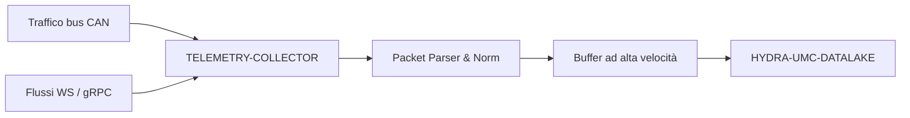

<p align="center">
  
</p>

# 📡 HYDRA-UMC-TELEMETRY-COLLECTOR

<p align="center"><a href="README.md">🇺🇸 English</a> | <a href="README_spa.md">🇪🇸 Español</a> | <a href="README_fra.md">🇫🇷 Français</a> | 🇮🇹 <b>Italiano</b> | <a href="README_deu.md">🇩🇪 Deutsch</a> | <a href="README_zho.md">🇨🇳 简体中文</a> | <a href="README_jpn.md">🇯🇵 日本語</a></p>

### 🚀 Nodo di ingestione ad alto throughput per log CAN e WebSocket

<p align="left">
  
  
  
</p>

---

## 1. 🛠️ PANORAMICA TECNICA

**HYDRA-UMC-TELEMETRY-COLLECTOR** è il gateway ad alta velocità che cattura tutte le comunicazioni grezze all'interno dell'ecosistema. Ascolta i bus FDCAN, i flussi WebSocket e gli aggiornamenti gRPC, incanalando i dati nel Datalake.

Esegue il parsing e la normalizzazione in tempo reale di fonti di dati eterogenee, assicurando che un picco di corrente del motore su un bus CAN sia correttamente correlato con un risultato di inferenza AI da un Vision Node.

### Caratteristiche principali:
* 🚀 **Ingestione multi-protocollo:** Gestisce la telemetria CAN, WebSocket, gRPC e HTTP.
* ⚡ **Alto throughput:** Ottimizzato per migliaia di messaggi al millisecondo con un sovraccarico minimo della CPU.
* 🧬 **Normalizzazione dei dati:** Traduce i pacchetti binari grezzi in formati JSON/Protobuf standardizzati.
* 🛡️ **Consegna bufferizzata:** Garantisce la perdita zero di dati durante interruzioni temporanee del database o picchi di rete.
* 🔁 **Deduplicazione sicura in caso di riconnessione:** Un numero di sequenza opzionale per produttore, tracciato in una finestra di riordino limitata, così che un dispositivo che si riconnette e reinvia i suoi ultimi messaggi non confermati non gonfi mai i conteggi di ingestione. *(implementato)*
* 🩺 **Diagnosi reale dei fallimenti:** Ogni fallimento di flush viene classificato come un rifiuto genuino dei dati da parte del sink rispetto a un problema di trasporto - esposto in `GET /stats` per una reale visibilità operativa. *(implementato)*
* 🧮 **Validazione dei campi finiti:** Un nome di campo vuoto o un valore numerico `NaN`/`Infinity`/`-Infinity` viene rifiutato (`400`) prima di raggiungere il buffer o un sink - la decodifica CAN passa per lo stesso `Sample.Validate()` dell'ingestione JSON. *(implementato)*

---

## 2. 🔄 WORKFLOW DI INGESTIONE



---

## 3. 🧱 ARCHITETTURA E DECISIONI DI PROGETTAZIONE

* **Perché `src/` è la radice del modulo Go, non la radice del repo.** Mantiene i file propri del modulo installabile (`main.go`, `version.go`, `go.mod`) separati dagli strumenti nella radice del repo (`bump_version.py`, `docker-compose.yml`) - `go build ./...` viene eseguito da dentro `src/`, non dalla radice del repo.
* **Perché la raccolta è separata da HYDRA-UMC-DATALAKE stesso.** La raccolta (interrogare HYDRA-UMC-SERVER, bufferizzare, raggruppare le scritture) è una preoccupazione legata all'I/O distinta da storage/query - tenerla come processo separato significa che un riavvio del collettore o un picco di contropressione non tocca il percorso di query proprio del data lake.
* **Perché un fallimento di scrittura nel sink rimette in coda il lotto invece di scartarlo.** `src/collector` è ciò che sostiene davvero la promessa "Consegna con Buffer: zero perdita di dati": `FlushOnce` rimuove un lotto dal buffer solo quando `Sink.Write` lo conferma, e lo rimette proprio in testa in caso di fallimento - un'interruzione reale riprova gli stessi campioni, non li perde. Il buffer (`src/buffer`) resta comunque limitato - un'interruzione che dura più della sua capacità SCARTA davvero l'eccesso più vecchio, un limite reale e onesto invece di promettere memoria infinita.
* **Perché CAN e WebSocket vengono entrambi analizzati nella stessa forma `Sample`.** `src/telemetry` normalizza entrambe le fonti eterogenee in un'unica struttura prima che qualsiasi cosa tocchi il buffer o il sink - il vero meccanismo dietro "un picco di corrente motore su CAN correttamente correlato con un risultato di un Vision Node": nessuna fase successiva deve sapere da quale protocollo è arrivato un campione.
* **Perché il formato dei frame CAN è una convenzione propria v0 di questo progetto, non ancora i veri ID CAN dell'ecosistema.** Le vere tabelle di ID CAN vivono nella documentazione firmware propria di HYDRA-UMC e URTC - integrarsi davvero con esse è lavoro futuro, non qualcosa da indovinare senza quel riferimento davanti.
* **Perché `DatalakeSink` scrive un campione per richiesta HTTP, e perché un fallimento parziale del batch può duplicare righe al ritentativo.** Il `POST /ingest` proprio di HYDRA-UMC-DATALAKE (vedi `src/hydra_umc_datalake/api.py` di quel progetto) è a singolo campione, non a batch - una "scrittura a batch" qui in realtà sono N richieste reali. Se una fallisce a metà di un batch, `Write` restituisce un errore e la logica di ritentativo propria di `collector.go` rimette in coda l'INTERO batch, quindi i campioni già scritti vengono reinviati e finiscono come righe duplicate in DATALAKE al prossimo flush riuscito. Almeno-una-volta con duplicati occasionali durante un'interruzione reale - invece di perdere dati in silenzio (al-più-una-volta) - è il compromesso onesto di questa v0; una consegna reale esattamente-una-volta (chiavi di idempotenza, upsert) è lavoro futuro, non tentata qui. `ConsoleSink` (stampa su stdout) resta il valore predefinito quando `-datalake-url` non viene passato, per eseguire questo collector in modo autonomo.
* **Come si inserisce nel resto dell'ecosistema.** Un servizio fratello sotto HYDRA-UMC-DATALAKE - il componente che contatta realmente HYDRA-UMC-SERVER per la telemetria per robot e la scrive nell'archivio di serie temporali condiviso.
* **Perché la deduplicazione è un package `dedup` separato, indicizzato su un `Sequence` opzionale, non un hash del contenuto stesso del campione.** Una riconnessione reale reinvia gli stessi identici byte, quindi l'hashing del contenuto funzionerebbe per quel caso - ma inghiottirebbe anche silenziosamente due campioni genuinamente diversi che per caso condividono tutti i campi (ad es. due letture di `0.0` a un secondo di distanza). Un numero di sequenza per produttore è ciò che un dispositivo reale deve già tracciare per i propri messaggi non confermati, quindi riutilizzarlo è il segnale onesto e reale - non una supposizione derivata da dati che in realtà non promettono unicità. `Sequence == 0`/omesso esclude completamente un produttore, quindi nulla del comportamento preesistente cambia per un dispositivo che non ne invia uno.
* **Perché `sink.InvalidDataError` non cambia la politica di ritentativo, ma la rende solo diagnosticabile.** Il rimettere-in-coda-e-ritentare tutto-o-niente di `collector.go` (vedi sopra) resta esattamente com'era - un campione permanentemente non valido viene comunque ritentato come qualsiasi altro, il che è di per sé una limitazione nota e documentata. Ciò che è nuovo è la visibilità reale: `invalidDataErrors` contro `transportErrors` in `GET /stats` permette a un operatore di distinguere "DATALAKE sta rifiutando i nostri dati" da "la rete verso DATALAKE è inattiva" senza dover indovinare dai log.

---

## 📂 STRUTTURA DELLE CARTELLE

Servizio puramente software (nodo di ingestione) - senza hardware, firmware o sistema operativo propri; tali cartelle sono omesse secondo la politica della struttura del repository.

```text
HYDRA-UMC-TELEMETRY-COLLECTOR/
├── src/                  # Modulo Go
│   ├── go.mod            # Definizione del modulo
│   ├── version.go        # const Version = "X.Y.Z"
│   ├── main.go           # Punto di ingresso: collega tutto, avvia l'API HTTP
│   ├── telemetry/        # Tipo Sample + parser CAN/WebSocket (normalizzazione)
│   ├── buffer/           # FIFO limitato con segnalazione di contropressione (Ring)
│   ├── dedup/            # Deduplicazione reale per sequenza per produttore (finestra di riordino)
│   ├── collector/        # Orchestra ingestione+flush, riprova se il sink fallisce, dedup
│   ├── sink/              # Dove vanno i lotti svuotati (ConsoleSink oggi), classificazione trasporto/dati non validi
│   └── api/                # Handler JSON/HTTP semplici che avvolgono il collector
├── docs/
│   └── API.md              # Riferimento reale degli endpoint HTTP (richieste, risposte, codici di stato)
├── images/               # Media e diagrammi
├── systemd/
│   └── hydra-umc-telemetry-collector.service # Unità systemd della API locale di ingestione telemetria sulla CM5
├── tools/
│   ├── build_test.py     # Controllo build senza versionamento
│   └── ci_validate.py    # Validazione manifest/CHANGELOG/docs usata dalla CI
├── build/                # Binari compilati (ignorato da git)
├── bump_version.py        # Incremento di versione nativa stile contachilometri (eseguito dal build)
├── bump_manifest_version.py # Sincronizza la versione di hydra-umc.project.json con quella nativa (--sync)
├── build.sh / build.bat   # Build reale: bump + go build
├── run.sh / run.bat       # Esecuzione reale: avvia il binario compilato
└── README.md
```

Rimossi dal template originale: `hardware/`, `firmware/` e `os/` — è un
servizio puramente software (binario Go) senza hardware o firmware propri
e senza un'immagine del sistema operativo da mantenere. Vedi [`docs/API.md`](docs/API.md)
per il riferimento completo degli endpoint HTTP.

---

## 4. ⚙️ BUILD ED ESECUZIONE

Richiede Go >= 1.21. Una vera pipeline di ingestione con API HTTP, non solo
uno scheletro che compila.

```bash
# Linux/macOS
./build.sh
./run.sh -addr :8092 -datalake-url http://localhost:8095

# Windows
build.bat
run.bat -addr :8092 -datalake-url http://localhost:8095
```

`build` incrementa la versione (`src/version.go`) e compila il modulo Go
in `src/` in `build/telemetry-collector(.exe)`. `run` esegue il binario
compilato, inoltrando qualsiasi flag, e inizia ad ascoltare traffico
reale. `-datalake-url` punta i batch svuotati verso un'istanza reale e
in esecuzione di HYDRA-UMC-DATALAKE (`POST /ingest`,
`sink.DatalakeSink`) - se omesso, stampa invece i campioni svuotati su
stdout (`sink.ConsoleSink`), utile per eseguire questo collector in modo
autonomo:

```bash
# Ingerire un campione di telemetria in stile WebSocket
curl -X POST localhost:8092/ingest/ws \
  -d '{"sourceId":"robot-1","kind":"motor_temp","timestamp":1700000000000,"fields":{"value":42.5}}'

# Ingerire un frame CAN (8 byte, base64 - vedi src/telemetry/can.go per il formato)
curl -X POST localhost:8092/ingest/can \
  -d '{"arbitrationId":7,"data":"AQAAUEEAAAA="}'

# Vedere cosa ha ingerito/svuotato/scartato il collector
curl localhost:8092/stats
```

```bash
cd src && go test ./...   # telemetry (round-trip CAN, validazione WS),
                           # buffer (FIFO limitato, contropressione, requeue),
                           # collector (il vero comportamento "non perdere
                           # dati durante un'interruzione del sink"), e api
                           # (round-trip HTTP reali via httptest)
```

---

## 🚀 TABELLA DI MARCIA
* **Fase 1:** Ingestione ad alto throughput del Datalake e indicizzazione per l'analisi storica.
* **Fase 2:** Compressione edge del collettore di telemetria e protocolli di trasmissione sicuri.
* **Fase 3:** Rilevamento delle anomalie tramite apprendimento non supervisionato e analisi delle vibrazioni del motore.
* **Fase 4:** Compressione on-the-fly per l'ingestione massiva di log e ottimizzazione multi-protocollo.

---

## 🔗 Progetti Correlati

Questo progetto fa parte dell'ecosistema robotico HYDRA-UMC dello stesso autore (JuanenRac / Electro Hobby 3D). Vale la pena conoscerlo, poiché una richiesta potrebbe in realtà riguardare uno di questi invece di questo repository.

**Progetto Padre**
- **[HYDRA-UMC-DATALAKE](https://github.com/JuanenRac/HYDRA-UMC-DATALAKE)** — vero archivio di serie temporali basato su sqlite3, con una vera API HTTP di ingestione/query; il genitore di cui questo repository è un servizio di analisi specifico, all'interno del proprio livello di dati e analisi.

**Progetti Fratelli** — gli altri servizi di analisi del livello di dati e analisi proprio di HYDRA-UMC-DATALAKE
- **[HYDRA-UMC-ANOMALY-DETECTOR](https://github.com/JuanenRac/HYDRA-UMC-ANOMALY-DETECTOR)** — vero rilevatore di anomalie FFT + baseline statistica, con monitoraggio della deriva.
- **[HYDRA-UMC-PRODUCTION-REPORTS](https://github.com/JuanenRac/HYDRA-UMC-PRODUCTION-REPORTS)** — vero calcolo OEE/disponibilità sullo storico di DATALAKE, con esportazione CSV riproducibile.

**Direttamente Correlati**
- **[HYDRA-UMC-SERVER](https://github.com/JuanenRac/HYDRA-UMC-SERVER)** — il vero backend headless (REST/WebSocket) con cui parla davvero ogni client di controllo — la fonte dei log che questo progetto ingerisce.
- **[HYDRA-UMC](https://github.com/JuanenRac/HYDRA-UMC)** — la scheda madre fisica del braccio robotico: host CM5 + coprocessore STM32H745 dual-core, che coordina fino a 8 bracci utensile via CAN-OTA/SPI-OTA — la vera tabella di ID CAN contro cui il formato CAN proprio di questo progetto è destinato a integrarsi col tempo; oggi usa la propria convenzione v0, tracciata onestamente come lavoro futuro anziché dichiarata completata.
- **[URTC](https://github.com/JuanenRac/URTC)** — firmware per la scheda fisica dell'Universal Robot Tool Controller, oltre 25 profili utensile su bus CAN — la vera tabella di ID CAN contro cui il formato CAN proprio di questo progetto è destinato a integrarsi col tempo; oggi usa la propria convenzione v0, tracciata onestamente come lavoro futuro anziché dichiarata completata.

**Fa Anche Parte dell'Ecosistema**

*Hardware e Piattaforma di Base*
- **[HYDRA-UMC-OS](https://github.com/JuanenRac/HYDRA-UMC-OS)** — livello prodotto riproducibile su Raspberry Pi OS per il CM5: agente in sola lettura, config/profili validati, provisioning WiFi al primo contatto.
- **[HYDRA-UMC-SDK](https://github.com/JuanenRac/HYDRA-UMC-SDK)** — il contratto JSON-Schema condiviso e la barriera di sicurezza contro cui ogni bridge valida i propri comandi.

*Backend Centrale e Client*
- **[HYDRA-UMC-STUDIO](https://github.com/JuanenRac/HYDRA-UMC-STUDIO)** — dashboard di controllo web con visualizzazione 3D multi-robot in tempo reale.
- **[HYDRA-UMC-SUITE](https://github.com/JuanenRac/HYDRA-UMC-SUITE)** — centro di comando sciame desktop (PySide6) per più server contemporaneamente, pacchettizzato come eseguibile standalone.
- **[HYDRA-UMC-ANDROID-CONTROL](https://github.com/JuanenRac/HYDRA-UMC-ANDROID-CONTROL)** — app di controllo nativa per Android con login biometrico e un companion Wear OS abbinato.
- **[HYDRA-UMC-IOS-CONTROL](https://github.com/JuanenRac/HYDRA-UMC-IOS-CONTROL)** — app di controllo per iOS/iPadOS (Flutter) con sincronizzazione WebSocket in tempo reale.
- **[HYDRA-UMC-DSI](https://github.com/JuanenRac/HYDRA-UMC-DSI)** — interfaccia touch nativa per il touchscreen DSI da 7" a bordo, incorporata direttamente nel CM5.
- **[HYDRA-UMC-EDITOR-URDF](https://github.com/JuanenRac/HYDRA-UMC-EDITOR-URDF)** — creatore/editor grafico desktop di URDF che invia i modelli finiti al catalogo di STUDIO.
- **[HYDRA-UMC-BRIDGE-AMR](https://github.com/JuanenRac/HYDRA-UMC-BRIDGE-AMR)** — barriera di coordinamento per flotte AGV/AMR tramite un publisher MQTT VDA 5050 reale.
- **[HYDRA-UMC-BRIDGE-CNC](https://github.com/JuanenRac/HYDRA-UMC-BRIDGE-CNC)** — coordinatore ad alto livello per celle CNC con accesso reale a stato/byte di controllo GRBL.
- **[HYDRA-UMC-BRIDGE-DROIDS](https://github.com/JuanenRac/HYDRA-UMC-BRIDGE-DROIDS)** — barriera di coordinamento per droidi con zampe/umanoidi, con un vero mittente di comandi per Boston Dynamics Spot.
- **[HYDRA-UMC-BRIDGE-LASER](https://github.com/JuanenRac/HYDRA-UMC-BRIDGE-LASER)** — coordinatore di sicurezza per celle laser che legge 3 salvaguardie GPIO reali di chiave/involucro/interblocco.
- **[HYDRA-UMC-BRIDGE-OPENPNP](https://github.com/JuanenRac/HYDRA-UMC-BRIDGE-OPENPNP)** — coordinatore ad alto livello sicuro per il flusso schede del pick-and-place OpenPnP.
- **[HYDRA-UMC-BRIDGE-PRINTER3D](https://github.com/JuanenRac/HYDRA-UMC-BRIDGE-PRINTER3D)** — barriera di coordinamento sicura per stampanti 3D Moonraker/Klipper, con comandi di lavoro reali e controllati.
- **[HYDRA-UMC-BRIDGE-ROS2](https://github.com/JuanenRac/HYDRA-UMC-BRIDGE-ROS2)** — coordinatore di sicurezza con un vero trasporto ROS 2 rclpy, importato in modo lazy.
- **[HYDRA-UMC-BRIDGE-UAV](https://github.com/JuanenRac/HYDRA-UMC-BRIDGE-UAV)** — barriera di coordinamento per UAV dotati di fotocamera, con un vero mittente di comandi MAVLink.

*Piattaforma Strumenti URTC*
- **[URTC-FLASHER](https://github.com/JuanenRac/URTC-FLASHER)** — strumento desktop con GUI per il flashing delle schede URTC, CAN-OTA più SWD/JTAG a chip intero.
- **[URTC-TESTER](https://github.com/JuanenRac/URTC-TESTER)** — strumento desktop di diagnostica CAN-bus dal vivo per schede URTC, un pannello per profilo utensile.
- **[URTC-WEB-STUDIO](https://github.com/JuanenRac/URTC-WEB-STUDIO)** — alternativa basata su browser a URTC-TESTER tramite la Web Serial API, senza installazione locale.

*Nodo IA Visione (Hailo-8)*
- **[HYDRA-UMC-VISION-NODE](https://github.com/JuanenRac/HYDRA-UMC-VISION-NODE)** — hub di integrazione per la pipeline di visione Hailo-8, con un vero controllo di prontezza hardware per fase.
- **[HYDRA-UMC-DETECTION-HEF](https://github.com/JuanenRac/HYDRA-UMC-DETECTION-HEF)** — registro reale di modelli compilati con verifica di caricamento sicuro per architettura Hailo/checksum.
- **[HYDRA-UMC-VISION-STREAMER](https://github.com/JuanenRac/HYDRA-UMC-VISION-STREAMER)** — generatore reale di pipeline GStreamer + config MediaMTX, con una vera barriera di integrazione HailoRT.
- **[HYDRA-UMC-VISUAL-SERVOING-API](https://github.com/JuanenRac/HYDRA-UMC-VISUAL-SERVOING-API)** — vera legge di correzione Position-Based Visual Servoing, con cancello di sicurezza sullo stato di zona a monte.
- **[HYDRA-UMC-SAFETY-ZONES](https://github.com/JuanenRac/HYDRA-UMC-SAFETY-ZONES)** — vero controllo di violazione zona e richiesta E-STOP, con imposizione della freschezza di calibrazione.

*Nodo IA Cognitivo (Hailo-10)*
- **[HYDRA-UMC-COGNITIVE-NODE](https://github.com/JuanenRac/HYDRA-UMC-COGNITIVE-NODE)** — hub di integrazione per la pipeline cognitiva Hailo-10 (orchestrazione LLM/VLA/voce).
- **[HYDRA-UMC-VLA-ENGINE](https://github.com/JuanenRac/HYDRA-UMC-VLA-ENGINE)** — vera codifica/decodifica di token d'azione e generazione di traiettoria per un modello Vision-Language-Action.
- **[HYDRA-UMC-VOICE-UI](https://github.com/JuanenRac/HYDRA-UMC-VOICE-UI)** — vero front-end vocale (VAD + parser di intenti) con un relay verso Watch limitato e soggetto a conferma.
- **[HYDRA-UMC-SEMANTIC-PLANNER](https://github.com/JuanenRac/HYDRA-UMC-SEMANTIC-PLANNER)** — vera scomposizione dei task basata su regole e recupero semantico degli errori sui codici errore MCU.
- **[HYDRA-UMC-DOCS-QA](https://github.com/JuanenRac/HYDRA-UMC-DOCS-QA)** — vera ricerca documentale TF-IDF (solo libreria standard) sui documenti Markdown di questo ecosistema.

*Orchestrazione e Sciame*
- **[HYDRA-UMC-ORCHESTRATOR](https://github.com/JuanenRac/HYDRA-UMC-ORCHESTRATOR)** — hub di integrazione con un vero contratto di health-report gRPC/Protobuf e una macchina a stati di missione.
- **[HYDRA-UMC-JOB-DISPATCHER](https://github.com/JuanenRac/HYDRA-UMC-JOB-DISPATCHER)** — vera coda di lavori basata su priorità con deduplicazione, su una vera API HTTP.
- **[HYDRA-UMC-NODE-HEALING](https://github.com/JuanenRac/HYDRA-UMC-NODE-HEALING)** — vero watchdog di salute della flotta basato su gRPC, con retry/backoff e rilevamento di discrepanza d'identità.
- **[HYDRA-UMC-PATH-PLANNER-3D](https://github.com/JuanenRac/HYDRA-UMC-PATH-PLANNER-3D)** — vero pianificatore di percorsi 3D basato su RRT, con vera validazione delle collisioni ostacolo/spazio di lavoro.
- **[HYDRA-UMC-SWARM-SYNC](https://github.com/JuanenRac/HYDRA-UMC-SWARM-SYNC)** — vera sincronizzazione di stato CRDT LWW-Element-Map, con property test per la convergenza multi-cella.

*Gemello Digitale e Simulazione*
- **[HYDRA-UMC-TWIN](https://github.com/JuanenRac/HYDRA-UMC-TWIN)** — hub di integrazione per il motore di gemello digitale, con un vero contratto di sincronizzazione per compatibilità di versione.
- **[HYDRA-UMC-HIL-BRIDGE](https://github.com/JuanenRac/HYDRA-UMC-HIL-BRIDGE)** — vero interblocco di sicurezza hardware-in-the-loop che instrada i comandi tra simulazione e hardware reale.
- **[HYDRA-UMC-PHYSICS-REPLICA](https://github.com/JuanenRac/HYDRA-UMC-PHYSICS-REPLICA)** — vera cinematica diretta e validazione dei limiti articolari su un vero sottoinsieme URDF.
- **[HYDRA-UMC-SYNTHETIC-DATA-GEN](https://github.com/JuanenRac/HYDRA-UMC-SYNTHETIC-DATA-GEN)** — vero generatore procedurale di scene 2D con esportazione di annotazioni YOLO/COCO.

*Gateway Industriale*
- **[HYDRA-UMC-GATEWAY-INDUSTRIAL](https://github.com/JuanenRac/HYDRA-UMC-GATEWAY-INDUSTRIAL)** — hub di integrazione che inoltra ai protocolli industriali, con un vero livello di allowlist dei comandi/backpressure.
- **[HYDRA-UMC-OPCUA-SERVER](https://github.com/JuanenRac/HYDRA-UMC-OPCUA-SERVER)** — vero spazio di indirizzi OPC-UA, verificato con una vera sessione client del protocollo binario.
- **[HYDRA-UMC-MQTT-BROKER](https://github.com/JuanenRac/HYDRA-UMC-MQTT-BROKER)** — vero broker MQTT con autenticazione opzionale per client e ACL sui topic.
- **[HYDRA-UMC-MTCONNECT-ADAPTER](https://github.com/JuanenRac/HYDRA-UMC-MTCONNECT-ADAPTER)** — veri endpoint XML `/probe` e `/current` di MTConnect, con output in modalità degradata.

*Strumenti Complementari e Operazioni dell'Ecosistema*
- **[HYDRA-UMC-DASHBOARD-AI](https://github.com/JuanenRac/HYDRA-UMC-DASHBOARD-AI)** — pannelli Smart Summaries e Anomaly Highlighting su DATALAKE/ANOMALY-DETECTOR, con un fallback statistico onesto.
- **[HYDRA-UMC-TOOL-CLI](https://github.com/JuanenRac/HYDRA-UMC-TOOL-CLI)** — CLI di flotta con un vero e stabile contratto di exit-code, un client live reale della stessa API di HYDRA-UMC-SERVER.
- **[HYDRA-UMC-WATCH](https://github.com/JuanenRac/HYDRA-UMC-WATCH)** — app companion WearOS con avvisi aptici reali e un relay vocale verso il telefono abbinato.
- **[URTC-SMART-RACK](https://github.com/JuanenRac/URTC-SMART-RACK)** — firmware per un rack di montaggio schede con decodifica reale dell'ID utensile e logica di preriscaldamento Smart Idle.
- **[URTC-VISION-TOOL](https://github.com/JuanenRac/URTC-VISION-TOOL)** — firmware più un vero companion di visione Python per una testa utensile di ispezione termica/RGB.
- **[HYDRA-UMC-UPDATER](https://github.com/JuanenRac/HYDRA-UMC-UPDATER)** — strumento amministrativo desktop che scopre, clona e aggiorna ogni repository di questo ecosistema.
- **[HYDRA-UMC-OS-REBUILDER](https://github.com/JuanenRac/HYDRA-UMC-OS-REBUILDER)** — strumento desktop Windows/Linux che costruisce un'immagine della CM5 pronta da scrivere, precaricata con le versioni più aggiornate dell'ecosistema, con configurazione di primo avvio Wi-Fi/utente/SSH in stile Raspberry Pi Imager.


---

## 📚 Documentazione e Comunità

- **[CONTRIBUTING.md](CONTRIBUTING.md)** — stack tecnologico e linee guida di codifica per una pull request.
- **[CODE_OF_CONDUCT.md](CODE_OF_CONDUCT.md)** — gli standard di comportamento attesi in questa comunità.
- **[SECURITY.md](SECURITY.md)** — come segnalare una vulnerabilità, e le reali aree di attenzione sulla sicurezza di questo progetto.
- **[SUPPORT.md](SUPPORT.md)** — dove porre domande e segnalare bug.
- **[LICENSE.md](LICENSE.md)** — la licenza propria di questo progetto.

## 👤 AUTORE
**JuanenRac** (Electro Hobby 3D)
📧 electrohobby3d@gmail.com
📺 [youtube.com/@electrohobby3d](https://youtube.com/@electrohobby3d)

## 📜 LICENZA
GPL-3.0 - Vedere LICENSE per i dettagli.
