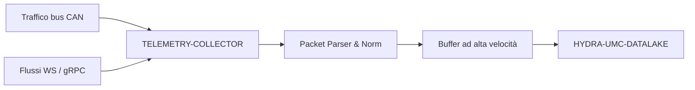

<p align="center">
  
</p>

# 📡 HYDRA-UMC-TELEMETRY-COLLECTOR

<p align="center"><a href="README.md">🇺🇸 English</a> | <a href="README_spa.md">🇪🇸 Español</a> | <a href="README_fra.md">🇫🇷 Français</a> | 🇮🇹 <b>Italiano</b> | <a href="README_deu.md">🇩🇪 Deutsch</a> | <a href="README_zho.md">🇨🇳 简体中文</a> | <a href="README_jpn.md">🇯🇵 日本語</a></p>

### 🚀 Nodo di ingestione ad alto throughput per log CAN e WebSocket

<p align="left">
  
  
  
</p>

---

## 1. 🛠️ PANORAMICA TECNICA

**HYDRA-UMC-TELEMETRY-COLLECTOR** è il gateway ad alta velocità che cattura tutte le comunicazioni grezze all'interno dell'ecosistema. Ascolta i bus FDCAN, i flussi WebSocket e gli aggiornamenti gRPC, incanalando i dati nel Datalake.

Esegue il parsing e la normalizzazione in tempo reale di fonti di dati eterogenee, assicurando che un picco di corrente del motore su un bus CAN sia correttamente correlato con un risultato di inferenza AI da un Vision Node.

### Caratteristiche principali:
* 🚀 **Ingestione multi-protocollo:** Gestisce la telemetria CAN, WebSocket, gRPC e HTTP.
* ⚡ **Alto throughput:** Ottimizzato per migliaia di messaggi al millisecondo con un sovraccarico minimo della CPU.
* 🧬 **Normalizzazione dei dati:** Traduce i pacchetti binari grezzi in formati JSON/Protobuf standardizzati.
* 🛡️ **Consegna bufferizzata:** Garantisce la perdita zero di dati durante interruzioni temporanee del database o picchi di rete.

---

## 2. 🔄 WORKFLOW DI INGESTIONE



---

## 3. 🧱 ARCHITETTURA E DECISIONI DI PROGETTAZIONE

* **Perché `src/` è la radice del modulo Go, non la radice del repo.** Mantiene i file propri del modulo installabile (`main.go`, `version.go`, `go.mod`) separati dagli strumenti nella radice del repo (`bump_version.py`, `docker-compose.yml`) - `go build ./...` viene eseguito da dentro `src/`, non dalla radice del repo.
* **Perché la raccolta è separata da HYDRA-UMC-DATALAKE stesso.** La raccolta (interrogare HYDRA-UMC-SERVER, bufferizzare, raggruppare le scritture) è una preoccupazione legata all'I/O distinta da storage/query - tenerla come processo separato significa che un riavvio del collettore o un picco di contropressione non tocca il percorso di query proprio del data lake.
* **Perché un fallimento di scrittura nel sink rimette in coda il lotto invece di scartarlo.** `src/collector` è ciò che sostiene davvero la promessa "Consegna con Buffer: zero perdita di dati": `FlushOnce` rimuove un lotto dal buffer solo quando `Sink.Write` lo conferma, e lo rimette proprio in testa in caso di fallimento - un'interruzione reale riprova gli stessi campioni, non li perde. Il buffer (`src/buffer`) resta comunque limitato - un'interruzione che dura più della sua capacità SCARTA davvero l'eccesso più vecchio, un limite reale e onesto invece di promettere memoria infinita.
* **Perché CAN e WebSocket vengono entrambi analizzati nella stessa forma `Sample`.** `src/telemetry` normalizza entrambe le fonti eterogenee in un'unica struttura prima che qualsiasi cosa tocchi il buffer o il sink - il vero meccanismo dietro "un picco di corrente motore su CAN correttamente correlato con un risultato di un Vision Node": nessuna fase successiva deve sapere da quale protocollo è arrivato un campione.
* **Perché il formato dei frame CAN è una convenzione propria v0 di questo progetto, non ancora i veri ID CAN dell'ecosistema.** Le vere tabelle di ID CAN vivono nella documentazione firmware propria di HYDRA-UMC e URTC - integrarsi davvero con esse è lavoro futuro (vedi `mejoras_futuras.txt`), non qualcosa da indovinare senza quel riferimento davanti.
* **Perché `DatalakeSink` scrive un campione per richiesta HTTP, e perché un fallimento parziale del batch può duplicare righe al ritentativo.** Il `POST /ingest` proprio di HYDRA-UMC-DATALAKE (vedi `src/hydra_umc_datalake/api.py` di quel progetto) è a singolo campione, non a batch - una "scrittura a batch" qui in realtà sono N richieste reali. Se una fallisce a metà di un batch, `Write` restituisce un errore e la logica di ritentativo propria di `collector.go` rimette in coda l'INTERO batch, quindi i campioni già scritti vengono reinviati e finiscono come righe duplicate in DATALAKE al prossimo flush riuscito. Almeno-una-volta con duplicati occasionali durante un'interruzione reale - invece di perdere dati in silenzio (al-più-una-volta) - è il compromesso onesto di questa v0; una consegna reale esattamente-una-volta (chiavi di idempotenza, upsert) è lavoro futuro, vedi `mejoras_futuras.txt`. `ConsoleSink` (stampa su stdout) resta il valore predefinito quando `-datalake-url` non viene passato, per eseguire questo collector in modo autonomo.
* **Come si inserisce nel resto dell'ecosistema.** Un servizio fratello sotto HYDRA-UMC-DATALAKE - il componente che contatta realmente HYDRA-UMC-SERVER per la telemetria per robot e la scrive nell'archivio di serie temporali condiviso.

---

## 📂 STRUTTURA DELLE CARTELLE

Servizio puramente software (nodo di ingestione) - senza hardware, firmware o sistema operativo propri; tali cartelle sono omesse secondo la politica della struttura del repository.

```text
HYDRA-UMC-TELEMETRY-COLLECTOR/
├── src/                  # Modulo Go
│   ├── go.mod            # Definizione del modulo
│   ├── version.go        # const Version = "X.Y.Z"
│   ├── main.go           # Punto di ingresso: collega tutto, avvia l'API HTTP
│   ├── telemetry/        # Tipo Sample + parser CAN/WebSocket (normalizzazione)
│   ├── buffer/           # FIFO limitato con segnalazione di contropressione (Ring)
│   ├── collector/        # Orchestra ingestione+flush, riprova se il sink fallisce
│   ├── sink/              # Dove vanno i lotti svuotati (ConsoleSink oggi)
│   └── api/                # Handler JSON/HTTP semplici che avvolgono il collector
├── build/                # Binari compilati (ignorato da git)
├── bump_version.py        # Incremento di versione stile contachilometri (eseguito dal build)
├── build.sh / build.bat   # Build reale: bump + go build
├── run.sh / run.bat       # Esecuzione reale: avvia il binario compilato
└── README.md
```

Rimossi dal template originale: `hardware/`, `firmware/`, `os/`, `docs/`,
`images/` e `scripts/` — è un servizio puramente software (binario Go)
senza hardware o firmware propri, senza un'immagine del sistema operativo
da mantenere, e senza contenuto di documentazione/media/script di utilità
ancora sufficiente da giustificare cartelle proprie.

---

## 4. ⚙️ BUILD ED ESECUZIONE

Richiede Go >= 1.21. Una vera pipeline di ingestione con API HTTP, non solo
uno scheletro che compila.

```bash
# Linux/macOS
./build.sh
./run.sh -addr :8092 -datalake-url http://localhost:8095

# Windows
build.bat
run.bat -addr :8092 -datalake-url http://localhost:8095
```

`build` incrementa la versione (`src/version.go`) e compila il modulo Go
in `src/` in `build/telemetry-collector(.exe)`. `run` esegue il binario
compilato, inoltrando qualsiasi flag, e inizia ad ascoltare traffico
reale. `-datalake-url` punta i batch svuotati verso un'istanza reale e
in esecuzione di HYDRA-UMC-DATALAKE (`POST /ingest`,
`sink.DatalakeSink`) - se omesso, stampa invece i campioni svuotati su
stdout (`sink.ConsoleSink`), utile per eseguire questo collector in modo
autonomo:

```bash
# Ingerire un campione di telemetria in stile WebSocket
curl -X POST localhost:8092/ingest/ws \
  -d '{"sourceId":"robot-1","kind":"motor_temp","timestamp":1700000000000,"fields":{"value":42.5}}'

# Ingerire un frame CAN (8 byte, base64 - vedi src/telemetry/can.go per il formato)
curl -X POST localhost:8092/ingest/can \
  -d '{"arbitrationId":7,"data":"AQAAUEEAAAA="}'

# Vedere cosa ha ingerito/svuotato/scartato il collector
curl localhost:8092/stats
```

```bash
cd src && go test ./...   # telemetry (round-trip CAN, validazione WS),
                           # buffer (FIFO limitato, contropressione, requeue),
                           # collector (il vero comportamento "non perdere
                           # dati durante un'interruzione del sink"), e api
                           # (round-trip HTTP reali via httptest)
```

---

## 🚀 ROADMAP
* **Fase 1:** Ingestione ad alto throughput del Datalake e indicizzazione per l'analisi storica.
* **Fase 2:** Compressione edge del collettore di telemetria e protocolli di trasmissione sicuri.
* **Fase 3:** Rilevamento delle anomalie tramite apprendimento non supervisionato e analisi delle vibrazioni del motore.
* **Fase 4:** Compressione on-the-fly per l'ingestione massiva di log e ottimizzazione multi-protocollo.

---

## 🔗 Progetti Correlati

Questo progetto fa parte di un ecosistema robotico più ampio dello stesso autore (JuanenRac / Electro Hobby 3D), che copre firmware, software di controllo, nodi IA e strumenti di flotta. Utile saperlo, perché una richiesta potrebbe in realtà riguardare uno di questi progetti anziché questo repository.

### Famiglia

**Genitore:** **[HYDRA-UMC-DATALAKE](https://github.com/JuanenRac/HYDRA-UMC-DATALAKE)** — il genitore di integrazione alimentato da questo collettore.

**Fratelli:**
- **[HYDRA-UMC-ANOMALY-DETECTOR](https://github.com/JuanenRac/HYDRA-UMC-ANOMALY-DETECTOR)** — servizio di analytics fratello, stesso genitore.
- **[HYDRA-UMC-PRODUCTION-REPORTS](https://github.com/JuanenRac/HYDRA-UMC-PRODUCTION-REPORTS)** — servizio di analytics fratello, stesso genitore.

### Relazione Diretta (fuori dalla famiglia)

- **[HYDRA-UMC-SERVER](https://github.com/JuanenRac/HYDRA-UMC-SERVER)** — la fonte dei log ingeriti da questo progetto.

### Resto dell'Ecosistema

**Piattaforma HYDRA-UMC** — la cella di micro-fabbrica multi-robot
- **[HYDRA-UMC](https://github.com/JuanenRac/HYDRA-UMC)** — la scheda madre CM5 + STM32H745 che orchestra fino a 8 bracci robotici.
- **[HYDRA-UMC-SERVER](https://github.com/JuanenRac/HYDRA-UMC-SERVER)** — il backend Express/WebSocket con cui parla ogni client di controllo.
- **[HYDRA-UMC-STUDIO](https://github.com/JuanenRac/HYDRA-UMC-STUDIO)** — dashboard di controllo web, visualizzazione 3D multi-robot.
- **[HYDRA-UMC-ANDROID-CONTROL](https://github.com/JuanenRac/HYDRA-UMC-ANDROID-CONTROL)** — app di controllo Android via Wi-Fi/Bluetooth.
- **[HYDRA-UMC-IOS-CONTROL](https://github.com/JuanenRac/HYDRA-UMC-IOS-CONTROL)** — app di controllo iOS/iPadOS costruita in Flutter.
- **[HYDRA-UMC-SUITE](https://github.com/JuanenRac/HYDRA-UMC-SUITE)** — centro di comando sciame desktop (Python/PySide6).
- **[HYDRA-UMC-EDITOR-URDF](https://github.com/JuanenRac/HYDRA-UMC-EDITOR-URDF)** — editor desktop di modelli URDF per il catalogo robot.
- **[HYDRA-UMC-DSI](https://github.com/JuanenRac/HYDRA-UMC-DSI)** — interfaccia touch nativa per lo schermo DSI a bordo.

**Piattaforma URTC** — il controller della testa utensile che ogni braccio HYDRA-UMC porta con sé
- **[URTC](https://github.com/JuanenRac/URTC)** — controller testa utensile su bus CAN, 25 profili utensile.
- **[URTC-FLASHER](https://github.com/JuanenRac/URTC-FLASHER)** — strumento desktop di flashing CAN-OTA + SWD/JTAG.
- **[URTC-TESTER](https://github.com/JuanenRac/URTC-TESTER)** — strumento desktop di diagnostica CAN live.
- **[URTC-WEB-STUDIO](https://github.com/JuanenRac/URTC-WEB-STUDIO)** — alternativa basata su browser via Web Serial API.

**🎥 Vision AI Node (Hailo-8)**
- [HYDRA-UMC-VISION-NODE](https://github.com/JuanenRac/HYDRA-UMC-VISION-NODE)
- [HYDRA-UMC-VISION-STREAMER](https://github.com/JuanenRac/HYDRA-UMC-VISION-STREAMER)
- [HYDRA-UMC-DETECTION-HEF](https://github.com/JuanenRac/HYDRA-UMC-DETECTION-HEF)
- [HYDRA-UMC-SAFETY-ZONES](https://github.com/JuanenRac/HYDRA-UMC-SAFETY-ZONES)
- [HYDRA-UMC-VISUAL-SERVOING-API](https://github.com/JuanenRac/HYDRA-UMC-VISUAL-SERVOING-API)

**🧠 Cognitive AI Node (Hailo-10)**
- [HYDRA-UMC-COGNITIVE-NODE](https://github.com/JuanenRac/HYDRA-UMC-COGNITIVE-NODE)
- [HYDRA-UMC-VLA-ENGINE](https://github.com/JuanenRac/HYDRA-UMC-VLA-ENGINE)
- [HYDRA-UMC-VOICE-UI](https://github.com/JuanenRac/HYDRA-UMC-VOICE-UI)
- [HYDRA-UMC-SEMANTIC-PLANNER](https://github.com/JuanenRac/HYDRA-UMC-SEMANTIC-PLANNER)
- [HYDRA-UMC-DOCS-QA](https://github.com/JuanenRac/HYDRA-UMC-DOCS-QA)

**🐝 Orchestration & Swarm**
- [HYDRA-UMC-ORCHESTRATOR](https://github.com/JuanenRac/HYDRA-UMC-ORCHESTRATOR)
- [HYDRA-UMC-SWARM-SYNC](https://github.com/JuanenRac/HYDRA-UMC-SWARM-SYNC)
- [HYDRA-UMC-PATH-PLANNER-3D](https://github.com/JuanenRac/HYDRA-UMC-PATH-PLANNER-3D)
- [HYDRA-UMC-JOB-DISPATCHER](https://github.com/JuanenRac/HYDRA-UMC-JOB-DISPATCHER)
- [HYDRA-UMC-NODE-HEALING](https://github.com/JuanenRac/HYDRA-UMC-NODE-HEALING)

**🎮 Digital Twin & Simulation**
- [HYDRA-UMC-TWIN](https://github.com/JuanenRac/HYDRA-UMC-TWIN)
- [HYDRA-UMC-PHYSICS-REPLICA](https://github.com/JuanenRac/HYDRA-UMC-PHYSICS-REPLICA)
- [HYDRA-UMC-HIL-BRIDGE](https://github.com/JuanenRac/HYDRA-UMC-HIL-BRIDGE)
- [HYDRA-UMC-SYNTHETIC-DATA-GEN](https://github.com/JuanenRac/HYDRA-UMC-SYNTHETIC-DATA-GEN)

**🏭 Industrial Gateway**
- [HYDRA-UMC-GATEWAY-INDUSTRIAL](https://github.com/JuanenRac/HYDRA-UMC-GATEWAY-INDUSTRIAL)
- [HYDRA-UMC-OPCUA-SERVER](https://github.com/JuanenRac/HYDRA-UMC-OPCUA-SERVER)
- [HYDRA-UMC-MQTT-BROKER](https://github.com/JuanenRac/HYDRA-UMC-MQTT-BROKER)
- [HYDRA-UMC-MTCONNECT-ADAPTER](https://github.com/JuanenRac/HYDRA-UMC-MTCONNECT-ADAPTER)

**🛠️ Complementary Tools**
- [URTC-SMART-RACK](https://github.com/JuanenRac/URTC-SMART-RACK)
- [URTC-VISION-TOOL](https://github.com/JuanenRac/URTC-VISION-TOOL)
- [HYDRA-UMC-WATCH](https://github.com/JuanenRac/HYDRA-UMC-WATCH)
- [HYDRA-UMC-TOOL-CLI](https://github.com/JuanenRac/HYDRA-UMC-TOOL-CLI)
- [HYDRA-UMC-DASHBOARD-AI](https://github.com/JuanenRac/HYDRA-UMC-DASHBOARD-AI)


## 👤 AUTORE
**JuanenRac** (Electro Hobby 3D)
📧 electrohobby3d@gmail.com

## 📜 LICENZA
GPL-3.0 - Vedere LICENSE per i dettagli.

## 🛠️ BUILD & RUN

Usa il controllo di compilazione senza versionamento prima di una compilazione di rilascio:

| Azione | Windows | Linux / macOS |
|---|---|---|
| Controllo di compilazione (senza modificare versione o CHANGELOG) | `build-test.bat` | `./build-test.sh` |
| Esecuzione / sviluppo (se disponibile) | `run*.bat` o `dev*.bat` | `./run*.sh` o `./dev*.sh` |

`build-test.bat` e `build-test.sh` compilano o convalidano lo stack del progetto senza incrementare `hydra-umc.project.json` né modificare `CHANGELOG.md`. Possono creare solo i normali output del compilatore. Gli script esistenti `build*.bat`, `build*.sh`, `run*` e `dev*` mantengono il comportamento specifico di versione o esecuzione; usali quando tale comportamento è necessario.