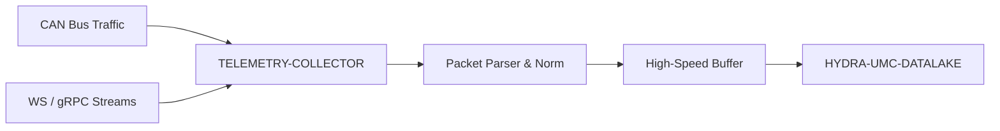

<p align="center">
  
</p>

# 📡 HYDRA-UMC-TELEMETRY-COLLECTOR

<p align="center"><a href="README.md">🇺🇸 English</a> | <a href="README_spa.md">🇪🇸 Español</a> | <a href="README_fra.md">🇫🇷 Français</a> | <a href="README_ita.md">🇮🇹 Italiano</a> | <a href="README_deu.md">🇩🇪 Deutsch</a> | <a href="README_zho.md">🇨🇳 简体中文</a> | 🇯🇵 <b>日本語</b></p>

### 🚀 CAN および WebSocket ログ向けの高スループット取り込みノード

<p align="left">
  
  
  
</p>

---

## 1. 🛠️ 技術概要

**HYDRA-UMC-TELEMETRY-COLLECTOR** は、エコシステム内のすべての生の通信
を捕捉する高速ゲートウェイです。FDCAN バス、WebSocket ストリーム、
gRPC の更新を監視し、データをデータレイクへと流し込みます。

異種データソースのリアルタイムな解析と正規化を行い、CAN バス上の
モーター電流のスパイクが、ビジョンノードからの AI 推論結果と正しく
相関付けられることを保証します。

### 主な機能：
* 🚀 **マルチプロトコル取り込み：** CAN、WebSocket、gRPC、HTTP のテレメトリを処理します。
* ⚡ **高スループット：** 最小限の CPU オーバーヘッドで、1 ミリ秒あたり数千メッセージ向けに最適化。
* 🧬 **データ正規化：** 生のバイナリパケットを標準化された JSON/Protobuf 形式に変換します。
* 🛡️ **バッファ付き配信：** データベースの一時的な停止やネットワークスパイク時にもデータ損失をゼロに保ちます。

---

## 2. 🔄 取り込みワークフロー



---

## 3. 🧱 アーキテクチャと設計上の決定

* **`src/` がリポジトリルートではなく Go モジュールのルートである理由。** インストール可能なモジュール自身のファイル（`main.go`、`version.go`、`go.mod`）を、リポジトリルートのツール（`bump_version.py`、`docker-compose.yml`）から分離するためです——`go build ./...` はリポジトリルートではなく `src/` 内部から実行されます。
* **データ収集が HYDRA-UMC-DATALAKE 自体から分離されている理由。** データ収集（HYDRA-UMC-SERVER のポーリング、バッファリング、バッチ書き込み）は、ストレージ/クエリとは異なる I/O バウンドな関心事です——独立したプロセスとして保つことで、コレクターの再起動やバックプレッシャーのスパイクが、データレイク自身のクエリパスに影響を与えることはありません。
* **シンク書き込みの失敗がバッチを破棄せず再キューに入れる理由。** `src/collector` こそが「バッファ配信：データ損失ゼロ」という約束を実際に果たしている部分です——`FlushOnce` は `Sink.Write` が確認して初めて、取り出したバッチをバッファから削除します。失敗した場合は先頭にそのまま戻します——実際の障害は同じサンプルを再試行するのであって、失うわけではありません。とはいえバッファ(`src/buffer`)は依然として有限です——その容量を超える障害は、実際に最も古い超過分を失います。これは無限のメモリを約束するのではなく、現実的で正直な限界です。
* **CAN と WebSocket の両方が同じ `Sample` 形式にパースされる理由。** `src/telemetry` は、何かがバッファやシンクに触れる前に、両方の異種ソースを一つの構造体に正規化します——これが「CAN 上のモーター電流スパイクが Vision Node の推論結果と正しく相関する」ことの実際のメカニズムです：下流のどの段階も、サンプルがどのプロトコル経由で届いたかを知る必要がありません。
* **CAN のワイヤーフォーマットが、まだエコシステムの本物の CAN ID ではなく、このプロジェクト独自の v0 規約である理由。** 本物の CAN ID テーブルは HYDRA-UMC と URTC それぞれの実際のファームウェアドキュメントにあります——それらと本当に統合するのは将来の作業です(`mejoras_futuras.txt` を参照)。その参照資料を手元に置かずに推測すべきものではありません。
* **`DatalakeSink` が HTTP リクエスト1件につきサンプル1件を書き込む理由、そしてバッチの部分的な失敗が再試行時に行の重複を引き起こしうる理由。** HYDRA-UMC-DATALAKE 自身の `POST /ingest`(そのプロジェクトの `src/hydra_umc_datalake/api.py` を参照)は単一サンプル用であり、バッチ用ではありません——ここでの「バッチ書き込み」は実際には N 回の実際のリクエストです。バッチの途中で1件が失敗すると、`Write` はエラーを返し、`collector.go` 自身の再試行ロジックがバッチ全体を再度キューに入れるため、すでに書き込まれたサンプルが再送信され、次に成功したフラッシュ時に DATALAKE 内で重複した行になります。実際の障害発生時に「少なくとも一度」で時折重複が生じること——データを静かに失う(最大一度)のではなく——が、この v0 の誠実なトレードオフです。真の「正確に一度」の配信(冪等性キー、upsert)は今後の課題です。`mejoras_futuras.txt` を参照してください。`-datalake-url` が指定されない場合、`ConsoleSink`(標準出力への表示)が引き続きデフォルトとなり、このコレクターを単独で実行する際に役立ちます。
* **エコシステムの他の部分との関係。** HYDRA-UMC-DATALAKE の下の兄弟サービスです——実際に HYDRA-UMC-SERVER に対してロボットごとのテレメトリを問い合わせ、それを共有時系列ストアに書き込む唯一のコンポーネントです。

---

## 📂 リポジトリ構成

純粋なソフトウェアサービス（取り込みノード）——独自のハードウェア/
ファームウェア/OS を持たず、テンプレートから省略されています
（エコシステムの慣例は `SONNET/_papelera/` を参照）。

```text
HYDRA-UMC-TELEMETRY-COLLECTOR/
├── src/                  # Go モジュール
│   ├── go.mod            # モジュール定義
│   ├── version.go        # const Version = "X.Y.Z"
│   ├── main.go           # エントリポイント：すべてを接続し、HTTP API を起動
│   ├── telemetry/        # Sample 型 + CAN/WebSocket パーサー(正規化)
│   ├── buffer/           # 背圧を報告する有界 FIFO(Ring)
│   ├── collector/        # 取り込み+フラッシュを調整、シンク失敗時に再試行
│   ├── sink/              # フラッシュされたバッチの行き先(現在は ConsoleSink)
│   └── api/                # collector を包む単純な JSON/HTTP ハンドラー
├── build/                # コンパイル済みバイナリ（gitignore 対象）
├── bump_version.py        # オドメーター式バージョンインクリメント（ビルドが実行）
├── build.sh / build.bat   # 実際のビルド：バージョンインクリメント + go build
├── run.sh / run.bat       # 実際の実行：コンパイル済みバイナリを実行
└── README.md
```

元のテンプレートから省略：`hardware/`、`firmware/`、`os/`、`docs/`、
`images/`、`scripts/` —— これは純粋なソフトウェアサービス(Go バイナリ)
であり、専用のハードウェアやファームウェア、維持すべき
オペレーティングシステムイメージもなく、専用フォルダを正当化する
ほどのドキュメント/メディア/ユーティリティスクリプトの内容もまだ
ありません。

---

## 4. ⚙️ ビルドと実行

Go >= 1.21 が必要です。コンパイルできるだけの骨組みではなく、HTTP API
を備えた本物の取り込みパイプラインです。

```bash
# Linux/macOS
./build.sh
./run.sh -addr :8092 -datalake-url http://localhost:8095

# Windows
build.bat
run.bat -addr :8092 -datalake-url http://localhost:8095
```

`build` はバージョンを増加させ（`src/version.go`）、`src/` 内の Go
モジュールを `build/telemetry-collector(.exe)` としてコンパイルします。
`run` はコンパイル済みバイナリを実行し、フラグをそのまま渡して、
実際のトラフィックのリッスンを開始します。`-datalake-url` は
フラッシュされたバッチを、実際に稼働している HYDRA-UMC-DATALAKE
インスタンス（`POST /ingest`、`sink.DatalakeSink`）に向けます——
省略した場合は、フラッシュされたサンプルを代わりに標準出力へ表示します
（`sink.ConsoleSink`）。このコレクターを単独で実行する際に便利です：

```bash
# WebSocket 形式のテレメトリサンプルを取り込む
curl -X POST localhost:8092/ingest/ws \
  -d '{"sourceId":"robot-1","kind":"motor_temp","timestamp":1700000000000,"fields":{"value":42.5}}'

# CAN フレームを取り込む(8 バイト、base64 - フォーマットは src/telemetry/can.go を参照)
curl -X POST localhost:8092/ingest/can \
  -d '{"arbitrationId":7,"data":"AQAAUEEAAAA="}'

# collector が取り込み/フラッシュ/破棄した内容を確認する
curl localhost:8092/stats
```

```bash
cd src && go test ./...   # telemetry(CAN 往復、WS 検証)、buffer(有界
                           # FIFO、背圧、requeue)、collector(「シンク
                           # 障害時にデータを失わない」という実際の
                           # 挙動)、そして api(httptest による本物の
                           # HTTP 往復テスト)
```

---

## 🚀 ロードマップ
* **フェーズ 1：** 履歴分析のためのデータレイクの高スループット取り込みとインデックス作成。
* **フェーズ 2：** テレメトリコレクターのエッジ圧縮と安全な送信プロトコル。
* **フェーズ 3：** 教師なし学習とモーター振動分析を用いた異常検知。
* **フェーズ 4：** 大量のログ取り込みのためのオンザフライ圧縮とマルチプロトコル最適化。

---

## 🔗 関連プロジェクト

本プロジェクトは、同一著者（JuanenRac / Electro Hobby 3D）による、
ファームウェア、制御ソフトウェア、AI ノード、フリート管理ツールにまたがる、
より大きなロボティクスエコシステムの一部です。ご要望が実際にはこれらの
プロジェクトのいずれかに関するものであり、本リポジトリのものではない
可能性もあるため、知っておく価値があります。

### プロジェクトファミリー

**親プロジェクト：** **[HYDRA-UMC-DATALAKE](https://github.com/JuanenRac/HYDRA-UMC-DATALAKE)** —— 本コレクターが供給する統合親プロジェクト。

**兄弟プロジェクト：**
- **[HYDRA-UMC-ANOMALY-DETECTOR](https://github.com/JuanenRac/HYDRA-UMC-ANOMALY-DETECTOR)** —— 同じ親プロジェクトを持つ兄弟分析サービス。
- **[HYDRA-UMC-PRODUCTION-REPORTS](https://github.com/JuanenRac/HYDRA-UMC-PRODUCTION-REPORTS)** —— 同じ親プロジェクトを持つ兄弟分析サービス。

### 直接関連（ファミリー外）

- **[HYDRA-UMC-SERVER](https://github.com/JuanenRac/HYDRA-UMC-SERVER)** —— 本プロジェクトが取り込むログの発生源。

### エコシステムのその他のプロジェクト

**HYDRA-UMC プラットフォーム** — マルチロボット・マイクロファクトリーセル
- **[HYDRA-UMC](https://github.com/JuanenRac/HYDRA-UMC)** — 最大 8 台のロボットアームを統括する CM5 + STM32H745 マザーボード。
- **[HYDRA-UMC-SERVER](https://github.com/JuanenRac/HYDRA-UMC-SERVER)** — すべての制御クライアントが接続する Express/WebSocket バックエンド。
- **[HYDRA-UMC-STUDIO](https://github.com/JuanenRac/HYDRA-UMC-STUDIO)** — Web ベースの制御ダッシュボード、マルチロボット 3D 可視化。
- **[HYDRA-UMC-ANDROID-CONTROL](https://github.com/JuanenRac/HYDRA-UMC-ANDROID-CONTROL)** — Wi-Fi/Bluetooth 経由の Android 制御アプリ。
- **[HYDRA-UMC-IOS-CONTROL](https://github.com/JuanenRac/HYDRA-UMC-IOS-CONTROL)** — Flutter で構築された iOS/iPadOS 制御アプリ。
- **[HYDRA-UMC-SUITE](https://github.com/JuanenRac/HYDRA-UMC-SUITE)** — デスクトップ版群制御コマンドセンター（Python/PySide6）。
- **[HYDRA-UMC-EDITOR-URDF](https://github.com/JuanenRac/HYDRA-UMC-EDITOR-URDF)** — ロボットカタログ向けのデスクトップ版 URDF モデルエディター。
- **[HYDRA-UMC-DSI](https://github.com/JuanenRac/HYDRA-UMC-DSI)** — 機載 DSI タッチスクリーン用のネイティブタッチ UI。

**URTC プラットフォーム** — すべての HYDRA-UMC ロボットアームが搭載するツールヘッドコントローラー
- **[URTC](https://github.com/JuanenRac/URTC)** — CAN バスツールヘッドコントローラー、25 種類のツールプロファイル。
- **[URTC-FLASHER](https://github.com/JuanenRac/URTC-FLASHER)** — デスクトップ版 CAN-OTA + SWD/JTAG フラッシュツール。
- **[URTC-TESTER](https://github.com/JuanenRac/URTC-TESTER)** — デスクトップ版ライブ CAN バス診断ツール。
- **[URTC-WEB-STUDIO](https://github.com/JuanenRac/URTC-WEB-STUDIO)** — Web Serial API によるブラウザベースの代替版。

**🎥 ビジョン AI ノード（Hailo-8）**
- [HYDRA-UMC-VISION-NODE](https://github.com/JuanenRac/HYDRA-UMC-VISION-NODE)
- [HYDRA-UMC-VISION-STREAMER](https://github.com/JuanenRac/HYDRA-UMC-VISION-STREAMER)
- [HYDRA-UMC-DETECTION-HEF](https://github.com/JuanenRac/HYDRA-UMC-DETECTION-HEF)
- [HYDRA-UMC-SAFETY-ZONES](https://github.com/JuanenRac/HYDRA-UMC-SAFETY-ZONES)
- [HYDRA-UMC-VISUAL-SERVOING-API](https://github.com/JuanenRac/HYDRA-UMC-VISUAL-SERVOING-API)

**🧠 認知 AI ノード（Hailo-10）**
- [HYDRA-UMC-COGNITIVE-NODE](https://github.com/JuanenRac/HYDRA-UMC-COGNITIVE-NODE)
- [HYDRA-UMC-VLA-ENGINE](https://github.com/JuanenRac/HYDRA-UMC-VLA-ENGINE)
- [HYDRA-UMC-VOICE-UI](https://github.com/JuanenRac/HYDRA-UMC-VOICE-UI)
- [HYDRA-UMC-SEMANTIC-PLANNER](https://github.com/JuanenRac/HYDRA-UMC-SEMANTIC-PLANNER)
- [HYDRA-UMC-DOCS-QA](https://github.com/JuanenRac/HYDRA-UMC-DOCS-QA)

**🐝 オーケストレーションと群制御**
- [HYDRA-UMC-ORCHESTRATOR](https://github.com/JuanenRac/HYDRA-UMC-ORCHESTRATOR)
- [HYDRA-UMC-SWARM-SYNC](https://github.com/JuanenRac/HYDRA-UMC-SWARM-SYNC)
- [HYDRA-UMC-PATH-PLANNER-3D](https://github.com/JuanenRac/HYDRA-UMC-PATH-PLANNER-3D)
- [HYDRA-UMC-JOB-DISPATCHER](https://github.com/JuanenRac/HYDRA-UMC-JOB-DISPATCHER)
- [HYDRA-UMC-NODE-HEALING](https://github.com/JuanenRac/HYDRA-UMC-NODE-HEALING)

**🎮 デジタルツインとシミュレーション**
- [HYDRA-UMC-TWIN](https://github.com/JuanenRac/HYDRA-UMC-TWIN)
- [HYDRA-UMC-PHYSICS-REPLICA](https://github.com/JuanenRac/HYDRA-UMC-PHYSICS-REPLICA)
- [HYDRA-UMC-HIL-BRIDGE](https://github.com/JuanenRac/HYDRA-UMC-HIL-BRIDGE)
- [HYDRA-UMC-SYNTHETIC-DATA-GEN](https://github.com/JuanenRac/HYDRA-UMC-SYNTHETIC-DATA-GEN)

**🏭 産業用ゲートウェイ**
- [HYDRA-UMC-GATEWAY-INDUSTRIAL](https://github.com/JuanenRac/HYDRA-UMC-GATEWAY-INDUSTRIAL)
- [HYDRA-UMC-OPCUA-SERVER](https://github.com/JuanenRac/HYDRA-UMC-OPCUA-SERVER)
- [HYDRA-UMC-MQTT-BROKER](https://github.com/JuanenRac/HYDRA-UMC-MQTT-BROKER)
- [HYDRA-UMC-MTCONNECT-ADAPTER](https://github.com/JuanenRac/HYDRA-UMC-MTCONNECT-ADAPTER)

**🛠️ 補完ツール**
- [URTC-SMART-RACK](https://github.com/JuanenRac/URTC-SMART-RACK)
- [URTC-VISION-TOOL](https://github.com/JuanenRac/URTC-VISION-TOOL)
- [HYDRA-UMC-WATCH](https://github.com/JuanenRac/HYDRA-UMC-WATCH)
- [HYDRA-UMC-TOOL-CLI](https://github.com/JuanenRac/HYDRA-UMC-TOOL-CLI)
- [HYDRA-UMC-DASHBOARD-AI](https://github.com/JuanenRac/HYDRA-UMC-DASHBOARD-AI)


## 👤 作者
**JuanenRac**（Electro Hobby 3D）
📧 electrohobby3d@gmail.com

## 📜 ライセンス
GPL-3.0 —— 詳細は LICENSE を参照してください。

## 関連プロジェクト

> Canonical public ecosystem relationship map.

**Direct integrations:**
[HYDRA-UMC-OS](https://github.com/JuanenRac/HYDRA-UMC-OS) · [HYDRA-UMC-SDK](https://github.com/JuanenRac/HYDRA-UMC-SDK) · [HYDRA-UMC-SERVER](https://github.com/JuanenRac/HYDRA-UMC-SERVER) · [URTC](https://github.com/JuanenRac/URTC) · [HYDRA-UMC-DATALAKE](https://github.com/JuanenRac/HYDRA-UMC-DATALAKE) · [HYDRA-UMC-ANOMALY-DETECTOR](https://github.com/JuanenRac/HYDRA-UMC-ANOMALY-DETECTOR) · [HYDRA-UMC-PRODUCTION-REPORTS](https://github.com/JuanenRac/HYDRA-UMC-PRODUCTION-REPORTS)

**Platform and contracts:**
[HYDRA-UMC-OS](https://github.com/JuanenRac/HYDRA-UMC-OS) · [HYDRA-UMC-SDK](https://github.com/JuanenRac/HYDRA-UMC-SDK)

**Rest of the ecosystem:**
All remaining public repositories are grouped by the seven ecosystem layers in the [JuanenRac ecosystem dashboard](https://juanenrac.github.io/JuanenRac/).
