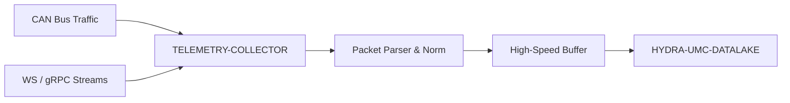

<p align="center">
  
</p>

# 📡 HYDRA-UMC-TELEMETRY-COLLECTOR

<p align="center"><a href="README.md">🇺🇸 English</a> | <a href="README_spa.md">🇪🇸 Español</a> | <a href="README_fra.md">🇫🇷 Français</a> | <a href="README_ita.md">🇮🇹 Italiano</a> | <a href="README_deu.md">🇩🇪 Deutsch</a> | <a href="README_zho.md">🇨🇳 简体中文</a> | 🇯🇵 <b>日本語</b></p>

### 🚀 CAN および WebSocket ログ向けの高スループット取り込みノード

<p align="left">
  
  
  
</p>

---

## 1. 🛠️ 技術概要

**HYDRA-UMC-TELEMETRY-COLLECTOR** は、エコシステム内のすべての生の通信
を捕捉する高速ゲートウェイです。FDCAN バス、WebSocket ストリーム、
gRPC の更新を監視し、データをデータレイクへと流し込みます。

異種データソースのリアルタイムな解析と正規化を行い、CAN バス上の
モーター電流のスパイクが、ビジョンノードからの AI 推論結果と正しく
相関付けられることを保証します。

### 主な機能：
* 🚀 **マルチプロトコル取り込み：** CAN、WebSocket、gRPC、HTTP のテレメトリを処理します。
* ⚡ **高スループット：** 最小限の CPU オーバーヘッドで、1 ミリ秒あたり数千メッセージ向けに最適化。
* 🧬 **データ正規化：** 生のバイナリパケットを標準化された JSON/Protobuf 形式に変換します。
* 🛡️ **バッファ付き配信：** データベースの一時的な停止やネットワークスパイク時にもデータ損失をゼロに保ちます。
* 🔁 **再接続に強い重複排除：** プロデューサーごとのオプションのシーケンス番号を、有界の並べ替えウィンドウ内で追跡することで、再接続して未確認の直近メッセージを再送するデバイスが取り込み件数を水増しすることは決してありません。*(実装済み)*
* 🩺 **実際の障害診断：** すべてのフラッシュ失敗は、シンクが実際にデータを拒否したのか、それとも輸送(トランスポート)上の問題なのかに分類され——`GET /stats` で公開され、実際の運用上の可視性をもたらします。*(実装済み)*

---

## 2. 🔄 取り込みワークフロー



---

## 3. 🧱 アーキテクチャと設計上の決定

* **`src/` がリポジトリルートではなく Go モジュールのルートである理由。** インストール可能なモジュール自身のファイル（`main.go`、`version.go`、`go.mod`）を、リポジトリルートのツール（`bump_version.py`、`docker-compose.yml`）から分離するためです——`go build ./...` はリポジトリルートではなく `src/` 内部から実行されます。
* **データ収集が HYDRA-UMC-DATALAKE 自体から分離されている理由。** データ収集（HYDRA-UMC-SERVER のポーリング、バッファリング、バッチ書き込み）は、ストレージ/クエリとは異なる I/O バウンドな関心事です——独立したプロセスとして保つことで、コレクターの再起動やバックプレッシャーのスパイクが、データレイク自身のクエリパスに影響を与えることはありません。
* **シンク書き込みの失敗がバッチを破棄せず再キューに入れる理由。** `src/collector` こそが「バッファ配信：データ損失ゼロ」という約束を実際に果たしている部分です——`FlushOnce` は `Sink.Write` が確認して初めて、取り出したバッチをバッファから削除します。失敗した場合は先頭にそのまま戻します——実際の障害は同じサンプルを再試行するのであって、失うわけではありません。とはいえバッファ(`src/buffer`)は依然として有限です——その容量を超える障害は、実際に最も古い超過分を失います。これは無限のメモリを約束するのではなく、現実的で正直な限界です。
* **CAN と WebSocket の両方が同じ `Sample` 形式にパースされる理由。** `src/telemetry` は、何かがバッファやシンクに触れる前に、両方の異種ソースを一つの構造体に正規化します——これが「CAN 上のモーター電流スパイクが Vision Node の推論結果と正しく相関する」ことの実際のメカニズムです：下流のどの段階も、サンプルがどのプロトコル経由で届いたかを知る必要がありません。
* **CAN のワイヤーフォーマットが、まだエコシステムの本物の CAN ID ではなく、このプロジェクト独自の v0 規約である理由。** 本物の CAN ID テーブルは HYDRA-UMC と URTC それぞれの実際のファームウェアドキュメントにあります——それらと本当に統合するのは将来の作業です(`mejoras_futuras.txt` を参照)。その参照資料を手元に置かずに推測すべきものではありません。
* **`DatalakeSink` が HTTP リクエスト1件につきサンプル1件を書き込む理由、そしてバッチの部分的な失敗が再試行時に行の重複を引き起こしうる理由。** HYDRA-UMC-DATALAKE 自身の `POST /ingest`(そのプロジェクトの `src/hydra_umc_datalake/api.py` を参照)は単一サンプル用であり、バッチ用ではありません——ここでの「バッチ書き込み」は実際には N 回の実際のリクエストです。バッチの途中で1件が失敗すると、`Write` はエラーを返し、`collector.go` 自身の再試行ロジックがバッチ全体を再度キューに入れるため、すでに書き込まれたサンプルが再送信され、次に成功したフラッシュ時に DATALAKE 内で重複した行になります。実際の障害発生時に「少なくとも一度」で時折重複が生じること——データを静かに失う(最大一度)のではなく——が、この v0 の誠実なトレードオフです。真の「正確に一度」の配信(冪等性キー、upsert)は今後の課題です。`mejoras_futuras.txt` を参照してください。`-datalake-url` が指定されない場合、`ConsoleSink`(標準出力への表示)が引き続きデフォルトとなり、このコレクターを単独で実行する際に役立ちます。
* **エコシステムの他の部分との関係。** HYDRA-UMC-DATALAKE の下の兄弟サービスです——実際に HYDRA-UMC-SERVER に対してロボットごとのテレメトリを問い合わせ、それを共有時系列ストアに書き込む唯一のコンポーネントです。
* **重複排除が独立した `dedup` パッケージであり、サンプル自体のコンテンツのハッシュではなく、オプションの `Sequence` をキーにしている理由。** 実際の再接続は同一のバイト列をそのまま再送するため、コンテンツハッシュはその場合には機能します——しかし、たまたますべてのフィールドが一致する、実際には異なる2つのサンプル(例:1秒間隔の2つの `0.0` の読み取り値)を静かに取りこぼしてしまいます。プロデューサーごとのシーケンス番号は、実際のデバイスが自分自身の未確認メッセージを追跡するためにもともと持っているべきものなので、それを再利用することが誠実で本物のシグナルです——一意性を実際には保証しないデータから導き出した推測ではありません。`Sequence == 0`/省略は、あるプロデューサーを完全にオプトアウトさせるため、シーケンスを送らないデバイスの既存の動作は何一つ変わりません。
* **`sink.InvalidDataError` がリトライポリシーを変更せず、診断可能にするだけである理由。** `collector.go` のオールオアナッシングな再キュー・再試行ロジック(上記参照)はまったく変更されていません——恒久的に無効なサンプルも、他のものと同様に再試行され続けます。これはそれ自体が既知の、文書化された制限です(`mejoras_futuras.txt` を参照)。新しいのは実際の可視性です:`GET /stats` の `invalidDataErrors` と `transportErrors` を見比べることで、運用者はログから推測することなく、「DATALAKE が私たちのデータを拒否している」のか「DATALAKE へのネットワークがダウンしている」のかを区別できます。

---

## 📂 リポジトリ構成

純粋なソフトウェアサービス（取り込みノード）であり、独自のハードウェア、
ファームウェア、OS はありません。これらのディレクトリはリポジトリ構造
ポリシーに従って省略されています。

```text
HYDRA-UMC-TELEMETRY-COLLECTOR/
├── src/                  # Go モジュール
│   ├── go.mod            # モジュール定義
│   ├── version.go        # const Version = "X.Y.Z"
│   ├── main.go           # エントリポイント：すべてを接続し、HTTP API を起動
│   ├── telemetry/        # Sample 型 + CAN/WebSocket パーサー(正規化)
│   ├── buffer/           # 背圧を報告する有界 FIFO(Ring)
│   ├── dedup/            # 実際のプロデューサーごとのシーケンス重複排除(並べ替えウィンドウ)
│   ├── collector/        # 取り込み+フラッシュを調整、シンク失敗時に再試行、重複排除
│   ├── sink/              # フラッシュされたバッチの行き先(現在は ConsoleSink)、トランスポート/無効データの分類
│   └── api/                # collector を包む単純な JSON/HTTP ハンドラー
├── docs/
│   └── API.md              # 本物の HTTP エンドポイントリファレンス（リクエスト、レスポンス、ステータスコード）
├── images/               # メディアと図表
├── systemd/
│   └── hydra-umc-telemetry-collector.service # ローカルCM5テレメトリ取り込みAPIのsystemdユニット
├── tools/
│   ├── build_test.py     # バージョンを増やさないビルドチェック
│   └── ci_validate.py    # CI が使用するマニフェスト/CHANGELOG/ドキュメント検証
├── build/                # コンパイル済みバイナリ（gitignore 対象）
├── bump_version.py        # ネイティブバージョンのオドメーター式インクリメント（ビルドが実行）
├── bump_manifest_version.py # hydra-umc.project.json のバージョンをネイティブ版と同期(--sync)
├── build.sh / build.bat   # 実際のビルド：バージョンインクリメント + go build
├── run.sh / run.bat       # 実際の実行：コンパイル済みバイナリを実行
└── README.md
```

元のテンプレートから省略：`hardware/`、`firmware/`、`os/` —— これは純粋な
ソフトウェアサービス(Go バイナリ)であり、専用のハードウェアや
ファームウェア、維持すべきオペレーティングシステムイメージもありません。
完全な HTTP エンドポイントリファレンスは [`docs/API.md`](docs/API.md) を参照。

---

## 4. ⚙️ ビルドと実行

Go >= 1.21 が必要です。コンパイルできるだけの骨組みではなく、HTTP API
を備えた本物の取り込みパイプラインです。

```bash
# Linux/macOS
./build.sh
./run.sh -addr :8092 -datalake-url http://localhost:8095

# Windows
build.bat
run.bat -addr :8092 -datalake-url http://localhost:8095
```

`build` はバージョンを増加させ（`src/version.go`）、`src/` 内の Go
モジュールを `build/telemetry-collector(.exe)` としてコンパイルします。
`run` はコンパイル済みバイナリを実行し、フラグをそのまま渡して、
実際のトラフィックのリッスンを開始します。`-datalake-url` は
フラッシュされたバッチを、実際に稼働している HYDRA-UMC-DATALAKE
インスタンス（`POST /ingest`、`sink.DatalakeSink`）に向けます——
省略した場合は、フラッシュされたサンプルを代わりに標準出力へ表示します
（`sink.ConsoleSink`）。このコレクターを単独で実行する際に便利です：

```bash
# WebSocket 形式のテレメトリサンプルを取り込む
curl -X POST localhost:8092/ingest/ws \
  -d '{"sourceId":"robot-1","kind":"motor_temp","timestamp":1700000000000,"fields":{"value":42.5}}'

# CAN フレームを取り込む(8 バイト、base64 - フォーマットは src/telemetry/can.go を参照)
curl -X POST localhost:8092/ingest/can \
  -d '{"arbitrationId":7,"data":"AQAAUEEAAAA="}'

# collector が取り込み/フラッシュ/破棄した内容を確認する
curl localhost:8092/stats
```

```bash
cd src && go test ./...   # telemetry(CAN 往復、WS 検証)、buffer(有界
                           # FIFO、背圧、requeue)、collector(「シンク
                           # 障害時にデータを失わない」という実際の
                           # 挙動)、そして api(httptest による本物の
                           # HTTP 往復テスト)
```

---

## 🚀 ロードマップ
* **フェーズ 1：** 履歴分析のためのデータレイクの高スループット取り込みとインデックス作成。
* **フェーズ 2：** テレメトリコレクターのエッジ圧縮と安全な送信プロトコル。
* **フェーズ 3：** 教師なし学習とモーター振動分析を用いた異常検知。
* **フェーズ 4：** 大量のログ取り込みのためのオンザフライ圧縮とマルチプロトコル最適化。

---

## 🔗 関連プロジェクト

本プロジェクトは、同じ作者(JuanenRac / Electro Hobby 3D)による HYDRA-UMC ロボティクスエコシステムの一部です。リクエストが実はこの中のどれかについてのものである可能性があるため、知っておく価値があります。

**親プロジェクト**
- **[HYDRA-UMC-DATALAKE](https://github.com/JuanenRac/HYDRA-UMC-DATALAKE)** — 実際の取り込み/クエリ HTTP API を備えた、実際の sqlite3 ベースの時系列ストア。本リポジトリは、その自身のデータ&分析レイヤー内における特定の分析サービスとして、この親の一部を成す。

**兄弟プロジェクト** —— HYDRA-UMC-DATALAKE 自身のデータ&分析レイヤーにおける他の分析サービス
- **[HYDRA-UMC-ANOMALY-DETECTOR](https://github.com/JuanenRac/HYDRA-UMC-ANOMALY-DETECTOR)** — ドリフト監視を備えた、実際の FFT + 統計ベースラインによる異常検知器。
- **[HYDRA-UMC-PRODUCTION-REPORTS](https://github.com/JuanenRac/HYDRA-UMC-PRODUCTION-REPORTS)** — DATALAKE の履歴に対する実際の OEE/稼働率計算、再現可能な CSV エクスポート付き。

**直接関連**
- **[HYDRA-UMC-SERVER](https://github.com/JuanenRac/HYDRA-UMC-SERVER)** — すべての制御クライアントが実際に通信する、本物のヘッドレスバックエンド(REST/WebSocket) ——本プロジェクトが取り込むログの情報源。
- **[HYDRA-UMC](https://github.com/JuanenRac/HYDRA-UMC)** — 実際のロボットアームのマザーボード——CM5 ホスト + デュアルコア STM32H745、CAN-OTA/SPI-OTA 経由で最大 8 本のツールアームを統括 ——本プロジェクト自身の CAN ワイヤーフォーマットが将来的に統合されることを意図した実際の CAN ID テーブル。現在は独自の v0 規約を使用しており、完了済みと主張せず、将来の作業として正直に追跡されている。
- **[URTC](https://github.com/JuanenRac/URTC)** — 物理的な Universal Robot Tool Controller 基板向けファームウェア、CAN バス経由の 25 以上のツールプロファイル ——本プロジェクト自身の CAN ワイヤーフォーマットが将来的に統合されることを意図した実際の CAN ID テーブル。現在は独自の v0 規約を使用しており、完了済みと主張せず、将来の作業として正直に追跡されている。

**エコシステムの他のプロジェクト**

*コアハードウェア&プラットフォーム*
- **[HYDRA-UMC-OS](https://github.com/JuanenRac/HYDRA-UMC-OS)** — CM5 向けの再現可能な Raspberry Pi OS プロダクト層——読み取り専用エージェント、検証済み設定/プロファイル、WiFi 初回接続プロビジョニング。
- **[HYDRA-UMC-SDK](https://github.com/JuanenRac/HYDRA-UMC-SDK)** — すべてのブリッジが自身のコマンドを検証する共有 JSON-Schema 契約と安全ゲートの境界。

*コアバックエンド&クライアント*
- **[HYDRA-UMC-STUDIO](https://github.com/JuanenRac/HYDRA-UMC-STUDIO)** — リアルタイムのマルチロボット 3D 可視化を備えたウェブ制御ダッシュボード。
- **[HYDRA-UMC-SUITE](https://github.com/JuanenRac/HYDRA-UMC-SUITE)** — 複数のサーバーを同時に扱えるデスクトップ(PySide6)スウォームコマンドセンター、スタンドアロン実行ファイルとしてパッケージ化。
- **[HYDRA-UMC-ANDROID-CONTROL](https://github.com/JuanenRac/HYDRA-UMC-ANDROID-CONTROL)** — 生体認証ログインとペアリングされた Wear OS コンパニオンを備えたネイティブ Android 制御アプリ。
- **[HYDRA-UMC-IOS-CONTROL](https://github.com/JuanenRac/HYDRA-UMC-IOS-CONTROL)** — リアルタイム WebSocket 同期を備えた iOS/iPadOS 制御アプリ(Flutter)。
- **[HYDRA-UMC-DSI](https://github.com/JuanenRac/HYDRA-UMC-DSI)** — 本体搭載の 7 インチ DSI タッチスクリーン向けネイティブタッチ UI、CM5 自体に組み込み。
- **[HYDRA-UMC-EDITOR-URDF](https://github.com/JuanenRac/HYDRA-UMC-EDITOR-URDF)** — 完成したモデルを STUDIO 自身のカタログへ送信するデスクトップ用グラフィカル URDF 作成/編集ツール。
- **[HYDRA-UMC-BRIDGE-AMR](https://github.com/JuanenRac/HYDRA-UMC-BRIDGE-AMR)** — 実際の VDA 5050 MQTT パブリッシャーによる AGV/AMR フリートの調整境界。
- **[HYDRA-UMC-BRIDGE-CNC](https://github.com/JuanenRac/HYDRA-UMC-BRIDGE-CNC)** — 実際の GRBL ステータス/制御バイトへのアクセスを持つ、CNC セルの高レベルコーディネーター。
- **[HYDRA-UMC-BRIDGE-DROIDS](https://github.com/JuanenRac/HYDRA-UMC-BRIDGE-DROIDS)** — 実際の Boston Dynamics Spot コマンド送信機能を持つ、脚型/ヒューマノイドドロイドの調整境界。
- **[HYDRA-UMC-BRIDGE-LASER](https://github.com/JuanenRac/HYDRA-UMC-BRIDGE-LASER)** — 実際のキー/筐体/インターロック GPIO セーフガード 3 系統を読み取る、レーザーセルの安全コーディネーター。
- **[HYDRA-UMC-BRIDGE-OPENPNP](https://github.com/JuanenRac/HYDRA-UMC-BRIDGE-OPENPNP)** — OpenPnP ピックアンドプレースの基板フローを安全に統括する高レベルコーディネーター。
- **[HYDRA-UMC-BRIDGE-PRINTER3D](https://github.com/JuanenRac/HYDRA-UMC-BRIDGE-PRINTER3D)** — 実際にゲート制御されたジョブコマンドを持つ、Moonraker/Klipper 3D プリンター向けの安全な調整境界。
- **[HYDRA-UMC-BRIDGE-ROS2](https://github.com/JuanenRac/HYDRA-UMC-BRIDGE-ROS2)** — 実際の遅延インポート rclpy ROS 2 トランスポートを持つ安全コーディネーター。
- **[HYDRA-UMC-BRIDGE-UAV](https://github.com/JuanenRac/HYDRA-UMC-BRIDGE-UAV)** — 実際の MAVLink コマンド送信機能を持つ、カメラ搭載 UAV の調整境界。

*URTC ツールプラットフォーム*
- **[URTC-FLASHER](https://github.com/JuanenRac/URTC-FLASHER)** — URTC 基板用のデスクトップ GUI 書き込みツール、CAN-OTA およびフルチップ SWD/JTAG。
- **[URTC-TESTER](https://github.com/JuanenRac/URTC-TESTER)** — URTC 基板向けのデスクトップ CAN バスライブ診断ツール、ツールプロファイルごとに 1 パネル。
- **[URTC-WEB-STUDIO](https://github.com/JuanenRac/URTC-WEB-STUDIO)** — Web Serial API を使ったブラウザベースの URTC-TESTER の代替、ローカルインストール不要。

*ビジョン AI ノード(Hailo-8)*
- **[HYDRA-UMC-VISION-NODE](https://github.com/JuanenRac/HYDRA-UMC-VISION-NODE)** — Hailo-8 ビジョンパイプラインの統合ハブ、段階ごとの実際のハードウェア準備状況チェック付き。
- **[HYDRA-UMC-DETECTION-HEF](https://github.com/JuanenRac/HYDRA-UMC-DETECTION-HEF)** — Hailo アーキテクチャ/チェックサムによる安全読み込み検証を備えた、実際のコンパイル済みモデルレジストリ。
- **[HYDRA-UMC-VISION-STREAMER](https://github.com/JuanenRac/HYDRA-UMC-VISION-STREAMER)** — 実際の HailoRT 統合境界を持つ、実際の GStreamer パイプライン + MediaMTX 設定生成器。
- **[HYDRA-UMC-VISUAL-SERVOING-API](https://github.com/JuanenRac/HYDRA-UMC-VISUAL-SERVOING-API)** — 上流のゾーン状態に応じて安全ゲート制御される、実際の Position-Based Visual Servoing 補正則。
- **[HYDRA-UMC-SAFETY-ZONES](https://github.com/JuanenRac/HYDRA-UMC-SAFETY-ZONES)** — キャリブレーションの鮮度を強制する、実際のゾーン侵入チェックと E-STOP 要求。

*コグニティブ AI ノード(Hailo-10)*
- **[HYDRA-UMC-COGNITIVE-NODE](https://github.com/JuanenRac/HYDRA-UMC-COGNITIVE-NODE)** — Hailo-10 コグニティブパイプライン(LLM/VLA/音声オーケストレーション)の統合ハブ。
- **[HYDRA-UMC-VLA-ENGINE](https://github.com/JuanenRac/HYDRA-UMC-VLA-ENGINE)** — Vision-Language-Action モデル向けの、実際のアクショントークンのエンコード/デコードと軌道生成。
- **[HYDRA-UMC-VOICE-UI](https://github.com/JuanenRac/HYDRA-UMC-VOICE-UI)** — 確認ゲート付きの限定的な Watch リレーを備えた、実際の音声フロントエンド(VAD + 意図解析)。
- **[HYDRA-UMC-SEMANTIC-PLANNER](https://github.com/JuanenRac/HYDRA-UMC-SEMANTIC-PLANNER)** — MCU エラーコードに対する、実際のルールベースのタスク分解と意味的エラー復旧。
- **[HYDRA-UMC-DOCS-QA](https://github.com/JuanenRac/HYDRA-UMC-DOCS-QA)** — このエコシステム自身の Markdown ドキュメントに対する、標準ライブラリのみの実際の TF-IDF 文書検索。

*オーケストレーション&スウォーム*
- **[HYDRA-UMC-ORCHESTRATOR](https://github.com/JuanenRac/HYDRA-UMC-ORCHESTRATOR)** — 実際の gRPC/Protobuf ヘルスレポート契約とミッションステートマシンを持つ統合ハブ。
- **[HYDRA-UMC-JOB-DISPATCHER](https://github.com/JuanenRac/HYDRA-UMC-JOB-DISPATCHER)** — 実際の HTTP API 上に構築された、優先度ベースの実際のジョブキュー(重複排除付き)。
- **[HYDRA-UMC-NODE-HEALING](https://github.com/JuanenRac/HYDRA-UMC-NODE-HEALING)** — リトライ/バックオフとアイデンティティ不一致検出を備えた、実際の gRPC ベースのフリートヘルスウォッチドッグ。
- **[HYDRA-UMC-PATH-PLANNER-3D](https://github.com/JuanenRac/HYDRA-UMC-PATH-PLANNER-3D)** — 実際の障害物/ワークスペース衝突検証を備えた、実際の RRT ベースの 3D 経路プランナー。
- **[HYDRA-UMC-SWARM-SYNC](https://github.com/JuanenRac/HYDRA-UMC-SWARM-SYNC)** — 複数セルの収束についてプロパティテストされた、実際の CRDT LWW-Element-Map 状態同期。

*デジタルツイン&シミュレーション*
- **[HYDRA-UMC-TWIN](https://github.com/JuanenRac/HYDRA-UMC-TWIN)** — 実際のバージョン互換性同期契約を持つ、デジタルツインエンジンの統合ハブ。
- **[HYDRA-UMC-HIL-BRIDGE](https://github.com/JuanenRac/HYDRA-UMC-HIL-BRIDGE)** — シミュレーションと実際のハードウェアの間でコマンドをルーティングする、実際のハードウェア・イン・ザ・ループ安全インターロック。
- **[HYDRA-UMC-PHYSICS-REPLICA](https://github.com/JuanenRac/HYDRA-UMC-PHYSICS-REPLICA)** — 実際の URDF サブセットに対する、実際の順運動学と関節限界検証。
- **[HYDRA-UMC-SYNTHETIC-DATA-GEN](https://github.com/JuanenRac/HYDRA-UMC-SYNTHETIC-DATA-GEN)** — YOLO/COCO アノテーションのエクスポート機能を持つ、実際のプロシージャル 2D シーンジェネレーター。

*産業用ゲートウェイ*
- **[HYDRA-UMC-GATEWAY-INDUSTRIAL](https://github.com/JuanenRac/HYDRA-UMC-GATEWAY-INDUSTRIAL)** — 実際のコマンド許可リスト/バックプレッシャー層を持つ、産業用プロトコルへ中継する統合ハブ。
- **[HYDRA-UMC-OPCUA-SERVER](https://github.com/JuanenRac/HYDRA-UMC-OPCUA-SERVER)** — 実際のバイナリプロトコルクライアントセッションで検証された、実際の OPC-UA アドレス空間。
- **[HYDRA-UMC-MQTT-BROKER](https://github.com/JuanenRac/HYDRA-UMC-MQTT-BROKER)** — クライアント単位のオプション認証とトピック ACL を備えた、実際の MQTT ブローカー。
- **[HYDRA-UMC-MTCONNECT-ADAPTER](https://github.com/JuanenRac/HYDRA-UMC-MTCONNECT-ADAPTER)** — 縮退モード出力を備えた、実際の MTConnect `/probe` および `/current` XML エンドポイント。

*補完ツール&エコシステム運用*
- **[HYDRA-UMC-DASHBOARD-AI](https://github.com/JuanenRac/HYDRA-UMC-DASHBOARD-AI)** — 誠実な統計フォールバックを備えた、DATALAKE/ANOMALY-DETECTOR 上のスマートサマリーと異常ハイライトパネル。
- **[HYDRA-UMC-TOOL-CLI](https://github.com/JuanenRac/HYDRA-UMC-TOOL-CLI)** — 実際の安定した終了コード契約を持つフリート CLI、HYDRA-UMC-SERVER 自身の API の本物のライブクライアント。
- **[HYDRA-UMC-WATCH](https://github.com/JuanenRac/HYDRA-UMC-WATCH)** — 実際の触覚アラートとペアリングされたスマートフォンへの音声リレーを備えた WearOS コンパニオンアプリ。
- **[URTC-SMART-RACK](https://github.com/JuanenRac/URTC-SMART-RACK)** — 実際の工具 ID デコードと Smart Idle 予熱ロジックを備えた、基板搭載ラック用ファームウェア。
- **[URTC-VISION-TOOL](https://github.com/JuanenRac/URTC-VISION-TOOL)** — サーマル/RGB 検査ツールヘッド向けの、ファームウェアと実際の Python ビジョンコンパニオン。
- **[HYDRA-UMC-UPDATER](https://github.com/JuanenRac/HYDRA-UMC-UPDATER)** — このエコシステム内のすべてのリポジトリを検出・クローン・更新する、管理用デスクトップツール。


---

## 📚 ドキュメント & コミュニティ

- **[CONTRIBUTING.md](CONTRIBUTING.md)** —— プルリクエストのための技術スタックとコーディング指針。
- **[CODE_OF_CONDUCT.md](CODE_OF_CONDUCT.md)** —— このコミュニティで期待される行動規範。
- **[SECURITY.md](SECURITY.md)** —— 脆弱性の報告方法と、このプロジェクトの実際のセキュリティ重点領域。
- **[SUPPORT.md](SUPPORT.md)** —— 質問の投稿先とバグの報告先。
- **[LICENSE.md](LICENSE.md)** —— このプロジェクト自身のライセンス。

## 👤 作者
**JuanenRac** (Electro Hobby 3D)
📧 electrohobby3d@gmail.com
📺 [youtube.com/@electrohobby3d](https://youtube.com/@electrohobby3d)

## 📜 ライセンス
GPL-3.0 —— 詳細は LICENSE を参照してください。
