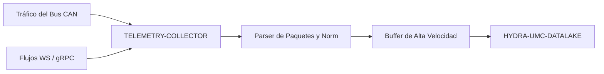

<p align="center">
  
</p>

# 📡 HYDRA-UMC-TELEMETRY-COLLECTOR

<p align="center"><a href="README.md">🇺🇸 English</a> | 🇪🇸 <b>Español</b> | <a href="README_fra.md">🇫🇷 Français</a> | <a href="README_ita.md">🇮🇹 Italiano</a> | <a href="README_deu.md">🇩🇪 Deutsch</a> | <a href="README_zho.md">🇨🇳 简体中文</a> | <a href="README_jpn.md">🇯🇵 日本語</a></p>

### 🚀 Nodo de Ingesta de Alto Rendimiento para Logs de CAN y WebSocket

<p align="left">
  
  
  
</p>

---

## 1. 🛠️ VISIÓN GENERAL TÉCNICA

**HYDRA-UMC-TELEMETRY-COLLECTOR** es la puerta de enlace de alta velocidad que captura toda la comunicación bruta dentro del ecosistema. Escucha los buses FDCAN, los flujos WebSocket y las actualizaciones gRPC, canalizando los datos hacia el Datalake.

Realiza el parseo y la normalización en tiempo real de fuentes de datos heterogéneas, asegurando que un pico de corriente de motor en un bus CAN esté correctamente correlacionado con un resultado de inferencia de IA de un Nodo Vision.

### Características Clave:
* 🚀 **Ingesta Multi-Protocolo:** Maneja telemetría CAN, WebSocket, gRPC y HTTP.
* ⚡ **Alto Rendimiento:** Optimizado para miles de mensajes por milisegundo con un overhead de CPU mínimo.
* 🧬 **Normalización de Datos:** Traduce paquetes binarios brutos a formatos estandarizados JSON/Protobuf.
* 🛡️ **Entrega Bufferizada:** Asegura la pérdida de datos cero durante fallos temporales de base de datos o picos de red.
* 🔁 **Deduplicación Segura ante Reconexión:** Un número de secuencia opcional por productor, rastreado en una ventana de reordenamiento acotada, para que un dispositivo que se reconecta y reenvía sus últimos mensajes sin confirmar nunca infle los conteos de ingesta. *(implementado)*
* 🩺 **Diagnóstico Real de Fallos:** Cada fallo de flush se clasifica como un rechazo genuino de los datos por parte del sink frente a un problema de transporte - expuesto en `GET /stats` para una visibilidad operativa real. *(implementado)*

---

## 2. 🔄 FLUJO DE TRABAJO DE INGESTA



---

## 3. 🧱 ARQUITECTURA Y DECISIONES DE DISEÑO

* **Por qué `src/` es la raíz del módulo Go, no la raíz del repo.** Mantiene los propios archivos del módulo instalable (`main.go`, `version.go`, `go.mod`) separados de las herramientas de la raíz del repo (`bump_version.py`, `docker-compose.yml`) - `go build ./...` se ejecuta desde dentro de `src/`, no desde la raíz del repo.
* **Por qué la recolección está separada del propio HYDRA-UMC-DATALAKE.** La recolección (sondear HYDRA-UMC-SERVER, hacer buffer, agrupar escrituras) es una preocupación ligada a E/S distinta del almacenamiento/consulta - mantenerla como proceso separado significa que un reinicio del recolector o un pico de contrapresión no toca el propio camino de consulta del data lake.
* **Por qué un fallo de escritura en el sink reencola el lote en vez de descartarlo.** `src/collector` es lo que de verdad respalda la promesa de "Entrega con Buffer: cero pérdida de datos": `FlushOnce` solo elimina un lote del buffer una vez que `Sink.Write` lo confirma, y lo devuelve directamente al frente en caso de fallo - un corte real reintenta las mismas muestras, no las pierde. El buffer (`src/buffer`) sigue siendo acotado, eso sí - un corte que dure más que su capacidad SÍ descarta el excedente más antiguo, un límite real y honesto en vez de prometer memoria infinita.
* **Por qué CAN y WebSocket se parsean ambos al mismo formato `Sample`.** `src/telemetry` normaliza ambas fuentes heterogéneas en una sola estructura antes de que nada toque el buffer o el sink - el mecanismo real detrás de "un pico de corriente de motor en CAN correlacionado correctamente con un resultado de un Vision Node": ninguna etapa posterior necesita saber por qué protocolo llegó una muestra.
* **Por qué el formato de trama CAN es una convención propia v0 de este proyecto, no todavía los IDs CAN reales del ecosistema.** Las tablas reales de IDs CAN viven en la propia documentación de firmware de HYDRA-UMC y URTC - integrarse contra ellas de verdad es trabajo futuro (ver `mejoras_futuras.txt`), no algo para adivinar sin esa referencia delante.
* **Por qué `DatalakeSink` escribe una muestra por petición HTTP, y por qué un fallo parcial de lote puede duplicar filas al reintentar.** El propio `POST /ingest` de HYDRA-UMC-DATALAKE (ver `src/hydra_umc_datalake/api.py` de ese proyecto) es de una sola muestra, no por lotes - una "escritura por lotes" aquí en realidad son N peticiones reales. Si una falla a mitad de un lote, `Write` devuelve un error y la propia lógica de reintento de `collector.go` reencola el lote COMPLETO, así que las muestras ya escritas se reenvían y terminan como filas duplicadas en DATALAKE en el siguiente flush exitoso. Al-menos-una-vez con duplicados ocasionales ante un corte real - en vez de perder datos en silencio (a-lo-sumo-una-vez) - es el compromiso honesto de esta v0; la entrega real exactamente-una-vez (claves de idempotencia, upserts) es trabajo futuro, ver `mejoras_futuras.txt`. `ConsoleSink` (imprime a stdout) sigue siendo el valor por defecto cuando no se pasa `-datalake-url`, para ejecutar este collector de forma independiente.
* **Cómo encaja en el resto del ecosistema.** Un servicio hermano bajo HYDRA-UMC-DATALAKE - el componente que realmente contacta con HYDRA-UMC-SERVER para obtener telemetría por robot y la escribe en el almacén de series temporales compartido.
* **Por qué la deduplicación es un paquete `dedup` separado, indexado por un `Sequence` opcional, no un hash del propio contenido de la muestra.** Una reconexión real reenvía los mismos bytes exactos, así que el hash de contenido funcionaría para ese caso - pero también se tragaría en silencio dos muestras genuinamente distintas que por casualidad comparten todos los campos (p. ej. dos lecturas de `0.0` con un segundo de diferencia). Un número de secuencia por productor es lo que un dispositivo real ya tiene que llevar para rastrear sus propios mensajes sin confirmar, así que reutilizarlo es la señal honesta y real - no una suposición derivada de datos que en realidad no prometen unicidad. `Sequence == 0`/omitido excluye por completo a un productor, así que nada del comportamiento preexistente cambia para un dispositivo que no envía uno.
* **Por qué `sink.InvalidDataError` no cambia la política de reintentos, solo la hace diagnosticable.** El reencolado-y-reintento todo-o-nada de `collector.go` (ver arriba) se mantiene exactamente igual - una muestra permanentemente inválida se sigue reintentando como cualquier otra, lo cual es en sí mismo una limitación conocida y documentada (ver `mejoras_futuras.txt`). Lo nuevo es visibilidad real: `invalidDataErrors` frente a `transportErrors` en `GET /stats` le permite a un operador distinguir "DATALAKE está rechazando nuestros datos" de "la red hacia DATALAKE está caída" sin tener que adivinar a partir de los logs.

---

## 📂 ESTRUCTURA DE DIRECTORIOS

Servicio de software puro (nodo de ingesta) - sin hardware, firmware ni sistema operativo propios; esas carpetas se omiten por política de estructura del repositorio.

```text
HYDRA-UMC-TELEMETRY-COLLECTOR/
├── src/                  # Módulo Go
│   ├── go.mod            # Definición del módulo
│   ├── version.go        # const Version = "X.Y.Z"
│   ├── main.go           # Punto de entrada: conecta todo, arranca la API HTTP
│   ├── telemetry/        # Tipo Sample + parsers CAN/WebSocket (normalizacion)
│   ├── buffer/           # FIFO acotado con reporte de contrapresion (Ring)
│   ├── dedup/            # Deduplicación real por secuencia por productor (ventana de reordenamiento)
│   ├── collector/        # Orquesta ingesta+flush, reintenta si falla el sink, dedup
│   ├── sink/              # A donde van los lotes vaciados (ConsoleSink hoy), clasificación transporte/datos inválidos
│   └── api/                # Handlers JSON/HTTP planos que envuelven el collector
├── docs/
│   └── API.md              # Referencia real de endpoints HTTP (peticiones, respuestas, codigos de estado)
├── build/                # Binarios compilados (ignorado por git)
├── bump_version.py        # Incremento de versión tipo cuentakilómetros (lo ejecuta el build)
├── build.sh / build.bat   # Build real: bump + go build
├── run.sh / run.bat       # Ejecución real: corre el binario compilado
└── README.md
```

Podado de la plantilla original: `hardware/`, `firmware/`, `os/`,
`images/` y `scripts/` — es un servicio de software puro (binario Go) sin
hardware ni firmware propios, sin imagen de sistema operativo que
mantener, y sin contenido de medios/scripts de utilidad todavía suficiente
para justificar sus propias carpetas. Ver [`docs/API.md`](docs/API.md)
para la referencia completa de endpoints HTTP.

---

## 4. ⚙️ BUILD Y EJECUCIÓN

Requiere Go >= 1.21. Un pipeline de ingesta real con API HTTP, no solo un
esqueleto que compila.

```bash
# Linux/macOS
./build.sh
./run.sh -addr :8092 -datalake-url http://localhost:8095

# Windows
build.bat
run.bat -addr :8092 -datalake-url http://localhost:8095
```

`build` incrementa la versión (`src/version.go`) y compila el módulo Go de
`src/` a `build/telemetry-collector(.exe)`. `run` ejecuta el binario
compilado, reenviando cualquier flag, y empieza a escuchar tráfico real.
`-datalake-url` apunta los lotes descargados a una instancia real y en
ejecución de HYDRA-UMC-DATALAKE (`POST /ingest`, `sink.DatalakeSink`) -
si se omite, imprime las muestras descargadas a stdout en su lugar
(`sink.ConsoleSink`), útil para ejecutar este collector de forma
independiente.

```bash
# Ingerir una muestra de telemetría estilo WebSocket
curl -X POST localhost:8092/ingest/ws \
  -d '{"sourceId":"robot-1","kind":"motor_temp","timestamp":1700000000000,"fields":{"value":42.5}}'

# Ingerir una trama CAN (8 bytes, base64 - ver src/telemetry/can.go para el formato)
curl -X POST localhost:8092/ingest/can \
  -d '{"arbitrationId":7,"data":"AQAAUEEAAAA="}'

# Ver qué ha ingerido/vaciado/descartado el collector
curl localhost:8092/stats
```

```bash
cd src && go test ./...   # telemetry (round-trip CAN, validacion WS),
                           # buffer (FIFO acotado, contrapresion, requeue),
                           # collector (el comportamiento real de "no
                           # perder datos ante un corte del sink"), y api
                           # (round-trips HTTP reales via httptest)
```

---

## 🚀 HOJA DE RUTA
* **Fase 1:** Ingesta de alto rendimiento e indexación del Datalake para análisis histórico.
* **Fase 2:** Compresión en el borde del colector de telemetría y protocolos de transmisión seguros.
* **Fase 3:** Detección de anomalías mediante aprendizaje no supervisado y análisis de vibración de motores.
* **Fase 4:** Compresión en tiempo real para ingesta de logs masivos y optimización multi-protocolo.

---

## 🔗 Proyectos Relacionados

Este proyecto forma parte de un ecosistema de robótica más amplio del mismo autor (JuanenRac / Electro Hobby 3D), que abarca firmware, software de control, nodos de IA y herramientas de flota. Vale la pena conocerlo, ya que una petición podría en realidad ser sobre uno de estos proyectos en vez de sobre este repositorio.

### Familia

**Padre:** **[HYDRA-UMC-DATALAKE](https://github.com/JuanenRac/HYDRA-UMC-DATALAKE)** — el padre de integración al que alimenta este recolector.

**Hermanos:**
- **[HYDRA-UMC-ANOMALY-DETECTOR](https://github.com/JuanenRac/HYDRA-UMC-ANOMALY-DETECTOR)** — servicio de analítica hermano, mismo padre.
- **[HYDRA-UMC-PRODUCTION-REPORTS](https://github.com/JuanenRac/HYDRA-UMC-PRODUCTION-REPORTS)** — servicio de analítica hermano, mismo padre.

### Relación Directa (fuera de la familia)

- **[HYDRA-UMC-SERVER](https://github.com/JuanenRac/HYDRA-UMC-SERVER)** — la fuente de los logs que ingiere este proyecto.

### Resto del Ecosistema

**Plataforma HYDRA-UMC** — la célula de micro-fábrica multi-robot
- **[HYDRA-UMC](https://github.com/JuanenRac/HYDRA-UMC)** — la placa base CM5 + STM32H745 que orquesta hasta 8 brazos robóticos.
- **[HYDRA-UMC-SERVER](https://github.com/JuanenRac/HYDRA-UMC-SERVER)** — el backend Express/WebSocket con el que habla cada cliente de control.
- **[HYDRA-UMC-STUDIO](https://github.com/JuanenRac/HYDRA-UMC-STUDIO)** — panel de control web, visualización 3D multi-robot.
- **[HYDRA-UMC-ANDROID-CONTROL](https://github.com/JuanenRac/HYDRA-UMC-ANDROID-CONTROL)** — app de control Android por Wi-Fi/Bluetooth.
- **[HYDRA-UMC-IOS-CONTROL](https://github.com/JuanenRac/HYDRA-UMC-IOS-CONTROL)** — app de control iOS/iPadOS construida en Flutter.
- **[HYDRA-UMC-SUITE](https://github.com/JuanenRac/HYDRA-UMC-SUITE)** — centro de mando de enjambre de escritorio (Python/PySide6).
- **[HYDRA-UMC-EDITOR-URDF](https://github.com/JuanenRac/HYDRA-UMC-EDITOR-URDF)** — editor de modelos URDF de escritorio para el catálogo de robots.
- **[HYDRA-UMC-DSI](https://github.com/JuanenRac/HYDRA-UMC-DSI)** — interfaz táctil nativa para la pantalla DSI integrada.

**Plataforma URTC** — el controlador de cabezal de herramienta que lleva cada brazo HYDRA-UMC
- **[URTC](https://github.com/JuanenRac/URTC)** — controlador de cabezal de herramienta CAN, 25 perfiles de herramienta.
- **[URTC-FLASHER](https://github.com/JuanenRac/URTC-FLASHER)** — herramienta de escritorio de flasheo CAN-OTA + SWD/JTAG.
- **[URTC-TESTER](https://github.com/JuanenRac/URTC-TESTER)** — herramienta de escritorio de diagnóstico CAN en vivo.
- **[URTC-WEB-STUDIO](https://github.com/JuanenRac/URTC-WEB-STUDIO)** — alternativa basada en navegador vía Web Serial API.

**🎥 Nodo de IA de Visión (Hailo-8)**
- [HYDRA-UMC-VISION-NODE](https://github.com/JuanenRac/HYDRA-UMC-VISION-NODE)
- [HYDRA-UMC-VISION-STREAMER](https://github.com/JuanenRac/HYDRA-UMC-VISION-STREAMER)
- [HYDRA-UMC-DETECTION-HEF](https://github.com/JuanenRac/HYDRA-UMC-DETECTION-HEF)
- [HYDRA-UMC-SAFETY-ZONES](https://github.com/JuanenRac/HYDRA-UMC-SAFETY-ZONES)
- [HYDRA-UMC-VISUAL-SERVOING-API](https://github.com/JuanenRac/HYDRA-UMC-VISUAL-SERVOING-API)

**🧠 Nodo de IA Cognitiva (Hailo-10)**
- [HYDRA-UMC-COGNITIVE-NODE](https://github.com/JuanenRac/HYDRA-UMC-COGNITIVE-NODE)
- [HYDRA-UMC-VLA-ENGINE](https://github.com/JuanenRac/HYDRA-UMC-VLA-ENGINE)
- [HYDRA-UMC-VOICE-UI](https://github.com/JuanenRac/HYDRA-UMC-VOICE-UI)
- [HYDRA-UMC-SEMANTIC-PLANNER](https://github.com/JuanenRac/HYDRA-UMC-SEMANTIC-PLANNER)
- [HYDRA-UMC-DOCS-QA](https://github.com/JuanenRac/HYDRA-UMC-DOCS-QA)

**🐝 Orquestación y Enjambre**
- [HYDRA-UMC-ORCHESTRATOR](https://github.com/JuanenRac/HYDRA-UMC-ORCHESTRATOR)
- [HYDRA-UMC-SWARM-SYNC](https://github.com/JuanenRac/HYDRA-UMC-SWARM-SYNC)
- [HYDRA-UMC-PATH-PLANNER-3D](https://github.com/JuanenRac/HYDRA-UMC-PATH-PLANNER-3D)
- [HYDRA-UMC-JOB-DISPATCHER](https://github.com/JuanenRac/HYDRA-UMC-JOB-DISPATCHER)
- [HYDRA-UMC-NODE-HEALING](https://github.com/JuanenRac/HYDRA-UMC-NODE-HEALING)

**🎮 Gemelo Digital y Simulación**
- [HYDRA-UMC-TWIN](https://github.com/JuanenRac/HYDRA-UMC-TWIN)
- [HYDRA-UMC-PHYSICS-REPLICA](https://github.com/JuanenRac/HYDRA-UMC-PHYSICS-REPLICA)
- [HYDRA-UMC-HIL-BRIDGE](https://github.com/JuanenRac/HYDRA-UMC-HIL-BRIDGE)
- [HYDRA-UMC-SYNTHETIC-DATA-GEN](https://github.com/JuanenRac/HYDRA-UMC-SYNTHETIC-DATA-GEN)

**🏭 Pasarela Industrial**
- [HYDRA-UMC-GATEWAY-INDUSTRIAL](https://github.com/JuanenRac/HYDRA-UMC-GATEWAY-INDUSTRIAL)
- [HYDRA-UMC-OPCUA-SERVER](https://github.com/JuanenRac/HYDRA-UMC-OPCUA-SERVER)
- [HYDRA-UMC-MQTT-BROKER](https://github.com/JuanenRac/HYDRA-UMC-MQTT-BROKER)
- [HYDRA-UMC-MTCONNECT-ADAPTER](https://github.com/JuanenRac/HYDRA-UMC-MTCONNECT-ADAPTER)

**🛠️ Herramientas Complementarias**
- [URTC-SMART-RACK](https://github.com/JuanenRac/URTC-SMART-RACK)
- [URTC-VISION-TOOL](https://github.com/JuanenRac/URTC-VISION-TOOL)
- [HYDRA-UMC-WATCH](https://github.com/JuanenRac/HYDRA-UMC-WATCH)
- [HYDRA-UMC-TOOL-CLI](https://github.com/JuanenRac/HYDRA-UMC-TOOL-CLI)
- [HYDRA-UMC-DASHBOARD-AI](https://github.com/JuanenRac/HYDRA-UMC-DASHBOARD-AI)


## 👤 AUTOR
**JuanenRac** (Electro Hobby 3D)
📧 electrohobby3d@gmail.com

## 📜 LICENCIA
GPL-3.0 - Ver archivo LICENSE para más detalles.
