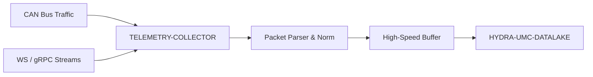

<p align="center">
  
</p>

# 📡 HYDRA-UMC-TELEMETRY-COLLECTOR

<p align="center"><a href="README.md">🇺🇸 English</a> | <a href="README_spa.md">🇪🇸 Español</a> | <a href="README_fra.md">🇫🇷 Français</a> | <a href="README_ita.md">🇮🇹 Italiano</a> | <a href="README_deu.md">🇩🇪 Deutsch</a> | 🇨🇳 <b>简体中文</b> | <a href="README_jpn.md">🇯🇵 日本語</a></p>

### 🚀 面向 CAN 和 WebSocket 日志的高吞吐量摄取节点

<p align="left">
  
  
  
</p>

---

## 1. 🛠️ 技术概述

**HYDRA-UMC-TELEMETRY-COLLECTOR** 是捕获生态系统内所有原始通信的高速
网关。它监听 FDCAN 总线、WebSocket 流和 gRPC 更新，将数据汇入数据湖。

它对异构数据源执行实时解析和归一化，确保 CAN 总线上的电机电流峰值能够
与来自视觉节点的 AI 推理结果正确关联。

### 关键特性：
* 🚀 **多协议摄取：** 处理 CAN、WebSocket、gRPC 和 HTTP 遥测数据。
* ⚡ **高吞吐量：** 针对每毫秒数千条消息进行优化，CPU 开销极小。
* 🧬 **数据归一化：** 将原始二进制数据包转换为标准化的 JSON/Protobuf 格式。
* 🛡️ **缓冲式交付：** 在数据库临时中断或网络峰值期间确保零数据丢失。
* 🔁 **重连安全去重：** 一个可选的按生产者维护的序列号，在有界重排序窗口内跟踪，使得重新连接并重发最后几条未确认消息的设备永远不会使摄取计数虚增。*(已实现)*
* 🩺 **真实故障诊断：** 每次刷新失败都会被分类为 sink 真正拒绝了数据，还是传输层出现了问题——通过 `GET /stats` 暴露，提供真实的运维可见性。*(已实现)*

---

## 2. 🔄 摄取工作流



---

## 3. 🧱 架构与设计决策

* **为何 `src/` 是 Go 模块根目录，而非仓库根目录。** 使可安装模块自身的文件（`main.go`、`version.go`、`go.mod`）与仓库根目录的工具（`bump_version.py`、`docker-compose.yml`）分离——`go build ./...` 在 `src/` 内部运行，而非仓库根目录。
* **为何数据采集与 HYDRA-UMC-DATALAKE 本身是分离的。** 数据采集（轮询 HYDRA-UMC-SERVER、缓冲、批量写入）是一项与存储/查询截然不同的 I/O 密集型任务——将其保持为独立进程，意味着一次采集器重启或背压峰值不会触及数据湖自身的查询路径。
* **为何 sink 写入失败会将该批次重新入队，而非直接丢弃。** `src/collector` 才是真正兑现「带缓冲的投递：零数据丢失」这一承诺的地方——`FlushOnce` 只有在 `Sink.Write` 确认后才会把已取出的批次从缓冲区中移除，写入失败时会把它直接放回队首——真实的服务中断会重试同一批样本，而不是丢失它们。不过缓冲区（`src/buffer`）仍然是有界的——如果中断持续时间超过其容量，确实会丢弃最旧的多余部分，这是一个真实、诚实的限制，而不是承诺无限内存。
* **为何 CAN 和 WebSocket 都被解析为同一个 `Sample` 形态。** `src/telemetry` 在任何东西触及缓冲区或 sink 之前，就把这两种异构来源归一化为同一个结构体——这正是「CAN 总线上的电机电流尖峰与 Vision Node 的推理结果正确关联」背后的真实机制：下游任何阶段都无需知道某个样本最初是通过哪种协议到达的。
* **为何 CAN 线路格式是本项目自己的 v0 约定，而非生态系统真正的 CAN ID。** 真正的 CAN ID 表存在于 HYDRA-UMC 和 URTC 各自的固件文档中——真正对接它们是未来的工作（见 `mejoras_futuras.txt`），在没有那份参考资料的情况下猜测是不可取的。
* **为何 `DatalakeSink` 每次 HTTP 请求只写入一条样本，以及为何批次部分失败会在重试时导致行重复。** HYDRA-UMC-DATALAKE 自身的 `POST /ingest`（参见该项目的 `src/hydra_umc_datalake/api.py`）是单样本接口，不是批量接口——这里的“批量写入”实际上是 N 次真实的请求。如果批次中途有一次失败，`Write` 会返回错误，`collector.go` 自身的重试逻辑会把整个批次重新排队，于是已经写入的样本会被重新发送，并在下一次成功刷新时在 DATALAKE 中产生重复的行。面对真实故障时“至少一次”并偶尔产生重复——而不是静默丢失数据（至多一次）——是这个 v0 版本的诚实取舍；真正的“恰好一次”投递（幂等键、upsert）是未来的工作，参见 `mejoras_futuras.txt`。当没有传入 `-datalake-url` 时，`ConsoleSink`（打印到 stdout）仍然是默认值，便于独立运行该 collector。
* **这如何融入生态系统的其余部分。** 作为 HYDRA-UMC-DATALAKE 下的同级服务——这是实际主动向 HYDRA-UMC-SERVER 请求逐机器人遥测数据、并将其写入共享时序存储的组件。
* **为何去重是一个独立的 `dedup` 包，以可选的 `Sequence` 为键，而非对样本自身内容做哈希。** 真实的重连会重发完全相同的字节，因此内容哈希对这种情况确实有效——但它也会悄悄吞掉两个碰巧所有字段都相同的、真正不同的样本（例如相隔一秒的两次 `0.0` 读数）。按生产者维护的序列号正是真实设备本就需要用来跟踪自身未确认消息的东西，因此复用它才是诚实、真实的信号——而不是从并不真正承诺唯一性的数据中猜测出来的东西。`Sequence == 0`/省略会使某个生产者完全选择退出去重，因此对于不发送该字段的设备，既有行为不会有任何变化。
* **为何 `sink.InvalidDataError` 不改变重试策略，只是让它变得可诊断。** `collector.go` 的全有或全无重新入队并重试逻辑（见上文）保持完全不变——一个永久无效的样本仍然会像其他样本一样被重试，这本身就是一个已知且已记录的限制（见 `mejoras_futuras.txt`）。新增的是真实的可见性：`GET /stats` 中的 `invalidDataErrors` 与 `transportErrors` 让运维人员无需从日志中猜测，就能分辨出「DATALAKE 正在拒绝我们的数据」还是「到 DATALAKE 的网络中断了」。

---

## 📂 目录结构

纯软件服务（摄取节点）——没有自己的硬件、固件或操作系统；这些目录按照
仓库结构策略予以省略。

```text
HYDRA-UMC-TELEMETRY-COLLECTOR/
├── src/                  # Go 模块
│   ├── go.mod            # 模块定义
│   ├── version.go        # const Version = "X.Y.Z"
│   ├── main.go           # 入口点：连接一切，启动 HTTP API
│   ├── telemetry/        # Sample 类型 + CAN/WebSocket 解析器（归一化）
│   ├── buffer/           # 带背压报告的有界 FIFO（Ring）
│   ├── dedup/            # 真实的按生产者序列号去重（重排序窗口）
│   ├── collector/        # 编排摄取+刷新，sink 失败时重试，去重
│   ├── sink/              # 已刷新批次的去向（目前是 ConsoleSink），传输/无效数据分类
│   └── api/                # 封装 collector 的简单 JSON/HTTP 处理器
├── docs/
│   └── API.md              # 真实的 HTTP 端点参考（请求、响应、状态码）
├── images/               # 媒体与图表
├── systemd/
│   └── hydra-umc-telemetry-collector.service # 本地 CM5 遥测数据摄取 API 的 systemd 单元
├── tools/
│   ├── build_test.py     # 不递增版本号的构建检查
│   └── ci_validate.py    # CI 使用的清单/CHANGELOG/文档校验
├── build/                # 编译后的二进制文件（已被 gitignore）
├── bump_version.py        # 原生版本的里程表式递增（由构建运行）
├── bump_manifest_version.py # 将 hydra-umc.project.json 的版本与原生版本同步(--sync)
├── build.sh / build.bat   # 真实构建：版本递增 + go build
├── run.sh / run.bat       # 真实运行：执行编译后的二进制文件
└── README.md
```

从原始模板中省略：`hardware/`、`firmware/` 和 `os/`——这是一个纯软件服务
（Go 二进制文件），没有专属硬件或固件，也没有需要维护的操作系统镜像。
完整的 HTTP 端点参考见 [`docs/API.md`](docs/API.md)。

---

## 4. ⚙️ 构建与运行

需要 Go >= 1.21。一个带有 HTTP API 的真实摄取流水线，而不只是一个能
编译的骨架。

```bash
# Linux/macOS
./build.sh
./run.sh -addr :8092 -datalake-url http://localhost:8095

# Windows
build.bat
run.bat -addr :8092 -datalake-url http://localhost:8095
```

`build` 会递增版本号（`src/version.go`），并将 `src/` 中的 Go 模块编译
为 `build/telemetry-collector(.exe)`。`run` 执行编译后的二进制文件，
转发任何标志，并开始监听真实流量。`-datalake-url` 会将刷新后的批次
指向一个真实的、正在运行的 HYDRA-UMC-DATALAKE 实例（`POST /ingest`，
`sink.DatalakeSink`）——省略该参数则改为将刷新的样本打印到 stdout
（`sink.ConsoleSink`），便于独立运行该 collector：

```bash
# 摄取一个 WebSocket 风格的遥测样本
curl -X POST localhost:8092/ingest/ws \
  -d '{"sourceId":"robot-1","kind":"motor_temp","timestamp":1700000000000,"fields":{"value":42.5}}'

# 摄取一个 CAN 帧（8 字节，base64——格式见 src/telemetry/can.go）
curl -X POST localhost:8092/ingest/can \
  -d '{"arbitrationId":7,"data":"AQAAUEEAAAA="}'

# 查看 collector 已摄取/已刷新/已丢弃的数据
curl localhost:8092/stats
```

```bash
cd src && go test ./...   # telemetry（CAN 往返、WS 校验）、buffer
                           # （有界 FIFO、背压、requeue）、collector
                           # （"sink 中断时不丢数据"的真实行为），以及
                           # api（通过 httptest 的真实 HTTP 往返测试）
```

---

## 🚀 路线图
* **第一阶段：** 数据湖的高吞吐量摄取和索引，用于历史分析。
* **第二阶段：** 遥测采集器的边缘压缩和安全传输协议。
* **第三阶段：** 使用无监督学习和电机振动分析进行异常检测。
* **第四阶段：** 用于海量日志摄取的实时压缩以及多协议优化。

---

## 🔗 相关项目

本项目是同一作者(JuanenRac / Electro Hobby 3D)打造的 HYDRA-UMC 机器人生态系统的一部分。值得了解,因为某个请求实际上可能是关于这些项目之一,而非本仓库本身。

**父项目**
- **[HYDRA-UMC-DATALAKE](https://github.com/JuanenRac/HYDRA-UMC-DATALAKE)** — 具备真实数据摄入/查询 HTTP API 的真实 sqlite3 时序数据存储;本仓库是其自身数据与分析层中一个具体分析服务所属的父项目。

**兄弟项目** —— HYDRA-UMC-DATALAKE 自身数据与分析层中的其他分析服务
- **[HYDRA-UMC-ANOMALY-DETECTOR](https://github.com/JuanenRac/HYDRA-UMC-ANOMALY-DETECTOR)** — 具备漂移监测能力的真实 FFT + 统计基线异常检测器。
- **[HYDRA-UMC-PRODUCTION-REPORTS](https://github.com/JuanenRac/HYDRA-UMC-PRODUCTION-REPORTS)** — 基于 DATALAKE 历史数据的真实 OEE/可用率计算，支持可复现的 CSV 导出。

**直接相关**
- **[HYDRA-UMC-SERVER](https://github.com/JuanenRac/HYDRA-UMC-SERVER)** — 每个控制客户端真正通信的真实无头后端(REST/WebSocket) —— 本项目摄取日志的来源。
- **[HYDRA-UMC](https://github.com/JuanenRac/HYDRA-UMC)** — 机器人手臂的真实主板——CM5 主机 + 双核 STM32H745，通过 CAN-OTA/SPI-OTA 协调最多 8 条工具臂 —— 本项目自身 CAN 线路格式最终计划与之集成的真实 CAN ID 表;目前使用自身的 v0 约定,诚实地作为未来工作跟踪,而非宣称已完成。
- **[URTC](https://github.com/JuanenRac/URTC)** — 面向实体 Universal Robot Tool Controller 板卡的固件，通过 CAN 总线支持 25 种以上工具配置 —— 本项目自身 CAN 线路格式最终计划与之集成的真实 CAN ID 表;目前使用自身的 v0 约定,诚实地作为未来工作跟踪,而非宣称已完成。

**生态系统中的其他项目**

*核心硬件与平台*
- **[HYDRA-UMC-OS](https://github.com/JuanenRac/HYDRA-UMC-OS)** — 面向 CM5 的可复现 Raspberry Pi OS 产品层——只读代理、经过验证的配置/配置文件、WiFi 首次配网。
- **[HYDRA-UMC-SDK](https://github.com/JuanenRac/HYDRA-UMC-SDK)** — 每个桥接都据此校验自身指令的共享 JSON-Schema 契约与安全门限边界。

*核心后端与客户端*
- **[HYDRA-UMC-STUDIO](https://github.com/JuanenRac/HYDRA-UMC-STUDIO)** — 具有实时多机器人 3D 可视化的网页控制面板。
- **[HYDRA-UMC-SUITE](https://github.com/JuanenRac/HYDRA-UMC-SUITE)** — 面向多台服务器的桌面(PySide6)集群指挥中心，打包为独立可执行文件。
- **[HYDRA-UMC-ANDROID-CONTROL](https://github.com/JuanenRac/HYDRA-UMC-ANDROID-CONTROL)** — 具有生物识别登录和配对 Wear OS 伴侣应用的原生 Android 控制应用。
- **[HYDRA-UMC-IOS-CONTROL](https://github.com/JuanenRac/HYDRA-UMC-IOS-CONTROL)** — 具有实时 WebSocket 同步的 iOS/iPadOS 控制应用(Flutter)。
- **[HYDRA-UMC-DSI](https://github.com/JuanenRac/HYDRA-UMC-DSI)** — 面向机载 7 英寸 DSI 触摸屏的原生触控界面，直接嵌入 CM5 本体。
- **[HYDRA-UMC-EDITOR-URDF](https://github.com/JuanenRac/HYDRA-UMC-EDITOR-URDF)** — 将完成的模型推送到 STUDIO 自身目录的桌面版图形化 URDF 创建/编辑工具。
- **[HYDRA-UMC-BRIDGE-AMR](https://github.com/JuanenRac/HYDRA-UMC-BRIDGE-AMR)** — 通过真实的 VDA 5050 MQTT 发布者为 AGV/AMR 车队提供的协调边界。
- **[HYDRA-UMC-BRIDGE-CNC](https://github.com/JuanenRac/HYDRA-UMC-BRIDGE-CNC)** — 具备真实 GRBL 状态/控制字节访问能力的高层 CNC 单元协调器。
- **[HYDRA-UMC-BRIDGE-DROIDS](https://github.com/JuanenRac/HYDRA-UMC-BRIDGE-DROIDS)** — 面向足式/人形机器人的协调边界，具备真实的 Boston Dynamics Spot 指令发送器。
- **[HYDRA-UMC-BRIDGE-LASER](https://github.com/JuanenRac/HYDRA-UMC-BRIDGE-LASER)** — 读取 3 项真实钥匙/外壳/联锁 GPIO 安全信号的激光单元安全协调器。
- **[HYDRA-UMC-BRIDGE-OPENPNP](https://github.com/JuanenRac/HYDRA-UMC-BRIDGE-OPENPNP)** — 面向 OpenPnP 贴片机板级流程的安全高层协调器。
- **[HYDRA-UMC-BRIDGE-PRINTER3D](https://github.com/JuanenRac/HYDRA-UMC-BRIDGE-PRINTER3D)** — 面向 Moonraker/Klipper 3D 打印机的安全协调边界，具备真实的受控作业指令。
- **[HYDRA-UMC-BRIDGE-ROS2](https://github.com/JuanenRac/HYDRA-UMC-BRIDGE-ROS2)** — 具备真实的惰性导入 rclpy ROS 2 传输层的安全协调器。
- **[HYDRA-UMC-BRIDGE-UAV](https://github.com/JuanenRac/HYDRA-UMC-BRIDGE-UAV)** — 面向搭载摄像头的无人机的协调边界，具备真实的 MAVLink 指令发送器。

*URTC 工具平台*
- **[URTC-FLASHER](https://github.com/JuanenRac/URTC-FLASHER)** — 面向 URTC 板卡的桌面图形烧录工具，支持 CAN-OTA 以及全芯片 SWD/JTAG。
- **[URTC-TESTER](https://github.com/JuanenRac/URTC-TESTER)** — 面向 URTC 板卡的桌面实时 CAN 总线诊断工具，每种工具配置对应一个面板。
- **[URTC-WEB-STUDIO](https://github.com/JuanenRac/URTC-WEB-STUDIO)** — 通过 Web Serial API 实现的浏览器版 URTC-TESTER 替代方案，无需本地安装。

*视觉 AI 节点(Hailo-8)*
- **[HYDRA-UMC-VISION-NODE](https://github.com/JuanenRac/HYDRA-UMC-VISION-NODE)** — 面向 Hailo-8 视觉流水线的集成中枢，具备逐阶段的真实硬件就绪检测。
- **[HYDRA-UMC-DETECTION-HEF](https://github.com/JuanenRac/HYDRA-UMC-DETECTION-HEF)** — 具备 Hailo 架构/校验和安全加载验证的真实编译模型注册表。
- **[HYDRA-UMC-VISION-STREAMER](https://github.com/JuanenRac/HYDRA-UMC-VISION-STREAMER)** — 具备真实 HailoRT 集成边界的真实 GStreamer 流水线 + MediaMTX 配置生成器。
- **[HYDRA-UMC-VISUAL-SERVOING-API](https://github.com/JuanenRac/HYDRA-UMC-VISUAL-SERVOING-API)** — 具备真实 Position-Based Visual Servoing 修正律，并依据上游区域状态进行安全门控。
- **[HYDRA-UMC-SAFETY-ZONES](https://github.com/JuanenRac/HYDRA-UMC-SAFETY-ZONES)** — 具备校准新鲜度强制检查的真实区域入侵检测与 E-STOP 请求。

*认知 AI 节点(Hailo-10)*
- **[HYDRA-UMC-COGNITIVE-NODE](https://github.com/JuanenRac/HYDRA-UMC-COGNITIVE-NODE)** — 面向 Hailo-10 认知流水线(LLM/VLA/语音编排)的集成中枢。
- **[HYDRA-UMC-VLA-ENGINE](https://github.com/JuanenRac/HYDRA-UMC-VLA-ENGINE)** — 面向 Vision-Language-Action 模型的真实动作 token 编解码与轨迹生成。
- **[HYDRA-UMC-VOICE-UI](https://github.com/JuanenRac/HYDRA-UMC-VOICE-UI)** — 具备受限、需确认的 Watch 中继的真实语音前端(VAD + 意图解析)。
- **[HYDRA-UMC-SEMANTIC-PLANNER](https://github.com/JuanenRac/HYDRA-UMC-SEMANTIC-PLANNER)** — 基于真实规则的任务分解，以及针对 MCU 错误码的语义化错误恢复。
- **[HYDRA-UMC-DOCS-QA](https://github.com/JuanenRac/HYDRA-UMC-DOCS-QA)** — 面向本生态系统自身 Markdown 文档的真实纯标准库 TF-IDF 文档检索。

*编排与集群*
- **[HYDRA-UMC-ORCHESTRATOR](https://github.com/JuanenRac/HYDRA-UMC-ORCHESTRATOR)** — 具备真实 gRPC/Protobuf 健康报告契约与任务状态机的集成中枢。
- **[HYDRA-UMC-JOB-DISPATCHER](https://github.com/JuanenRac/HYDRA-UMC-JOB-DISPATCHER)** — 基于真实 HTTP API 的真实优先级任务队列，支持去重。
- **[HYDRA-UMC-NODE-HEALING](https://github.com/JuanenRac/HYDRA-UMC-NODE-HEALING)** — 具备重试/退避与身份不匹配检测的真实基于 gRPC 的车队健康看门狗。
- **[HYDRA-UMC-PATH-PLANNER-3D](https://github.com/JuanenRac/HYDRA-UMC-PATH-PLANNER-3D)** — 具备真实障碍物/工作空间碰撞校验的真实基于 RRT 的三维路径规划器。
- **[HYDRA-UMC-SWARM-SYNC](https://github.com/JuanenRac/HYDRA-UMC-SWARM-SYNC)** — 经过多单元收敛属性测试的真实 CRDT LWW-Element-Map 状态同步。

*数字孪生与仿真*
- **[HYDRA-UMC-TWIN](https://github.com/JuanenRac/HYDRA-UMC-TWIN)** — 面向数字孪生引擎的集成中枢，具备真实的版本兼容性同步契约。
- **[HYDRA-UMC-HIL-BRIDGE](https://github.com/JuanenRac/HYDRA-UMC-HIL-BRIDGE)** — 在仿真与真实硬件之间路由指令的真实硬件在环安全联锁。
- **[HYDRA-UMC-PHYSICS-REPLICA](https://github.com/JuanenRac/HYDRA-UMC-PHYSICS-REPLICA)** — 面向真实 URDF 子集的真实正向运动学与关节限位校验。
- **[HYDRA-UMC-SYNTHETIC-DATA-GEN](https://github.com/JuanenRac/HYDRA-UMC-SYNTHETIC-DATA-GEN)** — 具备 YOLO/COCO 标注导出功能的真实程序化 2D 场景生成器。

*工业网关*
- **[HYDRA-UMC-GATEWAY-INDUSTRIAL](https://github.com/JuanenRac/HYDRA-UMC-GATEWAY-INDUSTRIAL)** — 中继至工业协议的集成中枢，具备真实的指令白名单/背压控制层。
- **[HYDRA-UMC-OPCUA-SERVER](https://github.com/JuanenRac/HYDRA-UMC-OPCUA-SERVER)** — 经真实二进制协议客户端会话验证的真实 OPC-UA 地址空间。
- **[HYDRA-UMC-MQTT-BROKER](https://github.com/JuanenRac/HYDRA-UMC-MQTT-BROKER)** — 具备可选按客户端认证与主题 ACL 的真实 MQTT 代理。
- **[HYDRA-UMC-MTCONNECT-ADAPTER](https://github.com/JuanenRac/HYDRA-UMC-MTCONNECT-ADAPTER)** — 具备降级模式输出的真实 MTConnect `/probe` 与 `/current` XML 端点。

*辅助工具与生态系统运维*
- **[HYDRA-UMC-DASHBOARD-AI](https://github.com/JuanenRac/HYDRA-UMC-DASHBOARD-AI)** — 基于 DATALAKE/ANOMALY-DETECTOR 的智能摘要与异常高亮面板，具备诚实的统计回退机制。
- **[HYDRA-UMC-TOOL-CLI](https://github.com/JuanenRac/HYDRA-UMC-TOOL-CLI)** — 具备真实、稳定退出码契约的车队 CLI，是 HYDRA-UMC-SERVER 自身 API 的真实在线客户端。
- **[HYDRA-UMC-WATCH](https://github.com/JuanenRac/HYDRA-UMC-WATCH)** — 具备真实触觉提醒与配对手机语音中继功能的 WearOS 伴侣应用。
- **[URTC-SMART-RACK](https://github.com/JuanenRac/URTC-SMART-RACK)** — 面向板卡安装机架的固件，具备真实的工具 ID 解码与 Smart Idle 预热逻辑。
- **[URTC-VISION-TOOL](https://github.com/JuanenRac/URTC-VISION-TOOL)** — 面向热成像/RGB 检测工具头的固件及真实 Python 视觉伴侣程序。
- **[HYDRA-UMC-UPDATER](https://github.com/JuanenRac/HYDRA-UMC-UPDATER)** — 发现、克隆并更新本生态系统中每个仓库的管理类桌面工具。


---

## 📚 文档与社区

- **[CONTRIBUTING.md](CONTRIBUTING.md)** —— 提交 Pull Request 所需的技术栈和编码规范。
- **[CODE_OF_CONDUCT.md](CODE_OF_CONDUCT.md)** —— 本社区所期望的行为准则。
- **[SECURITY.md](SECURITY.md)** —— 如何报告漏洞，以及本项目真实的安全关注重点。
- **[SUPPORT.md](SUPPORT.md)** —— 在哪里提问和报告缺陷。
- **[LICENSE.md](LICENSE.md)** —— 本项目自身的许可证。

## 👤 作者
**JuanenRac** (Electro Hobby 3D)
📧 electrohobby3d@gmail.com
📺 [youtube.com/@electrohobby3d](https://youtube.com/@electrohobby3d)

## 📜 许可证
GPL-3.0 —— 详见 LICENSE。
