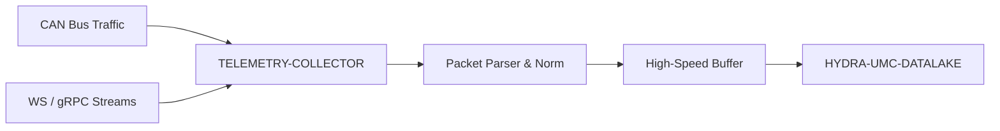

<p align="center">
  
</p>

# 📡 HYDRA-UMC-TELEMETRY-COLLECTOR

<p align="center"><a href="README.md">🇺🇸 English</a> | <a href="README_spa.md">🇪🇸 Español</a> | <a href="README_fra.md">🇫🇷 Français</a> | <a href="README_ita.md">🇮🇹 Italiano</a> | <a href="README_deu.md">🇩🇪 Deutsch</a> | 🇨🇳 <b>简体中文</b> | <a href="README_jpn.md">🇯🇵 日本語</a></p>

### 🚀 面向 CAN 和 WebSocket 日志的高吞吐量摄取节点

<p align="left">
  
  
  
</p>

---

## 1. 🛠️ 技术概述

**HYDRA-UMC-TELEMETRY-COLLECTOR** 是捕获生态系统内所有原始通信的高速
网关。它监听 FDCAN 总线、WebSocket 流和 gRPC 更新，将数据汇入数据湖。

它对异构数据源执行实时解析和归一化，确保 CAN 总线上的电机电流峰值能够
与来自视觉节点的 AI 推理结果正确关联。

### 关键特性：
* 🚀 **多协议摄取：** 处理 CAN、WebSocket、gRPC 和 HTTP 遥测数据。
* ⚡ **高吞吐量：** 针对每毫秒数千条消息进行优化，CPU 开销极小。
* 🧬 **数据归一化：** 将原始二进制数据包转换为标准化的 JSON/Protobuf 格式。
* 🛡️ **缓冲式交付：** 在数据库临时中断或网络峰值期间确保零数据丢失。

---

## 2. 🔄 摄取工作流



---

## 3. 🧱 架构与设计决策

* **为何 `src/` 是 Go 模块根目录，而非仓库根目录。** 使可安装模块自身的文件（`main.go`、`version.go`、`go.mod`）与仓库根目录的工具（`bump_version.py`、`docker-compose.yml`）分离——`go build ./...` 在 `src/` 内部运行，而非仓库根目录。
* **为何数据采集与 HYDRA-UMC-DATALAKE 本身是分离的。** 数据采集（轮询 HYDRA-UMC-SERVER、缓冲、批量写入）是一项与存储/查询截然不同的 I/O 密集型任务——将其保持为独立进程，意味着一次采集器重启或背压峰值不会触及数据湖自身的查询路径。
* **为何 sink 写入失败会将该批次重新入队，而非直接丢弃。** `src/collector` 才是真正兑现「带缓冲的投递：零数据丢失」这一承诺的地方——`FlushOnce` 只有在 `Sink.Write` 确认后才会把已取出的批次从缓冲区中移除，写入失败时会把它直接放回队首——真实的服务中断会重试同一批样本，而不是丢失它们。不过缓冲区（`src/buffer`）仍然是有界的——如果中断持续时间超过其容量，确实会丢弃最旧的多余部分，这是一个真实、诚实的限制，而不是承诺无限内存。
* **为何 CAN 和 WebSocket 都被解析为同一个 `Sample` 形态。** `src/telemetry` 在任何东西触及缓冲区或 sink 之前，就把这两种异构来源归一化为同一个结构体——这正是「CAN 总线上的电机电流尖峰与 Vision Node 的推理结果正确关联」背后的真实机制：下游任何阶段都无需知道某个样本最初是通过哪种协议到达的。
* **为何 CAN 线路格式是本项目自己的 v0 约定，而非生态系统真正的 CAN ID。** 真正的 CAN ID 表存在于 HYDRA-UMC 和 URTC 各自的固件文档中——真正对接它们是未来的工作（见 `mejoras_futuras.txt`），在没有那份参考资料的情况下猜测是不可取的。
* **为何 `DatalakeSink` 每次 HTTP 请求只写入一条样本，以及为何批次部分失败会在重试时导致行重复。** HYDRA-UMC-DATALAKE 自身的 `POST /ingest`（参见该项目的 `src/hydra_umc_datalake/api.py`）是单样本接口，不是批量接口——这里的“批量写入”实际上是 N 次真实的请求。如果批次中途有一次失败，`Write` 会返回错误，`collector.go` 自身的重试逻辑会把整个批次重新排队，于是已经写入的样本会被重新发送，并在下一次成功刷新时在 DATALAKE 中产生重复的行。面对真实故障时“至少一次”并偶尔产生重复——而不是静默丢失数据（至多一次）——是这个 v0 版本的诚实取舍；真正的“恰好一次”投递（幂等键、upsert）是未来的工作，参见 `mejoras_futuras.txt`。当没有传入 `-datalake-url` 时，`ConsoleSink`（打印到 stdout）仍然是默认值，便于独立运行该 collector。
* **这如何融入生态系统的其余部分。** 作为 HYDRA-UMC-DATALAKE 下的同级服务——这是实际主动向 HYDRA-UMC-SERVER 请求逐机器人遥测数据、并将其写入共享时序存储的组件。

---

## 📂 目录结构

纯软件服务（摄取节点）——没有自己的硬件/固件/操作系统，已从模板中省略
（生态系统惯例参见 `SONNET/_papelera/`）。

```text
HYDRA-UMC-TELEMETRY-COLLECTOR/
├── src/                  # Go 模块
│   ├── go.mod            # 模块定义
│   ├── version.go        # const Version = "X.Y.Z"
│   ├── main.go           # 入口点：连接一切，启动 HTTP API
│   ├── telemetry/        # Sample 类型 + CAN/WebSocket 解析器（归一化）
│   ├── buffer/           # 带背压报告的有界 FIFO（Ring）
│   ├── collector/        # 编排摄取+刷新，sink 失败时重试
│   ├── sink/              # 已刷新批次的去向（目前是 ConsoleSink）
│   └── api/                # 封装 collector 的简单 JSON/HTTP 处理器
├── build/                # 编译后的二进制文件（已被 gitignore）
├── bump_version.py        # 里程表式版本递增（由构建运行）
├── build.sh / build.bat   # 真实构建：版本递增 + go build
├── run.sh / run.bat       # 真实运行：执行编译后的二进制文件
└── README.md
```

从原始模板中省略：`hardware/`、`firmware/`、`os/`、`docs/`、
`images/` 和 `scripts/`——这是一个纯软件服务（Go 二进制文件），
没有专属硬件或固件，没有需要维护的操作系统镜像，目前也还没有
足够多的文档/媒体/实用脚本内容值得为它们单独建立文件夹。

---

## 4. ⚙️ 构建与运行

需要 Go >= 1.21。一个带有 HTTP API 的真实摄取流水线，而不只是一个能
编译的骨架。

```bash
# Linux/macOS
./build.sh
./run.sh -addr :8092 -datalake-url http://localhost:8095

# Windows
build.bat
run.bat -addr :8092 -datalake-url http://localhost:8095
```

`build` 会递增版本号（`src/version.go`），并将 `src/` 中的 Go 模块编译
为 `build/telemetry-collector(.exe)`。`run` 执行编译后的二进制文件，
转发任何标志，并开始监听真实流量。`-datalake-url` 会将刷新后的批次
指向一个真实的、正在运行的 HYDRA-UMC-DATALAKE 实例（`POST /ingest`，
`sink.DatalakeSink`）——省略该参数则改为将刷新的样本打印到 stdout
（`sink.ConsoleSink`），便于独立运行该 collector：

```bash
# 摄取一个 WebSocket 风格的遥测样本
curl -X POST localhost:8092/ingest/ws \
  -d '{"sourceId":"robot-1","kind":"motor_temp","timestamp":1700000000000,"fields":{"value":42.5}}'

# 摄取一个 CAN 帧（8 字节，base64——格式见 src/telemetry/can.go）
curl -X POST localhost:8092/ingest/can \
  -d '{"arbitrationId":7,"data":"AQAAUEEAAAA="}'

# 查看 collector 已摄取/已刷新/已丢弃的数据
curl localhost:8092/stats
```

```bash
cd src && go test ./...   # telemetry（CAN 往返、WS 校验）、buffer
                           # （有界 FIFO、背压、requeue）、collector
                           # （"sink 中断时不丢数据"的真实行为），以及
                           # api（通过 httptest 的真实 HTTP 往返测试）
```

---

## 🚀 路线图
* **第一阶段：** 数据湖的高吞吐量摄取和索引，用于历史分析。
* **第二阶段：** 遥测采集器的边缘压缩和安全传输协议。
* **第三阶段：** 使用无监督学习和电机振动分析进行异常检测。
* **第四阶段：** 用于海量日志摄取的实时压缩以及多协议优化。

---

## 🔗 相关项目

本项目是同一作者（JuanenRac / Electro Hobby 3D）打造的更大规模机器人生态
系统的一部分，涵盖固件、控制软件、AI 节点和车队工具。值得了解，因为某个
需求实际上可能是关于这些项目之一，而非本仓库。

### 项目族

**父项目：** **[HYDRA-UMC-DATALAKE](https://github.com/JuanenRac/HYDRA-UMC-DATALAKE)** —— 本采集器所供给的集成父项目。

**同族项目：**
- **[HYDRA-UMC-ANOMALY-DETECTOR](https://github.com/JuanenRac/HYDRA-UMC-ANOMALY-DETECTOR)** —— 同级分析服务，同一父项目。
- **[HYDRA-UMC-PRODUCTION-REPORTS](https://github.com/JuanenRac/HYDRA-UMC-PRODUCTION-REPORTS)** —— 同级分析服务，同一父项目。

### 直接相关（项目族之外）

- **[HYDRA-UMC-SERVER](https://github.com/JuanenRac/HYDRA-UMC-SERVER)** —— 本项目所摄取日志的来源。

### 生态系统的其余部分

**HYDRA-UMC 平台** —— 多机器人微工厂单元
- **[HYDRA-UMC](https://github.com/JuanenRac/HYDRA-UMC)** —— 协调最多 8 条机械臂的 CM5 + STM32H745 主板。
- **[HYDRA-UMC-SERVER](https://github.com/JuanenRac/HYDRA-UMC-SERVER)** —— 每个控制客户端所对接的 Express/WebSocket 后端。
- **[HYDRA-UMC-STUDIO](https://github.com/JuanenRac/HYDRA-UMC-STUDIO)** —— 基于 Web 的控制仪表盘，多机器人 3D 可视化。
- **[HYDRA-UMC-ANDROID-CONTROL](https://github.com/JuanenRac/HYDRA-UMC-ANDROID-CONTROL)** —— 通过 Wi-Fi/蓝牙的 Android 控制应用。
- **[HYDRA-UMC-IOS-CONTROL](https://github.com/JuanenRac/HYDRA-UMC-IOS-CONTROL)** —— 基于 Flutter 构建的 iOS/iPadOS 控制应用。
- **[HYDRA-UMC-SUITE](https://github.com/JuanenRac/HYDRA-UMC-SUITE)** —— 桌面端集群指挥中心（Python/PySide6）。
- **[HYDRA-UMC-EDITOR-URDF](https://github.com/JuanenRac/HYDRA-UMC-EDITOR-URDF)** —— 用于机器人目录的桌面端 URDF 模型编辑器。
- **[HYDRA-UMC-DSI](https://github.com/JuanenRac/HYDRA-UMC-DSI)** —— 机载 DSI 触摸屏的原生触控 UI。

**URTC 平台** —— 每台 HYDRA-UMC 机械臂搭载的工具头控制器
- **[URTC](https://github.com/JuanenRac/URTC)** —— CAN 总线工具头控制器，25 种工具配置。
- **[URTC-FLASHER](https://github.com/JuanenRac/URTC-FLASHER)** —— 桌面端 CAN-OTA + SWD/JTAG 刷写工具。
- **[URTC-TESTER](https://github.com/JuanenRac/URTC-TESTER)** —— 桌面端实时 CAN 总线诊断工具。
- **[URTC-WEB-STUDIO](https://github.com/JuanenRac/URTC-WEB-STUDIO)** —— 通过 Web Serial API 的浏览器端替代方案。

**🎥 视觉 AI 节点（Hailo-8）**
- [HYDRA-UMC-VISION-NODE](https://github.com/JuanenRac/HYDRA-UMC-VISION-NODE)
- [HYDRA-UMC-VISION-STREAMER](https://github.com/JuanenRac/HYDRA-UMC-VISION-STREAMER)
- [HYDRA-UMC-DETECTION-HEF](https://github.com/JuanenRac/HYDRA-UMC-DETECTION-HEF)
- [HYDRA-UMC-SAFETY-ZONES](https://github.com/JuanenRac/HYDRA-UMC-SAFETY-ZONES)
- [HYDRA-UMC-VISUAL-SERVOING-API](https://github.com/JuanenRac/HYDRA-UMC-VISUAL-SERVOING-API)

**🧠 认知 AI 节点（Hailo-10）**
- [HYDRA-UMC-COGNITIVE-NODE](https://github.com/JuanenRac/HYDRA-UMC-COGNITIVE-NODE)
- [HYDRA-UMC-VLA-ENGINE](https://github.com/JuanenRac/HYDRA-UMC-VLA-ENGINE)
- [HYDRA-UMC-VOICE-UI](https://github.com/JuanenRac/HYDRA-UMC-VOICE-UI)
- [HYDRA-UMC-SEMANTIC-PLANNER](https://github.com/JuanenRac/HYDRA-UMC-SEMANTIC-PLANNER)
- [HYDRA-UMC-DOCS-QA](https://github.com/JuanenRac/HYDRA-UMC-DOCS-QA)

**🐝 编排与集群**
- [HYDRA-UMC-ORCHESTRATOR](https://github.com/JuanenRac/HYDRA-UMC-ORCHESTRATOR)
- [HYDRA-UMC-SWARM-SYNC](https://github.com/JuanenRac/HYDRA-UMC-SWARM-SYNC)
- [HYDRA-UMC-PATH-PLANNER-3D](https://github.com/JuanenRac/HYDRA-UMC-PATH-PLANNER-3D)
- [HYDRA-UMC-JOB-DISPATCHER](https://github.com/JuanenRac/HYDRA-UMC-JOB-DISPATCHER)
- [HYDRA-UMC-NODE-HEALING](https://github.com/JuanenRac/HYDRA-UMC-NODE-HEALING)

**🎮 数字孪生与仿真**
- [HYDRA-UMC-TWIN](https://github.com/JuanenRac/HYDRA-UMC-TWIN)
- [HYDRA-UMC-PHYSICS-REPLICA](https://github.com/JuanenRac/HYDRA-UMC-PHYSICS-REPLICA)
- [HYDRA-UMC-HIL-BRIDGE](https://github.com/JuanenRac/HYDRA-UMC-HIL-BRIDGE)
- [HYDRA-UMC-SYNTHETIC-DATA-GEN](https://github.com/JuanenRac/HYDRA-UMC-SYNTHETIC-DATA-GEN)

**🏭 工业网关**
- [HYDRA-UMC-GATEWAY-INDUSTRIAL](https://github.com/JuanenRac/HYDRA-UMC-GATEWAY-INDUSTRIAL)
- [HYDRA-UMC-OPCUA-SERVER](https://github.com/JuanenRac/HYDRA-UMC-OPCUA-SERVER)
- [HYDRA-UMC-MQTT-BROKER](https://github.com/JuanenRac/HYDRA-UMC-MQTT-BROKER)
- [HYDRA-UMC-MTCONNECT-ADAPTER](https://github.com/JuanenRac/HYDRA-UMC-MTCONNECT-ADAPTER)

**🛠️ 配套工具**
- [URTC-SMART-RACK](https://github.com/JuanenRac/URTC-SMART-RACK)
- [URTC-VISION-TOOL](https://github.com/JuanenRac/URTC-VISION-TOOL)
- [HYDRA-UMC-WATCH](https://github.com/JuanenRac/HYDRA-UMC-WATCH)
- [HYDRA-UMC-TOOL-CLI](https://github.com/JuanenRac/HYDRA-UMC-TOOL-CLI)
- [HYDRA-UMC-DASHBOARD-AI](https://github.com/JuanenRac/HYDRA-UMC-DASHBOARD-AI)


## 👤 作者
**JuanenRac**（Electro Hobby 3D）
📧 electrohobby3d@gmail.com

## 📜 许可证
GPL-3.0 —— 详见 LICENSE。
